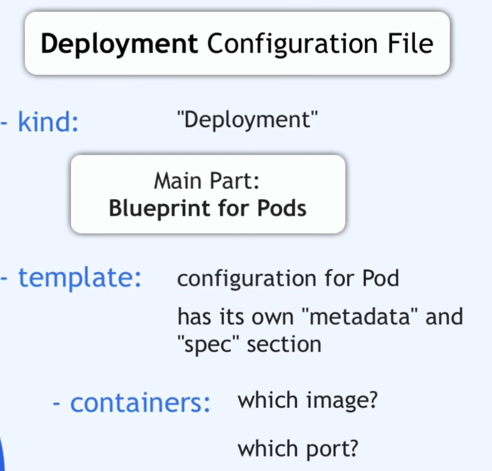

# Static/Dynamic sites

Web browsers communicate with [web servers](https://developer.mozilla.org/en-US/docs/Learn/Common_questions/What_is_a_web_server) using the **H**yper**T**ext**T**ransfer **P**rotocol ([HTTP](https://developer.mozilla.org/en-US/docs/Web/HTTP)).

### Static sites 

A _static site_ is one that returns the same hard coded content from the server whenever a particular resource is requested

### Dynamic sites 

A _dynamic site_ is one that can generate and return content based on the specific request URL and data (rather than always returning the same hard-coded file for a particular URL).

.png>)

A _Web Application's_ job is to receive HTTP requests and return HTTP responses. While interacting with a database to get or update information are very common tasks, the code may do other things at the same time, or not interact with a database at all.

links:



