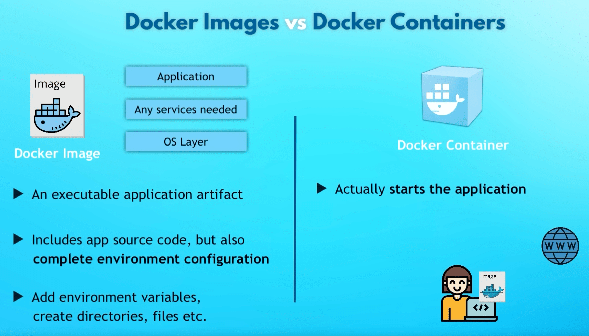

# Software Engineering

## What is Program And what is Product

If we're talking about the final product (for the business, for the customer), it's much more than just code or application components. And it takes a lot more time.

Frederick P. Brooks suggested that it would take 3 times as long as the program itself. But that was in 1975...

<figure><figcaption>
Evolution of the programming systems product
</figcaption></figure>

### src

lecture - [https://www.youtube.com/playlist?list=PLlb7e2G7aSpSidTs7HuqUX\_NeslBsg2Mb](https://www.youtube.com/playlist?list=PLlb7e2G7aSpSidTs7HuqUX\_NeslBsg2Mb)

## Requirements to requirements

• Singularity (1 req = one piece of text)

• Completeness (req is final)

• Consistency (1 req can’t be against 2 req)

• Atomicity (req can’t be divided)

• Traceability (by whom, for what)

• Relevance (we need it)

* Feasibility (We can do it)

• Unambiguity (only one meaning)

• Mandatory (why we need it, if no?)

• Verifiability (we can see, measure changes)

## Requirements analysis

• Feasibility analysis of requirements&#x20;

• Prioritization of requirements&#x20;

• Requirements planing&#x20;

• Creating a dictionary of terms&#x20;

• Creating a context diagram&#x20;

• Creation of user interface and technical prototypes

## Project components

### Components

* Money
* Time
* People
* Features
* Quality

### Priority

* Must
* Want
* Skip

## Product specification&#x20;

