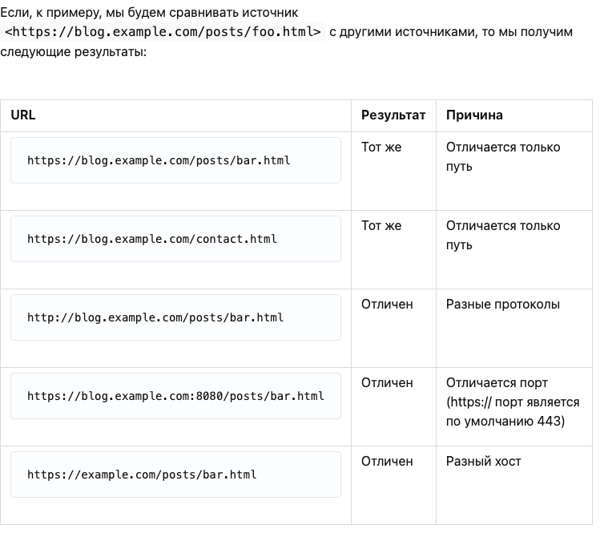

# CORS

When we face CORS

<figure><figcaption></figcaption></figure>

Запись из разных источников  — это ссылки, переадресации и отправка форм. С активным CORS в вашем браузере все эти операции разрешены. Существует также штука под названием **предварительный запрос**, которая настраивает запись из разных источников. Таким образом, если некоторые записи могут быть разрешены, это не означают, что они будут выполнены на практике. Мы вернемся к этому немного позже. \
\
Вставки из разных источников — это теги, загружаемые через `<script>`, `<link>`, ``, `<video>`, `<audio>`, `<object>`, `<embed>`, `<iframe>` и т.п. Все они разрешены по умолчанию. `<iframe>` выделяется на их фоне, так как он используется для загрузки другой страницы внутри фрейма. Его обрамление в зависимости от источника может регулироваться посредством использования заголовка  X-Frame-options.\
\
Что касается `` и других вставных тегов, то они устроены так, что сами инициируют запросы из разных источников cross-origin запроса. Именно поэтому в CORS существует различие между вставкой из разных источников и считыванием из разных источников. \
\
Считывание из разных источников  — это теги, загружаемые через вызовы AJAX/ fetch. Все они по умолчанию заблокированы вашим браузером. Существует обходной путь для вставки таких тегов на странице, но такие трюки регулируются другой политикой, которая соблюдается в современных браузерах. \
