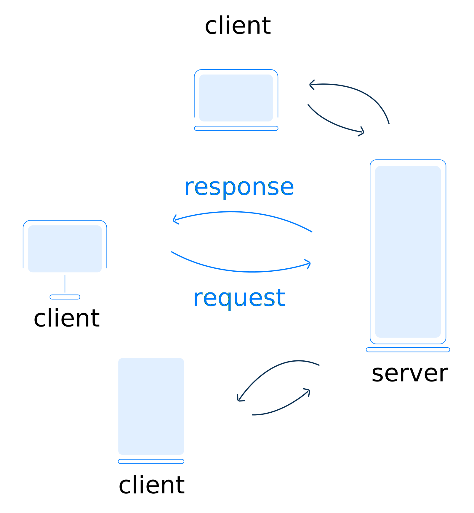

# Network

## Links:

Курс Созыкин - [https://www.youtube.com/playlist?list=PLtPJ9lKvJ4oiNMvYbOzCmWy6cRzYAh9B1](https://www.youtube.com/playlist?list=PLtPJ9lKvJ4oiNMvYbOzCmWy6cRzYAh9B1)

Web-App на низком уровне - [https://www.youtube.com/watch?v=4haMUvUxUJI](https://www.youtube.com/watch?v=4haMUvUxUJI)

<figure><figcaption></figcaption></figure>

 (1).png>)

 (1).png>)

## Glossaries

### Теримины

TLS - Transpor Layer Security\
SSL - Secure Socet Layer\
TCP - Transmission Control Protocol\
UDP - User Datagram Protocol\
Hub - концентратор\
SSID - ServiceSetID - имя сети (WiFi)

### Стандарты

ISO международ орг. стандартизации\
IEEE - институт инженеров электротехнике и электронике\
IAB - совет по архитектуре интернета\
W3C - консорциум интернета

## Транспортный уровень

### UDP

**User Datagram Protocol**

Нет надежной доставки\
Нет сохранения порядка сообщений

DNS использует UDP

Нет проверки получения запросов, при отправке запроса запускается таймер и повторяет запрос если на него не получен ожидаемый ответ

Основная задача - укзать порты отправителя и получателя

### TCP

**Transmission Control Protocol**

Гарантия доставки данных (подтверждение получения сегменов данных)\
Гарантия порядка сообщений

Перед передачей данных устанавливается соединение в рамках которого устанавливаются параметры передачи данных

### Стандартные порты

1-1024\
80 - HTTP (WEB)\
25 - SMTP (MAIL)\
53 - DNS\
1025-49151 - Зарегистрированные порты (нельзя использвать)\
49151-65535 - Динамические порты (можно использовать)

### Сокеты

Сокет - сочетание IP + TCP(port)\
Определяется как на стороне клиента, так и на стороне сервера

### NAT

**Network Address Translation**

Механизм в сетях TCP/IP, позволяющий изменять IP-адрес в заголовке пакета, проходящего через устройство маршрутизации трафика.

### Firewall

Брандмаур/Межсетевой экран

Позволяет фильтровать все проходящие запросы по заданным правилам фильтрации

## Прикладной уровень

### HTTP

**HyperText Transfer Protocol**

[**https://developer.mozilla.org/en-US/docs/Web/HTTP**](https://developer.mozilla.org/en-US/docs/Web/HTTP)

HTTP keep-alive - постоянное соединение

HTTP pipelining - конвейерная обработка. Возможность отправить несколько запросов на получение нескольких ресурсов одновременно

HTTP позволяет браузеру и серверу договориться о кешировании полученных данных и правилах проверки актуальности и обновлений

### SMTP/POP3/IMAP

### DNS

**Domain Name System**

Децентрализованная система.\
Пространство имен разделено на зоны (домены)\
За каждую зону отвечает регистратор.

 (1).png>)

#### Команды:

`nslookup google.com`\
`host google.com`\
`dig google.com`

#### Режим работы DNS

 (1) (1).png>)

#### Типы ответов

 (1).png>)

#### Возможности DNS

 (1).png>)

#### FTP

## Технологии шифрования:

#### TLS/SSL
