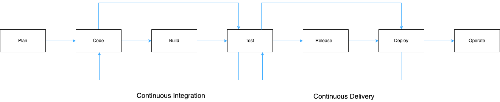

# 🖇 CI/CD

### Continuous Integration

For every push to the repository, you can create a set of scripts to **build and test your application automatically**. These scripts help decrease the chances that you introduce errors in your application.
This practice is known as Continuous Integration (CI). Each change submitted to an application, even to development branches, is built and tested automatically and continuously. These tests ensure the changes pass all tests, guidelines, and code compliance standards you established for your application.

Generally, the following steps happen in CI:
- Lint — to verify the code style;
- Build — to build the application with the feature;
- Test — to ensure you don't break the existing features.

### Continuous Delivery

A strategy when all the changes are automatically deployed to production after CI is called **delivery**. It facilitates the entire application release process. Continuous delivery is the approach for teams to produce software in short cycles, ensuring that each build is always error-free.

Generally, the following steps happen in CD:
- Test — to ensure you don't break the existing features;
- Release — to put it all together in an easily movable batch;
- Deployment — to make it available to the world.

### Continuous Deployment

Continuous Deployment is another step beyond Continuous Integration, similar to Continuous Delivery. The difference is that instead of deploying your application manually, you set it to be deployed automatically. **Human intervention is not required**.