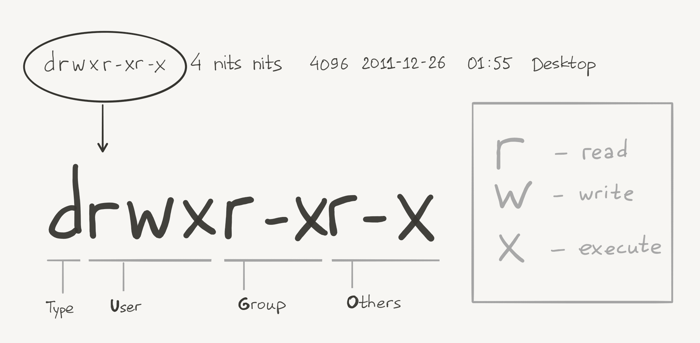
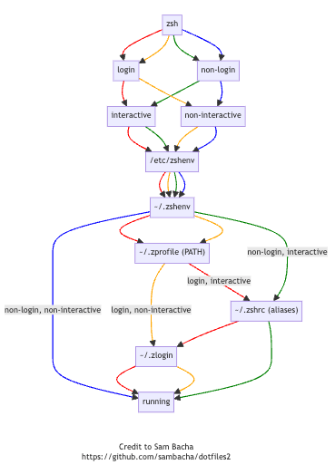

# 💻 CLI

zsh & bash -  programs that runs in Terminal, interprets Unix commands, and interacts with OS

#### links

* Mac Shortcuts - [https://support.apple.com/guide/terminal/keyboard-shortcuts-trmlshtcts/mac](https://support.apple.com/guide/terminal/keyboard-shortcuts-trmlshtcts/mac)
* More shortcuts - [http://macmy.ru/pages/terminal-commands-macosx#](http://macmy.ru/pages/terminal-commands-macosx)
* Explain Shell - [https://explainshell.com/explain?cmd=curl+-fsSL+example.org](https://explainshell.com/explain?cmd=curl+-fsSL+example.org)
* Filesystem Hierarchy Standard - [https://ru.wikipedia.org/wiki/FHS](https://ru.wikipedia.org/wiki/FHS)
* Database and OS scripting - [https://ss64.com/](https://ss64.com)
* 60 commands - [https://www.youtube.com/watch?v=gd7BXuUQ91w](https://www.youtube.com/watch?v=gd7BXuUQ91w)
- ShellCheck - https://www.shellcheck.net/
## Syntax

### comments

```bash
# one line

git status # inline

: '
long
comment
'
```

### man

SYNOPSIS - most common options
OPTIONS - full list of options

```bash
# man examples
say
[-v voice] 
[-r rate] 
[-o outfile [audio format options] | -n name:port | -a device] 
[-f file | string ...]

# one more
command [params...] [-options…] | command_two <param> [-options…]

# another example
cmd [param 1|param 2] 
```

Square brackets`[]` means optional

Pipe `|` means "OR" when there can only be one of two option

`[-f file | string ...]` it could be OR file OR string, not both

The value of an option is indicated by a space after the option value itself. If the option value contains special or space characters, it must be enclosed in quotation marks, double or single

### params

Required parameters are written in angle brackets \<param> \
optional – in square brackets \[param]\
To indicate that a parameter can be repeated, ellipses are used \[params...]
If only one of several parameters can be chosen, vertical bars are used: \[param 1|param 2]

### options

`--options` are **command line options** or **flags**, that modify the operation

short option `-o`

long `--option` (dash-dash-option)

### variables

[how-to-read-and-set-vars](https://www.digitalocean.com/community/tutorials/how-to-read-and-set-environmental-and-shell-variables-on-linux)

```bash
# set shell var
MY_TASK="project-1955"
TOKEN="bblablatoken64"

# check value
echo $TASK

# usage
open https://main-url-$MY_TASK.nl-k8s-stage.srv.local\?token=$TOKEN

# unset
unset MY_TASK

# check shell vars
set | less

# covert to env var
export TASK

# check env vars
printenv | less
```


### Glob patterns (Globbing)

Typically globbing is about file names.

- `*` - Any character (except `/`) in any number, or no characters at all
- `?` -  Any one character
- `[]` or `{}` - A group of characters {file1, file3, file6} or a set [0-9] [a-zA-Z] or [p1K]
- `[!]` or `[^]` - Negation of group or set of characters; is used with square brackets, like [!1-5]

examples
```bash
rm file{1-6}

cp ~/.* /mnt/usb/

git add *.scm
```

Glob vs regex

Some symbols have the same meaning. These are symbols like curly brackets `{}` and square brackets `[]`.

`*` in glob means either zero or any number of characters
`*` in regex means zero or more of the previous character

`?` in glob means any one character
`?` In regex means zero or only one of the previous characters

`.` in regex means the same as what `?` means in globbing
`.*` in regex means the same as `*` in glob patterns
### pipe

| pipe - connect output first command to input next command

```bash
# copy public key to clipboard 
cat ~/.ssh/id_rsa.pub | pbcopy

# find keyword in ls results
ls ~/.ssh | grep digital

# check last commands in history
history | tail -20

# grep all with "m"
echo -e "Hmm...\nBrr...\nMmm..." | grep "m"
```

### math

#### Arithmetic operators

| Op. | Function       | Description                                    | Example    | Result |
| --- | -------------- | ---------------------------------------------- | ---------- | ------ |
| +   | Addition       | Add two operands                               | $((10+3))  | 13     |
| -   | Subtraction    | Subtract two operands                          | $((10-3))  | 7      |
| *   | Multiplication | Multiply two operands                          | $((10*3))  | 30     |
| /   | Division       | Return quotient after division                 | $((10/3))  | 3      |
| %   | Modulo         | Return remainder after division                | $((10%3))  | 1      |
| **  | Exponential    | Raise the first operand to the power of second | $((10**3)) | 1000   |

```bash
#!usr/bin/env/bash

#Executing simple arithmetic operations
echo $(( 10*5+15 ))
echo $(( 40/6 ))
```

#### Operations with a variable
| Operator | Function                   | Description                     | Example     | Result |
| -------- | -------------------------- | ------------------------------- | ----------- | ------ |
| +=       | Addition by constant       | Add two operands                | $((_x_+=3)) | 13     |
| -=       | Subtraction by constant    | Subtract two operands           | $((_x_-=3)) | 7      |
| *=       | Multiplication by constant | Multiply two operands           | $((_x_*=3)) | 30     |
| /=       | Division by constant       | Return quotient after division  | $((_x_/=3)) | 3      |
| %=       | Modulo by constant         | Return remainder after division | $((_x_%=3)) | 1      |

```bash
#!usr/bin/env/bash

# Assigning value to variables
val1=$(( 10*3-15 ))
echo $val1

# Arithmetic operations using constants
# both `val=$(( 2 ))` and `$(( val = 2 ))` to assign values to vars
echo $(( val1 *= 3 ))
```


#### Relational and logical operations

`bc` utility provides us the ability to work with previously described operators as well as:
- Relational operators
- Logical or Boolean operators
- Math functions
- Conditional statements
- Iterative statements

| Op. | Example       | Evaluation logic                  | Result |
| --- | ------------- | --------------------------------- | ------ |
| &&  | bc <<< "5&&6" | 1; if all operands are non-zero   | 1      |
| \|  | bc <<< "5\|6" | 1; if any one operand is non-zero | 1      |
| !   | bc <<< "!5"   | 1; if the operand is 0            | 0      |

```bash
#!usr/bin/env/bash

# syntax command argument <<< "input"
# Less than operator
bc <<< "10 < 1"

# Is not equal to operator
bc <<< "10 != 11"
```

#### Math library

option `-l` enables the standard math library

| Math func. | Explanation                                                        | Example             |
| ---------- | ------------------------------------------------------------------ | ------------------- |
| sine       | Takes radian value as operand and gives its sine value             | bc -l <<< "s(30)"   |
| cosine     | Takes radian value as operand and gives its cosine value           | bc -l <<< "c(30)"   |
| tan-1      | Gives the inverse tangent in radians                               | bc -l <<< "a(1)"    |
| _ln_       | Gives the natural logarithm                                        | bc -l <<< "l(45)"   |
| _e_        | Raises _e_(euler's number i.e. 2.7182) to the power of the operand | bc -l <<< "e(1)"    |
| √          | Returns square root value                                          | bc -l <<< "sqrt(9)" |

```bash
#!usr/bin/env/bash

#Arithmetic operation that returns a floating-point number
bc -l <<< "(1 + 2)/7 * 2 ** 2"

#Using sine and cosine functions
bc -l <<< "s(1) + c(1)"

#Using logarithmic and exponential functions
bc -l <<< "e(1) + l(5)"

#Finding the square root of a number
bc -l <<< "sqrt(27)"

#Converting binary 10 to octal
bc -l <<< "ibase=2; obase=8; 10"

#Converting decimal 5 to binary
bc -l <<< "obase=2; 5"

#Using scale to control length of floating-point numbers
bc -l <<< "scale=3; a(30)"
```

### File redirections

`>>` appends new content to the file without removing the old information.

```bash
# adding new information to a diary
echo "Also my favorite things are ..." >> diary.txt

# example with folder
pwd >> ~/todo.txt
echo "^delete if using in docker" >> ~/todo.txt
```

`>` overwrites the file, removing any old content.

```bash
# rewrite/create file content
echo "My new everlasting love is ..." > secret.txt
```

#### stdout, stderr redirections

```bash
# program.sh
echo "Just a normal message"
echo "it will goes to stdout"
# >&2 directs the "ERROR!" message to stderr, represented by descriptor 2
echo "ERROR!" >&2
echo "one more error" >&2
echo "it will goes to stdout too"
echo "one last error" >&2
```

```bash
# 1> redirects all stdout (non-error) output to file
# 2> redirects all stderr output to file
bash program.sh 1> log.txt 2> errors.txt
```

## File Permissions

`drwx------    38 my.username  staff   1.2K Mar  4 13:07 .zsh_sessions`

```bash
# check prmissions
ls -l echo.txt 
-rw-r--r--@ 1 my.user  staff  24 Jun 27 21:15 echo.txt

# change owner
chown superman:marvel ./save_the_world.txt
```

In addition to the user name and group, each file has associated access rights: r - read, w - write and x - execute. These permissions are set for three types of users: the Owner, users belonging to the same group (Group), and Other (those who are not included in the previous two groups).



## Multiple commands in one line

```bash
# No matter the first command run successfully or not, run the second command cmd2:
cd; ls

# Only when the first command cmd1 run successfully, run the second command cmd2
cd && ls

# Only when the first command cmd1 failed to run, run the second command cmd2
cd || ls
```

## Built-in commands

#### examples

To check all available built-in system commands, type `man builtin`
To quit manual press q, f (forward), b (backward).

```bash
# cd - change directory
cd {folder/path} 
cd ~/.ssh

# go home
cd
cd ~

# go up
cd ..
cd ../../../

# go root
cd /

# go to previous dir
cd -

# ls - list directory contents

# l-longList a-all t-sortByTime r-sortReverse h-humanReadable
ls -latrh

# Disk Usage
du -h -d 1 # (linux) --human-readable --max-depth=1
du -hd 1 # (macos) only folders

# ping
ping google.com -c 5

# telnet (only lan - no encryption)
telnet <hostname/IP address> <port number>
telnet www.example.com 80

# seq - to gen sequences
seq 10 # 1 2 3 4 5 6 7 8 9 10

```

* `pwd` - **p**rint **w**orking **d**irectory
* `stat` - display file or file system status
* `hier` or `man hier` - layout of filesystems
* `cat` - concatenate and print files
* `touch` - file creating (not main function, but typical)
* `env` - current shell env vars
* `head` output the first part of textfiles
* `tail` - output the last part of textfiles
* `cp` & `mv` - copy & move. syntax - \<target file> \<destination>
* `compgen -c | less` - all available commands
* `file` - description of the type of the specified file. Works fine for files with no file extension
* `less` - interactive reader

### mv

move files/folders

```bash
mv secret.txt ./secrets
```
### Test

```bash
test expression
or
[ expression ]
```

Test command options
https://kapeli.com/cheat_sheets/Bash_Test_Operators.docset/Contents/Resources/Documents/index

| **Option** | **Purpose**                                                      | **Syntax**                  |
| ---------- | ---------------------------------------------------------------- | --------------------------- |
| -eq        | True if two integers are equal                                   | `if [ INT1 -eq INT2 ]`      |
| -ne        | True if two integers are not equal                               | `if [ INT1 -ne INT2 ]`      |
| -gt        | True if the first integer is greater than the second             | `if [ INT1 -gt INT2 ]`      |
| -ge        | True if the first integer is greater than or equal to the second | `if [ INT1 -ge INT2 ]`      |
| -lt        | True if the first integer is smaller than the second             | `if [ INT1 -lt INT2 ]`      |
| -le        | True if the first integer is smaller than or equal to the second | `if [ INT1 -le INT2 ]`      |
| =          | True if two strings are equal                                    | `if [ STRING1 = STRING2 ]`  |
| !=         | True if two strings are not equal                                | `if [ STRING1 != STRING2 ]` |
| \>         | True if the first string is greater than the second              | `if [ STRING1 \> STRING2 ]` |
| -z         | True if the string is null                                       | `if [ -z STRING ]`          |
| -n         | True if the string is not null                                   | `if [ -n STRING ]`          |
| -e         | True if file exists                                              | `if [ -e FILE ]`            |
| -d         | True if the file is a directory                                  | `if [ -d FILE ]`            |
| -s         | True if the file is not empty (non-zero file size)               | `if [ -s FILE ]`            |

| Logical Operators |             |                         |
| ----------------- | ----------- | ----------------------- |
| Option            | Purpose     | Syntax                  |
| !                 | Logical NOT | `if [ ! EXPR ]`         |
| -a                | Logical AND | `if [ EXPR1 -a EXPR2 ]` |
| -o                | Logical OR  | `if [ EXPR1 -o EXPR2 ]` |

### History

stores in `.zsh_history` / `.bash_history`

```bash
# show history
history

# clear history
history -c 
```

### Navigation

```bash
# add dir to stack
pushd

# check stack list
dirs -v

# delete 0 dir from stack and open it
popd
```

### Rename

```bash
# rename
touch file
mv file renamed-file

# make copy
cp renamed-file renamed-file-copy
```

### rm - Delete

```bash
rm folder/filename

# -r recursion, -f all without question
rm -rf foder/foldername
```

### eval

execute a string as a shell command

```bash
# example
command="echo \$(date)"
eval "$command"
```

### read

reads the contents of STDIN and saving as shell var

```
read first
# stdin > second

echo first
# stdout > second

set | grep first
# stdout > first=second
```

### grep

global regular expression print.
prints lines with found text

flags
- `-A <n>` shows the entry and n lines A(fter)
- `-B <n>` shows the entry and n lines B(efore)
- `-C <n>` shows n lines before and after C(ontext)

```bash
# -i ignore-case flag
grep -i "error text" log.txt

# get line number
grep -n "critical Error occured" log.txt

# -v, --invert-match (hide selected from results)
grep -i error log.txt | grep -v CORS

# -w, --word-regexp
echo "something" | grep -w something

# find with context
grep -C10 "error" logs.txt

# recursive search in ALL files in current folder and SUBFOLDERS
grep -r "Monday"
# stdout >> "calendar.txt: Blabla Monday Bla"

# -h, --no-filename (hide filenames from output)
grep -rh "Monday" 
# stdout >> "Blabla Monday Bla"

# grep "regexp" filename.abc
grep "^A" names.txt

```

### wc

prints X newlines, X words, X bytes counts for file

```bash
wc echo.txt 
# stdout >> 3       5      24 echo.txt

echo "Hello world" | wc
```

If you do not specify any files and run `wc` - terminal will read standard data input. When you finish, go to a new line and press the `Ctrl + D` key combination.
### cut

command to cut out a part of the text from a file or printed via standard input

text parts may be denoted by
- characters `-c` 
- fields `-f`
- bytes `-b`
- split text by separator `-d` (`TAB` by default)
syntax
`cut <options> <file path>`

```bash
# Winter: white: Weather: cold
# Spring: green: Snow:melted
# Summer: bright: Temperature: hot
# Autumn: yellow: Leaves: cool

cut -d ':' -f 1 seasons.txt
# Winter
# Spring
# Summer
# Autumn

echo "The sky is blue" | cut -d ' ' -f 1
# The
```
### tr

can translate, squeeze, and delete characters from standard input, writing to standard output. The program processes the text character by character

`tr <options>... <set1> <set2>`

- `-d` delete
- `-s` remove duplicates

```bash
echo lalala | tr a o
# lololo

echo 'Linux Ubuntu' | tr -d 'u'
# Linx Ubnt

echo 'Repeated  spaces in  line' | tr -s [:space:]
# Repeated spaces in line

```

### chown

`chown user <option> /path/to/file`

### chmod

`chmod permissions filename`

```bash
chmod 751 modify_it_now.exe

# modifying user permissions
chmod u=rwx modify_it_now.exe

# modifying group permissions
chmod g=r+x modify_it_now.exe

# modifying other permissions
chmod o=r+w modify_it_now.exe
```

### cat head tail

```bash
# one file
cat unix_cat.txt 

# multiple
cat unix_cat.txt ascii_cat.txt

# first 6 lines
head -n6 ascii_cat.txt

# first 8 characters
head -c 8 unix_cat.txt

# last 4 lines
tail -4 ascii_cat.txt

# tail --follow display the last lines in the file realtime (for logs)
tail -f logs.txt
```

## Shortcuts

### macOS Terminal

* Ctrl+R → fast history search
* Ctrl+A → Go to front of line
* Ctrl+E → Go to end of line
* Ctrl+C → Kill active process
* Ctrl+K → Exit shell
* Ctrl+L → Clear the screen
* Ctrl+Z → Put process in bg
* !! → Run previous command
* ! → Run prev matching cmd
* Ctrl+F → Go forward one character
* Ctrl+x Ctrl+e → Open line in SEDITOR
* Ctrl+B → Go back one character
* Alf+F → Go forward one word
* Alt+B → Go back one word
### Nano
- Ctrl+K → delete a line

## Shell Scripts

### Therms

`#!` - "shebang"
Directive for the Linux program loader that specifies a program that will run the script

`#!/usr/bin/env python3` - python example

### Run a script

* open the corresponding directory with file and type `bash hello_world.sh`
* make the file executable by typing `chmod +x hello_world.sh`
  Then can run it `./hello_world.sh`

### Positional parameters

null parameter `$0` is always the name of the script, and then follows user parameters passed to a script

Syntax

`$#` total number of the parameters
`$* , $@` - all parameters

Example
`personal_data.sh`

```bash
#!/usr/bin/env bash

echo "You provided $# facts about yourself!"
echo "Your name is $1"
echo "Your age is $2"
echo "All parameters in one var: $*"
echo "$@" # All arguments passed to the script
```

run

```bash
$ bash personal_data.sh Pepe 13

stdout:
You provided 2 facts about yourself!
Your name is Pepe
Your age is 33
All parameters in line: Pepe 33
All parameters by words: Pepe 33
```

### Functions

syntax

`function function_name {}`
or
`function_name() {}`

example

```bash
#!/usr/bin/env bash

personal_data() {
    echo "You provided $# facts about yourself!"
    echo "Your name is $1"
    echo "Your age is $2"
}

personal_data "Elden Lord" 200026
```

### Case statement

case statement is easy to read when there are multiple conditional statements

```bash
#!/usr/bin/env bash

case "${1}" in

    "")       # condition 
        echo "No option was selected." 
        ;; # end of the command
    1)     
        echo "You selected '1'." 
        ;;
    2)     
        echo "You selected '2'." 
        ;;
    3)     
        echo "You selected '3'." 
        ;;
    *)     # default case == else
        echo "Unknown number '${1}'." 
        ;;

esac

# syntax example
case $variable in
    condition-1 )
        commands;;
    condition-2 )
        commands;;
    condition-3 )
        commands;;
    condition-N )
        commands;;
    * )
        commands;;
esac

```


### Shift statement

`shift` - command that helps to iterate within list of arguments in function. like `i++` statement

example

```bash
#!/usr/bin/env bash

answers=("a" "d" "c" "a" "a")
total_score=0

for (( i = 0; i < 5; i++));
do
    case "${1}" in

        ${answers[i]})
            ((total_score++))
            ;;
        "-"|"--") # `|` bitwise operator 'OR'
            ;;
        *)
            ((total_score--))
            ;;

    esac
    shift 1 ## equal i + 1
done

echo "Total score is: $total_score"
```

### if-statement

```bash
# syntax
if [conditions]; then
   commands
fi

###
# elif
if test-commands; then
    consequent-commands
elif more-test-commands; then
    more-consequents
else
    some-more-consequents
fi
```

```bash
# Checking the password entered by user

echo "Enter password: "
read input
if [ $input = "Pass!@#" ]; then
    echo "Correct password entered"
fi

###
# add else block
if [ $input = "Pass!@#" ]; then
    echo "Correct password entered"
else
    echo "Incorrect password entered"
fi

###
# elif
num1=20;
num2=10;

if [ "$num1" -eq "$num2" ]; then
    echo "Numbers are equal"
elif [ "$num1" -gt "$num2" ]; then
    echo "First number is greater"
else
    echo "Second number is greater"
fi
```

### for

```bash
# syntax
for variable in set_of_values
do
    command
done

###
# example
$ for i in 1 2 3 4 5 do 
    echo $i 
  done

###
# example 2
for i in John Jack Mary do 
    echo "Here is $i" 
done

###
# using seq (seq [start] [incr] [stop])
for i in $(seq 1 2 5); do 
    echo "Number: $i"
  done
```


### while

```bash
# syntax
while control-command
do
    command
done

###
# example
i=1
while [ $i -le 3 ] do 
	echo "I is $i" 
    i=$(($i+1))
done

```

### Error handling

default, bash does not halt the execution of the script. 
if any command in the pipeline fails (returns a non-zero exit status), the entire pipeline is considered to have failed, even if some commands in the pipeline were successful

`set -euo pipefail` # shell options
	-exit on error
	-undefined vars caused exit
	-output will show last successful command

### Read User Input

```bash
#!/bin/bash

echo Write Mario

read mario

# OR with one line
# read -p "Write Mario: " mario

echo "It's me, $mario"
```

### Read file

read lines from file

```bash
#!/bin/bash

filename='example.txt'
while read line; do
    echo "Your line:  $line"
done < "$filename"
```

get lines from file and save to another file

```bash
filename='example.txt'
output='junior.txt'

while read line; do
    echo "Your line:  $line" >> junior.txt
done < "$filename"
```


## Shell config

* [https://github.com/ptrpl4/dotfiles](https://github.com/ptrpl4/dotfiles)



### PATH

`$PATH` environment variable. It sets the directories that the shell searches for executable files
It's a list of directory paths, separated by colons (`:`)

`/bin` - default system executable files

`/usr/bin`  - default user executable files

`/usr/local/bin` - bins for manually installed user-apps (docker, WARP, etc)

`/opt/homebrew/bin` - created and maintained by Brew

```bash
# a default $PATH looks like
# search order from left /usr/local/bin to right /sbin
/usr/local/bin:/usr/bin:/bin:/usr/sbin:/sbin

# update PATCH data for current shell session
PATH=$PATH:/path-to-your-directory
export PATH
```

### alias - Aliases

```bash
# to save it in shell zsh - ~/.zshrc
nano ~/.bashrc

# add alias, add ssh key, save file
alias key='ssh-add --apple-use-keychain ~/.ssh/id_rsa'
alias any-key='any-thing'

# reset shell environment
source ~/.bashrc

# check current list of aliases
alias

# to remove (for aliases added by command, not file)
unalias key
```

## OS programs

### ps - Processes

```bash
# report a snapshot of the current processes
ps 

# turn off proccess
kill 123321
```

### MacOS - softwareupdate

```bash
/usr/sbin/softwareupdate

# list
softwareupdate -l

# update all -R => restart if needed (sudo for -R option)
sudo softwareupdate -i -a -R
```

### Others
```bash
# secure check file info
codesign -vvvv -R="anchor apple" /usr/libexec/rapportd

```

## Third-party programs

### TLDR

**TLDR** stands for **T**oo **L**ong **D**idn'**t R**ead -  a collection of simplified and community-driven man pages.

```bash
brew install tldr
tldr ls
tldr git
```

### Sublime

```bash
brew install sublime-text

# open current dir
subl .


# sublime merge
brew install sublime-merge

# open dir
smerge .
```

### htop

user friendly top command

```bash
brew install htop
```

### **fonts**

```bash
# for mac
brew tap homebrew/cask-fonts
brew install --cask font-fira-code
```

### gping

for debugging multiple hosts at once

```bash
brew install gping
gping 1.1.1.1 8.8.8.8 192.168.100.1 192.168.100.38
```

source - [https://t.me/zhovner\_hub/1991](https://t.me/zhovner\_hub/1991)

### nmap

```bash
nmap -Pn 192.111.111.11
```