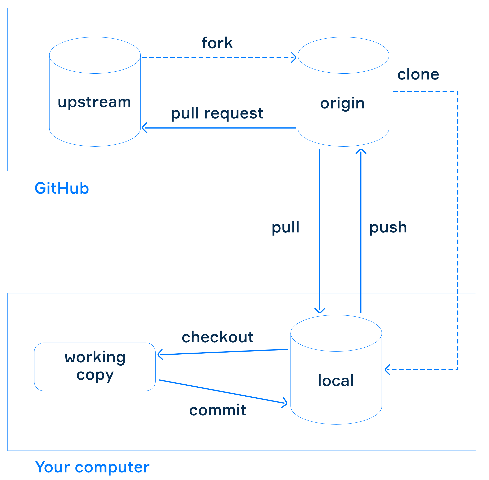
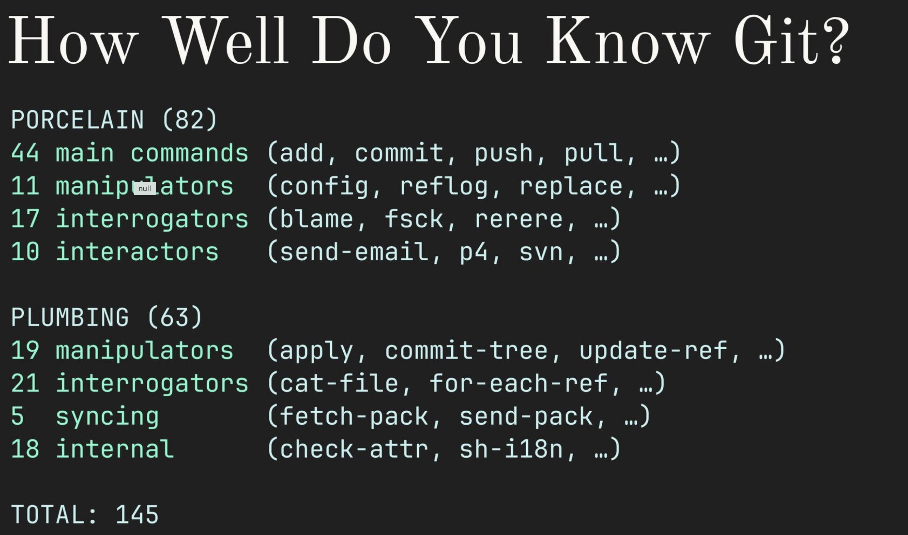
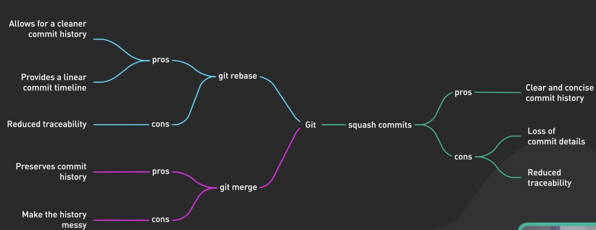
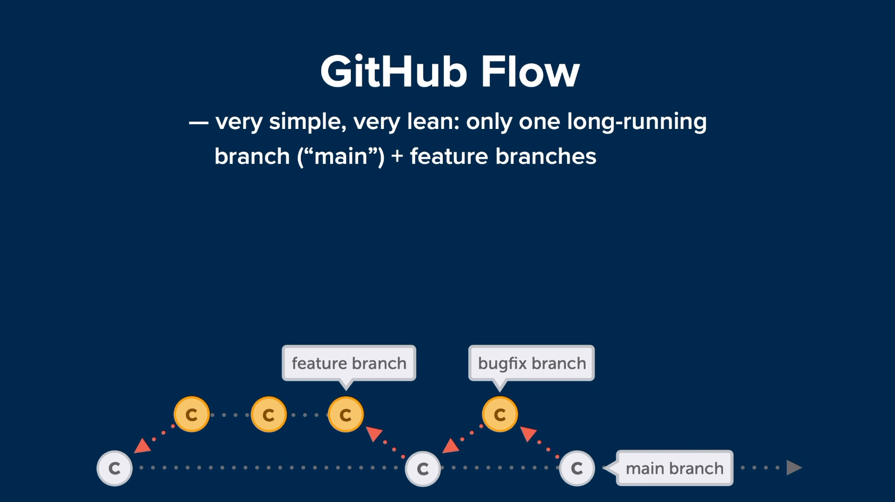
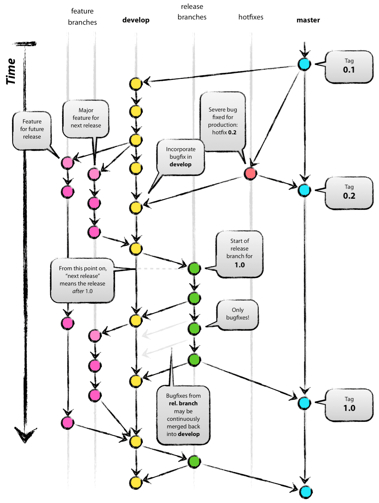

# 📖 Git

#### links

* [https://git-scm.com](https://git-scm.com/)
* [https://github.com/github/gitignore](https://github.com/github/gitignore)
* [https://ohshitgit.com](https://ohshitgit.com/)
* [https://gitexplorer.com](https://gitexplorer.com/)
* [https://blog.gitbutler.com](https://blog.gitbutler.com)

commits

* https://gist.github.com/joshbuchea/6f47e86d2510bce28f8e7f42ae84c716
* https://conventionalcomments.org
* https://www.conventionalcommits.org/en/v1.0.0/
* https://github.com/angular/angular/blob/68a6a07/CONTRIBUTING.md#commit
* [https://www.youtube.com/watch?v=uBhpBOX8VYg](https://www.youtube.com/watch?v=uBhpBOX8VYg)

hints and examples

* [https://wiki.nikiv.dev/programming/version-control/git](https://wiki.nikiv.dev/programming/version-control/git)



## Basics

### fast start

```bash
# creates a .git folder
git init

# connects repo
git remote add origin git@github.com:ptrpl4/GitBookWiki.git

# create commit
git commit -a -m 'init commit'
# or 
git ci -am 'init commit'

# push to repo
git push
# or
git push origin master

# check status
git status
```

### Semantic Commit Messages

Format: `<type>(<scope>): <subject>`
`(<scope>)` - optional

Examples

```bash
# feat: add hat wobble
# ^--^  ^------------^
# |     |
# |     +-> Summary in present tense.
# |
# +-------> Type: chore, docs, feat, fix, refactor, style, test.
# 
# chore-(project's maintenance or improvement)

git commit -m 'test(e2e): add e2e for existing user scenario'
git commit -m 'test(config): update config for existing user scenario'
git commit -m 'chore: up playwright version to v1.41.2'
git commit -m 'docs: update readme for playwright local run'
```

### config

```bash
# check settings list and used config files
git config --list --show-origin

# set global. stores in ~/.gitconfig file
git config --global user.name "John Doe"
git config --global user.email johndoe@example.com
# check current settings in file
cat ~/.gitconfig
git config --list --global

# set local. stores in .git/config file
git config --local user.name "Pyotr V."
git config --local user.email ptrpl4@example.co
# check current settings in file
cat .git/config
git config --list --local

# add alias
git config --global alias.staash 'stash --all'
git config --global alias.script !any-script.sh
```

### .gitignore

The following rules apply to templates in the .gitignore file:

* Blank lines, as well as lines starting with #, are ignored.
* Standard templates are global and are applied recursively to the entire directory tree.
* To avoid recursion use a slash (/) at the beginning of the template.
* To exclude a directory add a slash (/) at the end of the template.
* You can invert the template by using an exclamation point (!) as the first character.

### .git folder

#### structure

```
.git
├── hooks
├── info
├── logs
│   └── refs
│       ├── heads
│       └── remotes
│           └── origin
├── objects
│   ├── info
│   └── pack
└── refs
    ├── heads
    ├── remotes
    │   └── origin
    └── tags
```

#### contents

- **HEAD**: A reference to the currently checked-out branch or commit. It tells Git which branch you're currently working on.
- **config**: Contains the configuration settings for the repository, including remote repository URLs and branch information.
- **description**: Used by GitWeb to display a short description of the repository.
- **hooks**: Contains client or server-side scripts to trigger actions at certain points in Git's execution.
- **info**: Contains the global excludes file, which specifies intentionally untracked files that Git should ignore.
- **objects**: Stores all the data for your database. This includes blobs (file contents), trees (directory listings), commits, and tags. Inside `objects`, there are two subfolders: `pack` and `info`. The `pack` folder contains compressed snapshots of your codebase, while the `info` folder contains metadata about those snapshots.
- **refs**: Contains pointers to commit objects. It includes subfolders like `heads` (references to branches) and `tags` (references to specific tags).
- **index**: Also known as the staging area, it's a binary file (generally kept in `.git/index`) containing a sorted list of path names, each with permissions and the SHA1 of a blob object; git updates the index file as necessary when you run commands such as `git add`, `git rm`, `git commit`, etc.
- **info-exclude**: files that you do not want to include in the repository are described here.

#### Git file stages

1. _committed_, i.e., the file is already saved in your local database;
2. _modified_, i.e., there are some unsaved changes in files;
3. and prepared (_staged_), i.e., a modified file is marked for inclusion in the next commit.

#### Sections of a Git project

The **Git directory** (.git) is where Git stores the metadata and object base of your project. This is the most important part of Git, which gets copied when you clone a repository from another machine.  
  
The **working directory** is a snapshot of the project version. The files are unpacked from a compressed database into a Git directory and placed on a disk so that you can use and modify them.  
  
The **staging area** is a file located in your Git directory that contains information about what changes will go to the next commit. This area is also called the "_index_", but it is also common to call it the _stage area_. When you add a file, it first goes exactly to the index, and only after the commit it appears in the repository.

```bash
cat .git/HEAD # >> ref: refs/heads/master

cat .git/config 
: '
[core]
repositoryformatversion = 0
filemode = true
bare = false
logallrefupdates = true
ignorecase = true
precomposeunicode = true

[remote "origin"]
url = git@github.com:ptrpl4/GitBookWiki.git
fetch = +refs/heads/*:refs/remotes/origin/*

[branch "master"]
remote = origin
merge = refs/heads/master

[user]
name = Pyotr V.
email = ptrpl4@mail.co
'
```

## Basic commands



### Add

```bash
# add --patch (parts of changes to commit)
git add -p index.html 
# adding one concrete file
git add my_file.txt

# adding all files from your directory
git add -A

### Commit

```bash
# add all staged files to commit
git commit -a -m 'feat: add browser check'
# or
git ci -am 'feat: add browser check'
```

### Push

```bash
# For the first time push local branch because it does not exist in the remote repo
git push --set-upstream origin edit-readme

# sent to remote repo
git push

git push --force with lease
```

### Log

```shell
# all commits order by desc
git log
# last 5 commits
git log -n5 code.py

# find commits
git log --all --grep='README'

# show patch -p or --patch
git log -p -2
# short changed info --stat
git log --stat
# change view for data --pretty
git log --pretty
# additional options for --pretty
git log --pretty=oneline
# another addotional opt. - =short, =full, =fuller
# time options
git log --since=2.weeks
# serach for string -S
git log -S function_name
# commits related to specific file -- path/to/file
git log -- path/to/file
# exclude merges --no-merges
git log --no-merges
# branches and changes
git log --oneline --decorate

# last 15, only names
git log --oneline --format="%s" -n15

# Reference logs
git reflog
```

### Amend last commit

It adds everything from the last commit to the staging area and tries to make a new commit (Date - not changed, hash - recreated)

```bash
git add -A
git commit -m 'feat: validation'

# add some chaged in last commit
git add forgotten_file.md
git commit -a --amend -m 'feat: validation, registration' 

# if commit messgage is actual
git commit -a --amend --no-edit
```

### Remote

```shell
# check remote repos with links
git remote -v

# check remote repo info
git remote show origin

# connect origin repo to git
git remote add origin git@github.com:ptrpl4/GitBookWiki.git
```

### Fetch/Pull

```shell
# get data from origin repo
git fetch origin
# get + merge data from origin repo
git pull

# if unstashed changes
git stash save "Temporary changes"
git rebase
git stash pop
```

### Tag

```shell
# create Annotated Tags (full author info) and message
$ git tag -a v1.4 -m "my version 1.4"
$ git show v1.4
# Lightweight Tags (only tag info)
$ git tag v1.4-lw
# add tag to already created commit
$ git tag -a v1.2 9fceb02dfs22f332d
# push choosen tag to remote
$ git push origin <tagname>
# push all tags
$ git push --tags
# delete tag
$ git tag -d v1.4
# delete from remote
$ git push origin --delete <tagname>
# check tag file (not recommended)
$ git checkout v2.0.0
# create branch with tag (recommend)
$ git checkout -b version2 v2.0.0
```

### file renaming

```bash
$ git mv README.md README
# equal
$ mv README.md README
$ git rm README.md
$ git add README
```

### reset


````bash
# keeping the state of the staging area and working tree
git reset --soft @~1

# keep only the state of the working tree
git reset --mixed @~1

# undo changes in working tree also
git reset --hard @~1

# shows a list of all the commits and in the repository (incl. deleted)
git reflog
````

`--soft`. With `@~1` it undoes the last commit only but keeps the state of the staging area and working tree intact.
`@` is an alias for `HEAD`

`--mixed` (it's the default version of `git reset`) which will reset to a pointed commit and match the staging area, but keep the state of the working tree.

`--hard` it would reset to the pointed commit and match the state of the staging area and also the working tree with that commit in the repository.

```bash
# Unstaging a Staged File
git reset HEAD testfile.md
# OR
git reset @ testfile.md
# OR
git restore --staged testfile.md

# restore changed but not staged file (careful!)
git checkout -- CONTRIBUTING.md
# OR
git restore CONTRIBUTING.md
```

#### Revert

`git revert` makes "mirrored" changes to the last commit and undoes all of them, so new commit will be the same as the commit before the last one.
`git revert` command allows you to undo changes made in a previous commit without deleting that commit.

```bash
# make new revert commit from the current commit
git revert @

# Push the new revert commit to your remote repository
git push origin main 
```

### Diff

`git diff` used to show the differences between two versions of a file, two files, branches, or commits.

The main commands:

- `git diff` shows the difference between files in your staging area and modified files in the working tree;
- `git diff --staged` and `git diff --cached` shows the difference between files in the staging area and the last commit;
- `git diff <commit1>..<commit2>` and `git diff <branch1>..<branch2>` show differences between commits and branches;
- `git diff --stat` shows a short summary of the number of changes and names of files with those changes;

```bash
git diff
: '
diff --git a/our-file b/our-file
index c703f5f..891ccac 100644
--- a/our-file
+++ b/our-file
@@ -1 +1,2 @@
 Now you are
+here
'
<<<<<<< Updated upstream

# check diff with master
git show master
=======
>>>>>>> Stashed changes
```

The lines `--- a/our-file +++ b/our-file` show that the changes in the first file are marked by the `-` sign and changes in the second one are marked by `+`
Line `@@ -1 +1,2 @@` tell that in the output 1-st line from the first version of the file and 1-st and next 2 lines of the second version of the file

<<<<<<< Updated upstream
### Blame

```bash
git blame
```

Show commit hash and last author on each line of a file.

=======
>>>>>>> Stashed changes
## Branch

### Basics

```bash
# list of local branches
git branch --column

# create branch
git branch test_branch

# switch to branch
git checkout test_branch
# create and switch
git checkout -b test_branch

# delete branch (-d, --delete)
git branch -d test_branch
# local branches + last commits
git branch -v
# all not merged branches
git branch --no-merged
# all merged branches
git branch --merged
```

### renaming

```bash
# rename localy
$ git branch --move bad-branch-name corrected-branch-name
# push changes
$ git push --set-upstream origin corrected-branch-name
# delete branch
$ git push origin --delete bad-branch-name
```

### Merge and Rebase



`rebase` is better to use only for local branches to not mess with changes in remote repo. Git creates **new commits** for each commit in your branch, applying them on top of the main branch. This means the commit history of your branch is rewritten to start from the latest commit of the main branch.

Typical steps and cases for work with feature branch

1. `rebase` feature branch on top of main branch locally&#x20;
   1. &#x20;`feature` will have all history from `main` and all new feature commits on top
2. `merge` feature branch into main branch (`squash` commit preferred) when work is done&#x20;
   1. main branch will save original commit history and add one "merge commit" on top (squashing case)&#x20;
   2. main branch will save original commit history (because of step 1.) and will have all commit from feature branch on top (no squashing case)

```bash
# moving your current branch's commits to the tip of the main branch
git checkout feature_branch
git rebase main
# will create one merge commit and add all changes from 
git merge --squash feature_branch

## Other cases
# will save history of commits
git merge test_branch
# change commits when they are moved to a new branch
git rebase -i main
```

### Branching strategy

#### GitHub Flow



**long-live main branch + short-live feature branches**

#### GitFlow

Gitflow is a legacy Git workflow that was originally a disruptive and novel strategy for managing Git branches. Gitflow has fallen in popularity in favor of trunk-based workflows, which are now considered best practices for modern continuous software development and DevOps practices

**develop => feature => develop => release branch => master + tag version**



link

* [https://nvie.com/posts/a-successful-git-branching-model](https://nvie.com/posts/a-successful-git-branching-model/)
