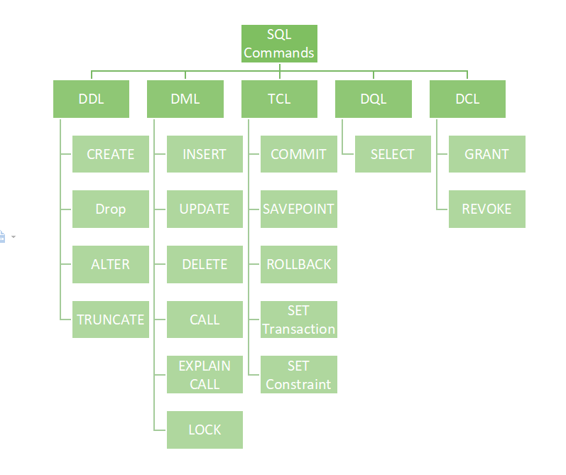
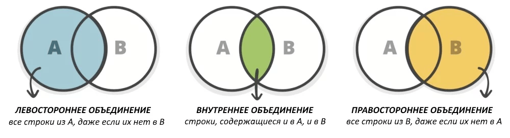
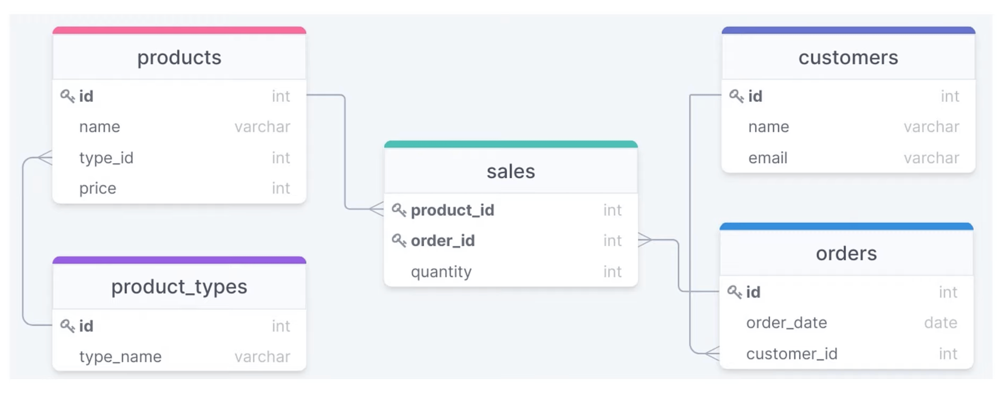

# 📑 SQL

Structured Query Language - [domain-specific programming language](https://www.jetbrains.com/mps/concepts/domain-specific-languages/) / [data manipulation language](https://www.techopedia.com/definition/1179/data-manipulation-language-dml) designed to handle data in tables.

## Basics

#### links

- [recap (ru)](https://tproger.ru/translations/sql-recap/)
- [docs (ru)](https://postgrespro.ru/docs/postgresql/12/index)
- [course (ru)](https://geekbrains.ru/chapters/1157)
- [lectures](https://www.youtube.com/playlist?list=PLtPJ9lKvJ4oh5SdmGVusIVDPcELrJ2bsT)
- [database-design-101](https://hyperskill.org/blog/post/database-design-101)

#### Therms

- СУБД - система управления базами данных
- RDBMS - Relational Database Management System

#### Правила проектирования

* Правило №1: Все элементы внутри ячеек должны быть атомарными (ячейка содержит только одно значение, не несколько).
* Правило №2 Все строки должны быть различными.
* Правило №3 Любое поле таблицы, не входящее в состав первичного ключа, функционально полно зависит от первичного ключа.
* Правило №4 Все предыдущие правила, и плюс то, что любой функциональный атрибут зависит только от первичного ключа.

### Syntax

It's necessary to end each SQL statement with a semicolon, also known as a statement terminator.

```sql
SELECT * FROM Census;
```

#### Comments

```sql
-- line comment

COUNT(*) -- inline comment

/* 
Multiline
comment
 */
```

## SQL Command types

* DDL – Data Definition Language
* DML – Data Manipulation Language
* TCL – Transaction Control Language
* DQl – Data Query Language
* DCL – Data Control Language



## Define - DDL

```sql
CREATE TABLE <table_name1> (
  <col_name1> <col_type1>,
  <col_name2> <col_type2>,
  <col_name3> <col_type3>
  PRIMARY KEY (<col_name1>),
  FOREIGN KEY (<col_name2>) REFERENCES <table_name2>(<col_name2>)
);

# Просмотр доступных баз данных
SHOW DATABASES;
# Создание новой базы данных
CREATE DATABASE;
# Выбор базы данных для использования
USE <database_name>; 
# Импорт SQL-команд из файла .sql
SOURCE <path_of_.sql_file>; 
# Удаление базы данных
DROP DATABASE <database_name>;
```

### Ограничения целостности при использовании CREATE TABLE

Может понадобиться создать ограничения для определённых столбцов в таблице. При создании таблицы можно задать следующие ограничения:

* ячейка таблицы не может иметь значение NULL;
* первичный ключ — `PRIMARY KEY (col_name1, col_name2, …)`;
* внешний ключ — `FOREIGN KEY (col_namex1, …, col_namexn) REFERENCES table_name(col_namex1, …, col_namexn)`.

Можно задать больше одного первичного ключа. В этом случае получится составной первичный ключ.

### Сведения о таблице

Можно просмотреть различные сведения (тип значений, является ключом или нет) о столбцах

```sql
DESCRIBE <table_name>; 
```

## Manipulation - DML

### INSERT

```sql
INSERT INTO <table_name> (<col_name1>, <col_name2>, <col_name3>, …)
VALUES (<value1>, <value2>, <value3>, …);

-- You do not need to specify column names when adding data to each column
INSERT INTO <table_name>
VALUES (<value1>, <value2>, <value3>, …); 
```

### UPDATE

```sql
UPDATE <table_name>
SET <col_name1> = <value1>, <col_name2> = <value2>, ...
WHERE <condition>; 
```

### DELETE

```sql
DELETE FROM <table_name>
WHERE ID = 2; 
# Delete all table data
DELETE FROM <table_name>
```

### DROP

```sql
DROP TABLE <table_name>; 
```

## Query - DQL

### SELECT

```sql
SELECT <col_name1>, <col_name2>, …
  FROM <table_name>;

-- All data
SELECT * FROM <table_name>;

-- Unique data
SELECT DISTINCT <col_name1>, <col_name2>, …
  FROM <table_name>;
  
-- Where
SELECT <col_name1>, <col_name2>, …
  FROM <table_name>
  WHERE <condition>; 
```

В запросе можно задавать следующие условия:

- сравнение текста;
- сравнение численных значений;
- логические операции AND (и), OR (или) и NOT (отрицание)

### GROUP BY

Оператор `GROUP BY` часто используется с агрегатными функциями, такими как `COUNT`, `MAX`, `MIN`, `SUM` и `AVG`, для группировки выходных значений.

```sql
SELECT <col_name1>, <col_name2>, …
  FROM <table_name>
  GROUP BY <col_namex>; 
```

### HAVING

Ключевое слово `HAVING` было добавлено в SQL потому, что `WHERE` не может быть использовано для работы с агрегатными функциями.

```sql
SELECT <col_name1>, <col_name2>, ...
  FROM <table_name>
  GROUP BY <column_namex>
  HAVING <condition>;
  
-- example
SELECT hair, COUNT(*) FROM superheroes
WHERE gender='Female Characters'
GROUP BY hair
HAVING COUNT(*) BETWEEN 50 AND 300;
```

### ORDER BY

`ORDER BY` используется для сортировки результатов запроса по убыванию или возрастанию, отсортирует по возрастанию, если не будет указан способ сортировки `ASC` или `DESC`.

```sql
SELECT <col_name1>, <col_name2>, …
  FROM <table_name>
  ORDER BY <col_name1>, <col_name2>, … ASC|DESC; 
```

### BETWEEN

`BETWEEN` используется для выбора значений данных из определённого промежутка. Могут быть использованы числовые и текстовые значения, а также даты.

```sql
SELECT <col_name1>, <col_name2>, …
  FROM <table_name>
  WHERE <col_namex> BETWEEN <value1> AND <value2>; 
```

### LIKE

Оператор `LIKE` используется в `WHERE`, чтобы задать шаблон поиска похожего значения.\
Есть два свободных оператора, которые используются в `LIKE`:

- `%` (ни одного, один или несколько символов)
- `_` (один символ)

```sql
SELECT <col_name1>, <col_name2>, …
  FROM <table_name>
  WHERE <col_namex> LIKE <pattern>; 
```

### IN

С помощью `IN` можно указать несколько значений для оператора `WHERE`

```sql
SELECT <col_name1>, <col_name2>, …
  FROM <table_name>
  WHERE <col_namen> IN (<value1>, <value2>, …); 
```

### JOIN

JOIN used to join two or more tables by using common attributes within them



```sql
-- JOIN = INNER JOIN

SELECT <col_name1>, <col_name2>, …
  FROM <table_name1>
  JOIN <table_name2>
  ON <table_name1.col_namex> = <table2.col_namex>;

-- One more example
SELECT p.name AS product_name,
t. type_name AS product_type, p.price AS product_price
FROM products AS p JOIN product types AS t
ON p.type id = t.id
WHERE t.type name='online-lesson'
ORDER BY p.price DESC

-- LEFT OUTER JOIN 
SELECT products.name, product_types.type_name
FROM products LEFT OUTER JOIN product_types
ON products.type_id = product_types.id

-- FULL OUTER JOIN - Join everything in all tables
```

### Aggregate functions

Эти функции используются для получения совокупного результата, относящегося к рассматриваемым данным. Ниже приведены общеупотребительные агрегированные функции:

* `COUNT (col_name)` — возвращает количество строк;
* `SUM (col_name)` — возвращает сумму значений в данном столбце;
* `AVG (col_name)` — возвращает среднее значение данного столбца;
* `MIN (col_name)` — возвращает наименьшее значение данного столбца;
* `MAX (col_name)` — возвращает наибольшее значение данного столбца.

## Subquery

- [info](https://www.w3resource.com/sql/subqueries/nested-subqueries.php)

An SQL Subquery, is a SELECT query within another query. It is also known as Inner query or Nested query and the query containing it is the outer query.

The outer query can contain the SELECT, INSERT, UPDATE, and DELETE statements. We can use the subquery as a column expression, as a condition in SQL clauses, and with operators like =, >, <, >=, <=, IN, BETWEEN, etc.

```sql
SELECT job_id,AVG(salary) 
    FROM employees   
    GROUP BY job_id   
    HAVING AVG(salary)<           
        (SELECT MAX(AVG(min_salary))            
        FROM jobs             
        WHERE job_id IN 
            (SELECT job_id FROM job_history                  
            WHERE department_id BETWEEN 50 AND 100)             
    GROUP BY job_id);
```

## View

`View` — это виртуальная таблица SQL, созданная в результате выполнения выражения. Она содержит строки и столбцы и очень похожа на обычную SQL-таблицу. `View` всегда показывает самую свежую информацию из базы данных.

**Создание**

```sql
CREATE VIEW <view_name> AS
  SELECT <col_name1>, <col_name2>, …
  FROM <table_name>
  WHERE <condition>; 
```

**Удаление**

```sql
DROP VIEW <view_name>; 
```

## Scheme

example scheme for online shop



## Transaction - TCL

A transaction is a unit or sequence of work that is performed on a database. Transactions are accomplished in a logical order, whether in a manual fashion by a user or automatically by some sort of a database program.

### ACID

* Atomicity − ensures that all operations within the work unit are completed successfully. Otherwise, the transaction is aborted at the point of failure and all the previous operations are rolled back to their former state.
* Consistency − ensures that the database properly changes states upon a successfully committed transaction.
* Isolation − enables transactions to operate independently of and transparent to each other.
* Durability − ensures that the result or effect of a committed transaction persists in case of a system failure.

### Transactional Control Commands

Transactional control commands are only used with the DML Commands such as - INSERT, UPDATE and DELETE. They cannot be used while creating tables or dropping them because these operations are automatically committed in the database. Following commands are used to control transactions.

* COMMIT − to save the changes.
* ROLLBACK − to roll back the changes.
* SAVEPOINT − creates points within the groups of transactions in which to ROLLBACK.
* SET TRANSACTION − Places a name on a transaction.
