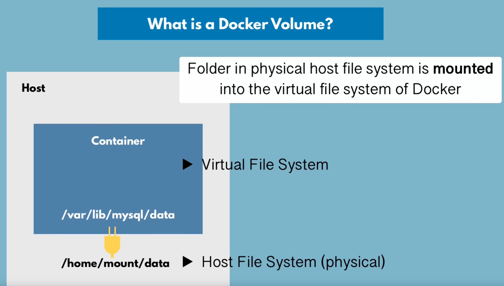
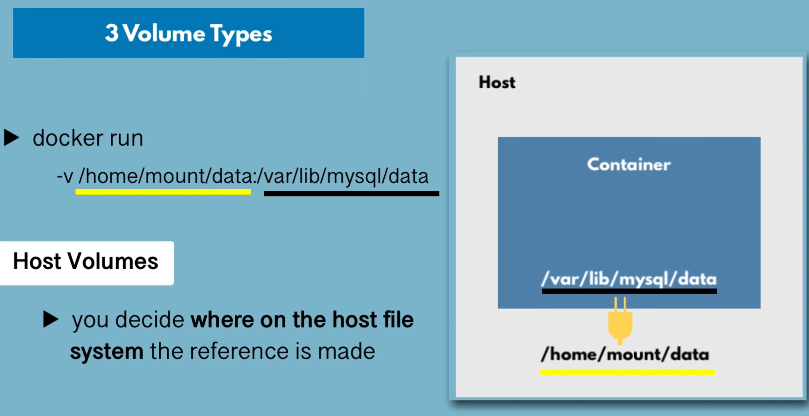
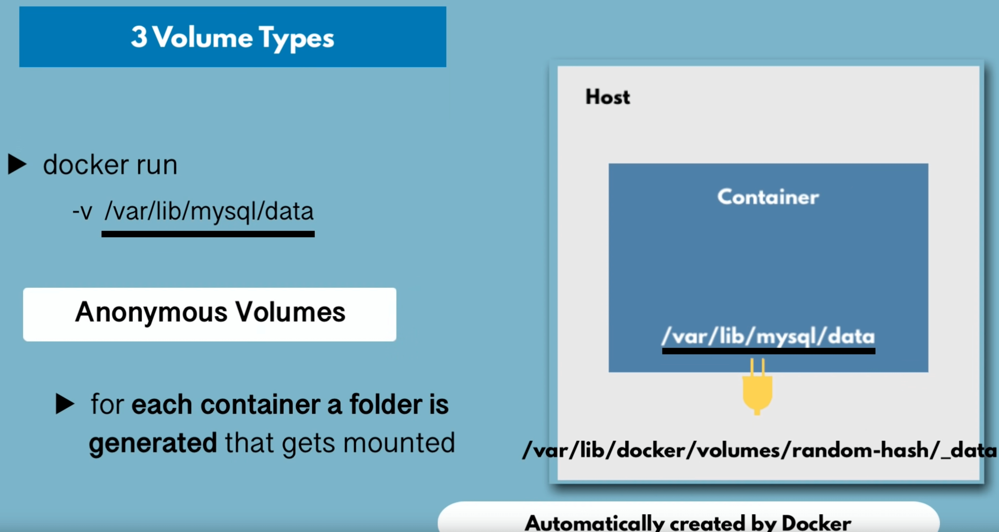
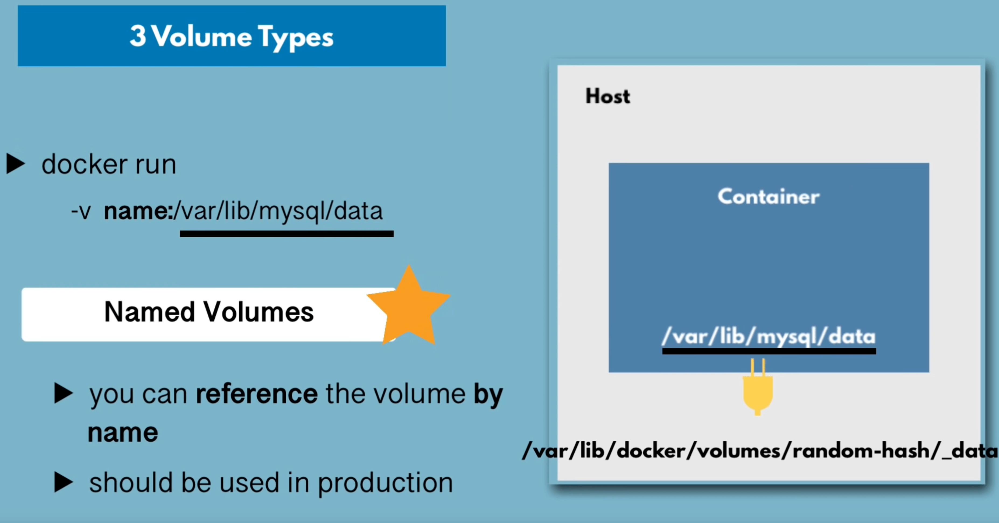
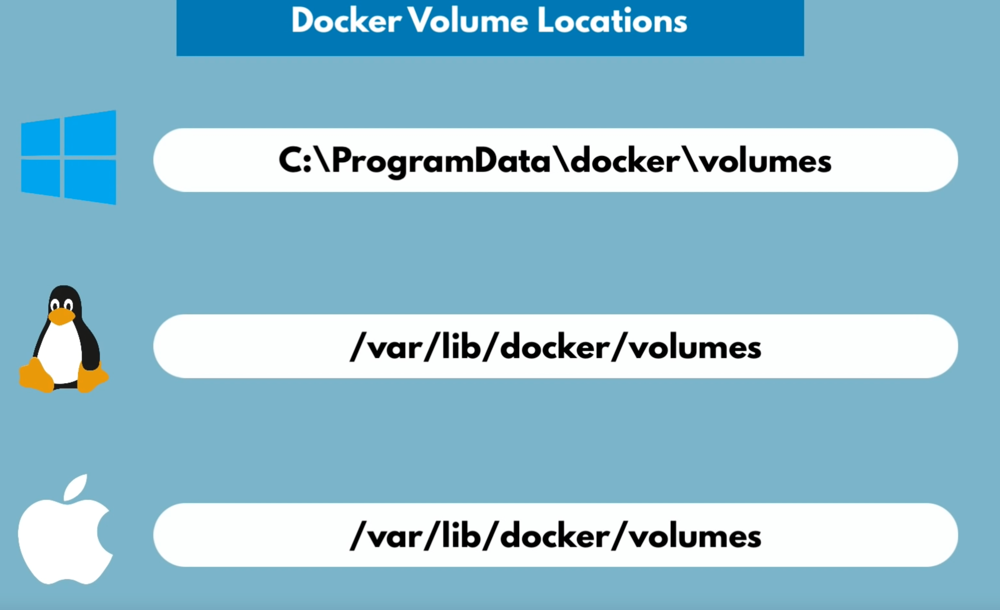

# 🗄 Docker Volumes



Volumes are the preferred mechanism for persisting data generated by and used by Docker containers.

We need to find the dir where stores important data and mount it to folder outside container.\
for mysql default folder is `/var/lib/mysql`

All data replicated. Container will use data from host when starts. Container will save updated data to host.

## Volume types

### Host Volumes

```bash
docker run -v /home/dir/dir/data:/var/lib/mysql
```



### Anonymous Volumes

```bash
docker run -v /var/lib/mysql
```



### Named Volumes

```bash
docker run -v mysql-storage:/var/lib/mysql
```



## In Compose

```yaml
mongodb:
    image: mysql
    volumes:
      - mysql-storage:/var/lib/mysql
volumes:
    mysql-storage:
        driver: local
```

## Volume Location



! on mac data stores on linux VM machine

```bash
# it could be smthg like
screen ~/Library/Containers/com.docker.docker/Data/com.docker.driver.amd64-1inux/tty
# and there is linux filesystem will be /var/lib/docker/volumes
```
