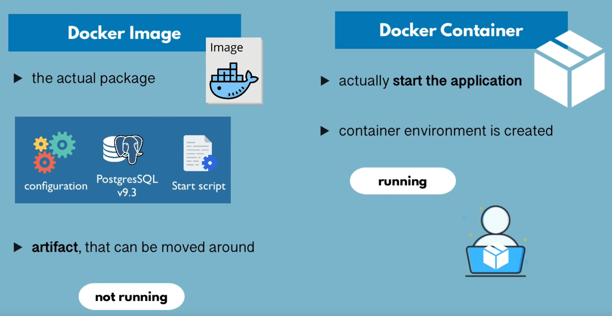
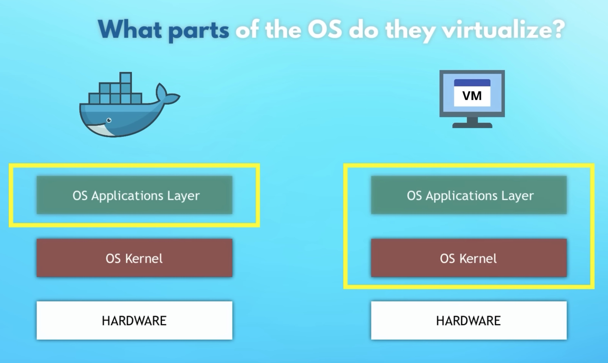

# 🐋 Docker

A technology that provides virtualisation of isolated and independent containers on a single operating system.

#### links

- docker registry- [https://hub.docker.com/](https://hub.docker.com)
- [web-sandbox](https://labs.play-with-docker.com)
- [guide(ru)](https://my-js.org/docs/guide/docker/) 
- [basics (ru)](https://doka.guide/tools/docker/)

## Theory

### Therms



images and layers
- **Dockerfile** - set of instructions to build Image from layers. Each instruction creates a layer in the final image.
- Container **Image** - already builded artefact (collection of docker layers)
  includes all necessary information to run a software, including code, runtime, libraries, env vars, config files
- **Registry** - image storage
- **Docker Compose** - orchestration tool

containers and environment
- **Container** - instance of Container Image
- Container **environment** - context and settings in which a containerised application runs
- **Isolated Docker Network** - network for containers
  containers cloud communicate using container name instead ip:port connections. It automatically used in docker-compose

### Namespaces

Namespaces limiting what containers can see and access.  Containers create namespaces that the particular container will use and have multiple namespaces that present different information about the OS. 

- **MNT** namespace limits the mounted file systems a container can use
- **USER** namespace is used to isolate users in each container

### Control groups

Also called **cgroups**. Linux kernel feature that isolates, prioritizes, and calculates the resource usage (CPU, memory, disk I/O, network, etc.) of a set of processes. 

Control groups can also impose strict limits on usage, ensure that containers use only the resources they need and, if necessary, set limits on the resources a container can use.

### Isolated Union file system

Isolated Union file systems used in containers are stackable. This system helps avoid duplication of data every time you deploy a new container.

### Layers

Container consist of layers

* linux base image
* application image

if smthg changes - inside container will be updated/changed only image layers with changes

### Docker on macOS

Docker requires a Linux kernel to work, and on macOS using a lightweight virtual machine.

- Docker daemon (`dockerd`) runs inside VM. It manages images, containers, networks, and volumes.
- Docker desktop needs to create socket `~/.docker/docker.sock` for communication with docker daemon.
- hypervisor (either Apple’s Hypervisor.framework or qemu) runs the VM that contains the Docker daemon and containers
- Docker images and containers are stored inside the VM, they are managed through the Docker CLI.
- Docker volumes can be mapped to directories on macOS host using the `-v` or `--mount` options in Docker commands.

## Commands

#### links:

- https://docs.docker.com/reference/cli/docker/

`open -a Docker` for Docker Desktop on macOS

### Basics and examples

```bash
# start/stop container
docker stop <the-container-id>
docker start <the-container-id>

# get logs from container (if container runs in -d mode for example)
docker logs 87sd7v8sd7f8

#stop and delete container
docker stop <the-container-id>
docker rm <the-container-id>

# check docker network
docker network ls

# exec smthg inside container
docker exec -it 87sd7v8sd7f8 /bin/bash

# only create not run container with unique ID and a name
docker container create hello-world
# => 5a30b370e9dfc147f5438380d60ff4b1c43869a752f2ef481b6cf0adb33dae83

# run created container
docker container start c6c7b4c22dfa

# list all include stopped (alias to docker ps)
docker ls -a
# only running
docker ls
# show size
docker ls -s -a
# filter
docker ps --filter status=running

docker ps -a --format "table {{.Names}}\\t{{.Command}}" --last 1

# interact with running container
docker container exec 9faa5154097e ls

# stop
docker container stop 9faa5154097e

# rm
docker container rm 9faa5154097e # or docker rm
```

### run

flags

```bash
# docker run [OPTIONS] IMAGE [COMMAND] [ARG...]

# -d detached(background) mode 
# -p 80:80 binds port 80 of the host to port 80 in the container
docker run -d -p 80:80 docker/getting-started

# --interactive, --tty creating an interactive shell
docker run -i -t ubuntu bash

# --detach, -p bind port, Assign a name to the container
docker run -d -p 3000:3000 --name myapp-new redis:4.0

# mongo example
docker run -d \
    -p 27017:27017 \
    -e MONGO_INITDB_ROOT_USERNAME=admin \
    -e MONGO_INITDB_ROOT_PASSWORD=password \
    --name mongodb \
    --net mongo-network \
    mongo
    
# one more example
docker run -d \
    -p 3000:3000 \
    --name ci-cd-app \
    --net ci-cd-test-project_default \
    ci-cd-app:1.0
```

### Image operations

#### pull

process

- Docker requests the metadata (manifests) of the specified image. 
- identifies the layers
- Each layer is then downloaded individually (in parallel).
	- If any layer already exists on the local machine, it will be skipped. 
- Each downloaded layer is stored in Docker's local storage.
  The storage location depends on the storage driver being used. with the `overlay2` driver layers are stored under `/var/lib/docker/overlay2/`.
- Once all layers are downloaded and stored, Docker assembles them into a complete image

```bash
# docker pull [OPTIONS] NAME[:TAG|@DIGEST]
docker pull nginx:1.23

# docker images [OPTIONS] [REPOSITORY[:TAG]]
docker images
docker images --format='{{.Repository}}\t{{.Tag}}\t{{.Size}}' | head -4

# delete
docker image rm <image-id>

# -t name the image . look for the Dockerfile in the current directory
docker build -t my-app:1.0 .

# example when file not in root folder
docker build --file build/Dockerfile --tag ci-cd-test-app:1.0  .
# dont forget "." in the end!

# get detailed image info
docker inspect ff095b82
docker inspect ubuntu:v1 --format='{{json .Config}}'
```

### inspect

syntax
`docker inspect <container-id or container-name>`

output - JSON object containing:

- **Configuration:** image, command, entry point, environment, variables, exposed ports
- **Network settings:** IP address, port mapping, attached networks
- **Volume mounts**
- **Environment variables**
- **Runtime information:** status, start time, resource usage

### Registry

```bash
docker login --username johndoe --password mypassword

docker pull hello-world

docker tag hello-world:latest johndoe/hello-world:v1.0

docker push johndoe/hello-world:v1.0

docker pull docker.io/johndoe/hello-world:v1.0
```

## Network

Allows containers to communicate with each other and external resources through the network. It works with the help of network drivers.

Usage of host network provides performance benefits and easier port mapping, it also poses security risks as the container has unrestricted access to the host network.

```shell
# create network
docker network create mynetwork

# run postgres
docker run \
-d --network=mynetwork --name mydb -e \
  POSTGRES_PASSWORD=mysecretpassword postgres

# Start a web application that connects to the PostgreSQL
docker run \
-d --network=mynetwork --name myapp -e DATABASE_HOST=mydb \
  -e DATABASE_PASSWORD=mysecretpassword myapp-image

# connect container to existing network
docker network connect mynetwork nginx-container

# use host network directly
docker run --net=host -d --name nginx-host-container nginx
```

### Drivers

- `bridge` - default. [Bridge networks](https://docs.docker.com/network/bridge/) are isolated from the Docker host. Typically used when applications run in standalone containers and communicate on the same host\
  `docker network create <network-name>`
- `host`: A [host networks](https://docs.docker.com/network/host/) is used for standalone containers. It removes network isolation between the container and the Docker host to use the host’s networking configurations directly, container doesn't get its own IP address.\
  Offers better performance when making a large number of requests with different ports. It doesn't require NAT(Network address translation) which saves time.
  Docker automatically creates a host network and you can't create more.
- `overlay`: [Overlay networks](https://docs.docker.com/network/overlay/) connect multiple Docker daemons and enable swarm services to communicate with each other. You can also use overlay networks to facilitate communication between a swarm service and a standalone container, or between two standalone containers on different Docker daemons. This strategy removes the need to do OS-level routing between containers.\
  Useful when you want containers on different hosts to communicate with one another. Docker manages to route itself and provides secure communication between containers when encryption is enabled.
  `docker network create -d overlay --attachable <network-name>`
- ipvlan
- macvlan

### Inspecting

`docker network inspect <network-name>`

```json
[
    {
        "Name": "hs-bridge",
        "Id": "ac6211a0597ae3da32fbba251b1a141df3bf88b8e2a31afdf8ea3a84b56659fb",
        "Created": "2022-11-03T15:55:46.780000757Z",
        "Scope": "local",
        "Driver": "bridge",
        "EnableIPv6": false,
        "IPAM": {
            "Driver": "default",
            "Options": {},
            "Config": [
                {
                    "Subnet": "172.19.0.0/16",
                    "Gateway": "172.19.0.1"
                }
            ]
        },
        "Internal": false,
        "Attachable": false,
        "Ingress": false,
        "ConfigFrom": {
            "Network": ""
        },
        "ConfigOnly": false,
        "Containers": {
    "dfeffe32841f8a630095a9701581ff791302f1cf0533131fbd8464b7344c622c": {
        "Name": "hs-ubuntu",
        "EndpointID": "6f1a9ced6bb3c10f232d86b7081e759b9658b478ba68d45c66547f9eade5d9f2",
        "MacAddress": "02:42:ac:13:00:02",
        "IPv4Address": "172.19.0.2/16",
        "IPv6Address": ""
    },
        "Options": {},
        "Labels": {}
    }
]
```

 - IPAM(IP Address Management). 
   includes subnet and default gateway. In this case, based on the values of subnet the containers will receive IP addresses in the range of 172.19.0.2 - 172.19.255.254
 

### Commands
  
```bash
# check avaliable
docker network ls

# create new network
docker network create mongo-network

# create container and specify network
docker create --name hs-ubuntu-v1 --network hs-bridge ubuntu:v1

# run container and specify network
docker run -d -it --name hs-ubuntu-v2 --network hs-bridge ubuntu:v1

# attach an already-running container to a network
docker network connect <network-name> <container-name>

# disconnect
docker network disconnect <network-name> <container-name>

# list containers with network info
docker ps -a --format '{{ .ID }} {{ .Names }} {{ json .Networks }}'
```

### Docker on remote pc

```bash
# connect, login, delete existed, run new in background (example from gitlab ci)
script:
    - ssh -o StrictHostKeyChecking=no -i $SSH_KEY root@138.68.92.11 "
        docker login -u $DOCKER_USER -p $DOCKER_PASSWORD &&
        docker ps -aq | xargs docker stop | xargs docker rm && 
        docker run -d -p 5000:5000 $IMAGE_NAME:$IMAGE_TAG " 
```

## Container orchestration

Orchestration is the automated configuration, management, and coordination of computer systems, applications, and services.

Container orchestration automates the deployment, management, scaling, and networking of containers.

- Docker Compose
	- Primarily designed for running multi-container applications on a **single host**. It simplifies the process of defining and running applications with multiple containers using a simple YAML file.

- Kubernetes
	-  A robust orchestration platform that manages containers across **multiple nodes**(servers). It is suitable for large-scale applications and can handle complex deployments.


## Helpers

### run as non-root

- https://docs.docker.com/engine/install/linux-postinstall/#manage-docker-as-a-non-root-user

```bash
sudo groupadd docker
sudo usermod -aG docker $USER
```

## VM vs Docker

### virtual machine

**virtual machine** is an emulation of another computer within a real computer, it runs a virtual instance of a computer in the hardware decoupled layer. Virtualization of the physical resources of the machine is performed by a software called _hypervisor_ that creates, hosts, and runs virtual machines.

### docker



Docker virtualised only application layer on top of current OS. To improve compatibility most of docker images based on linux kernel. 
- Docker Desktop uses a Hypervisor layer with lightweight Linux distro (provides Linux Kernel for macOS and Windows)