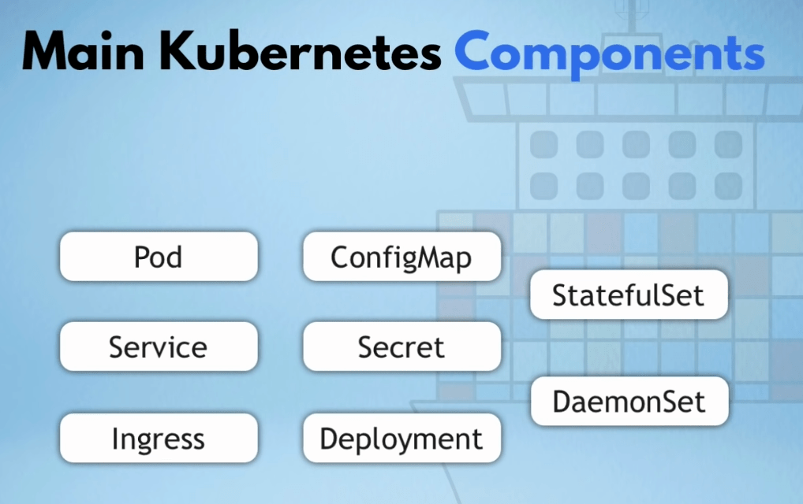
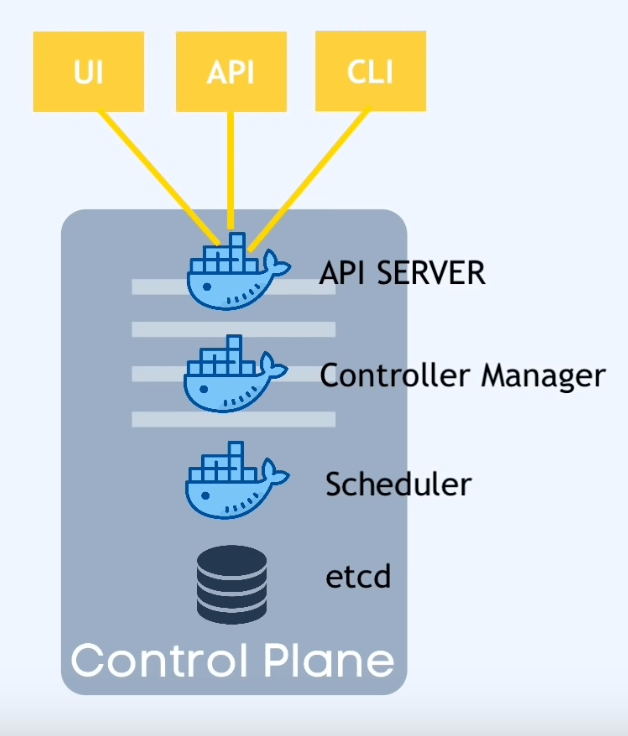
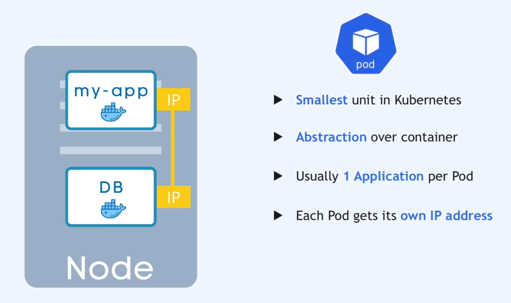
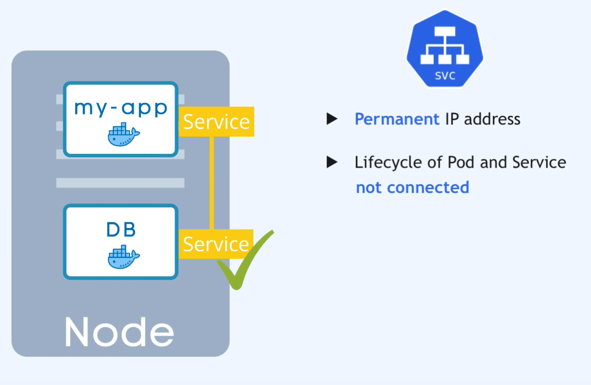
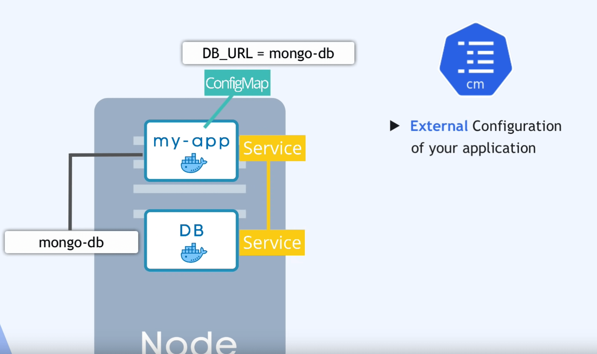
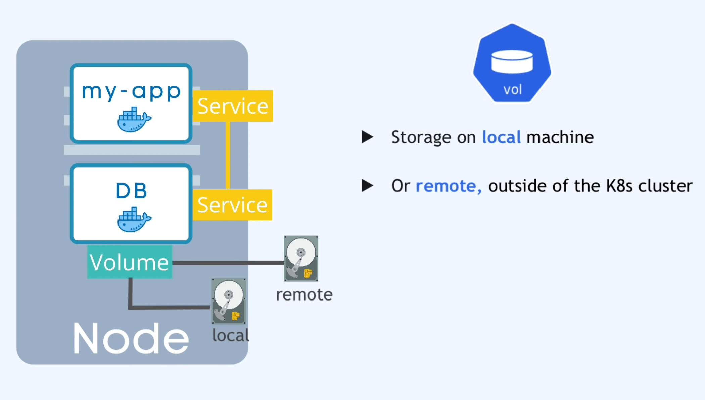
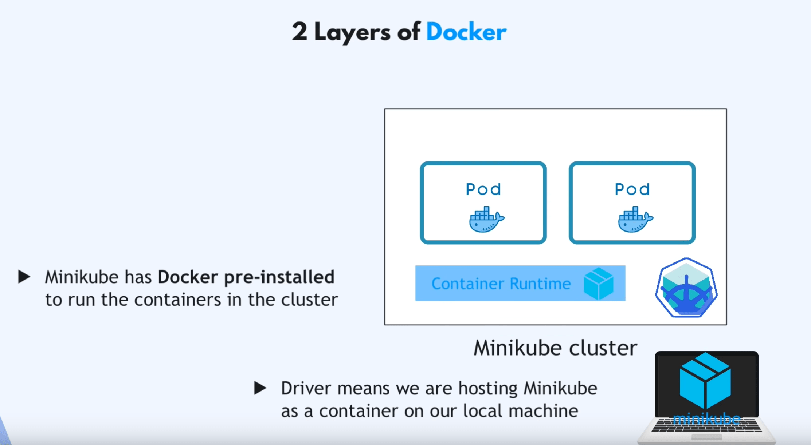
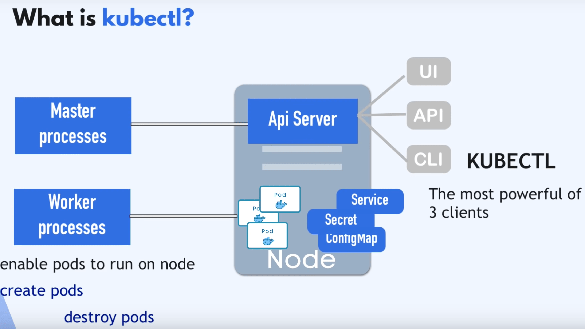
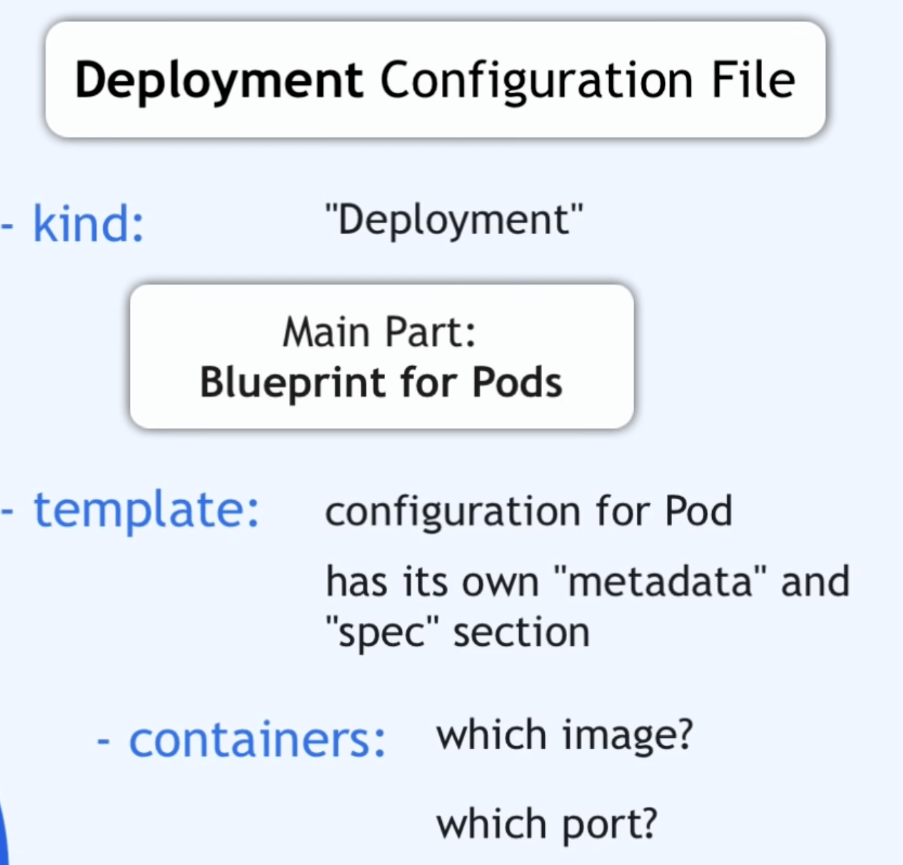
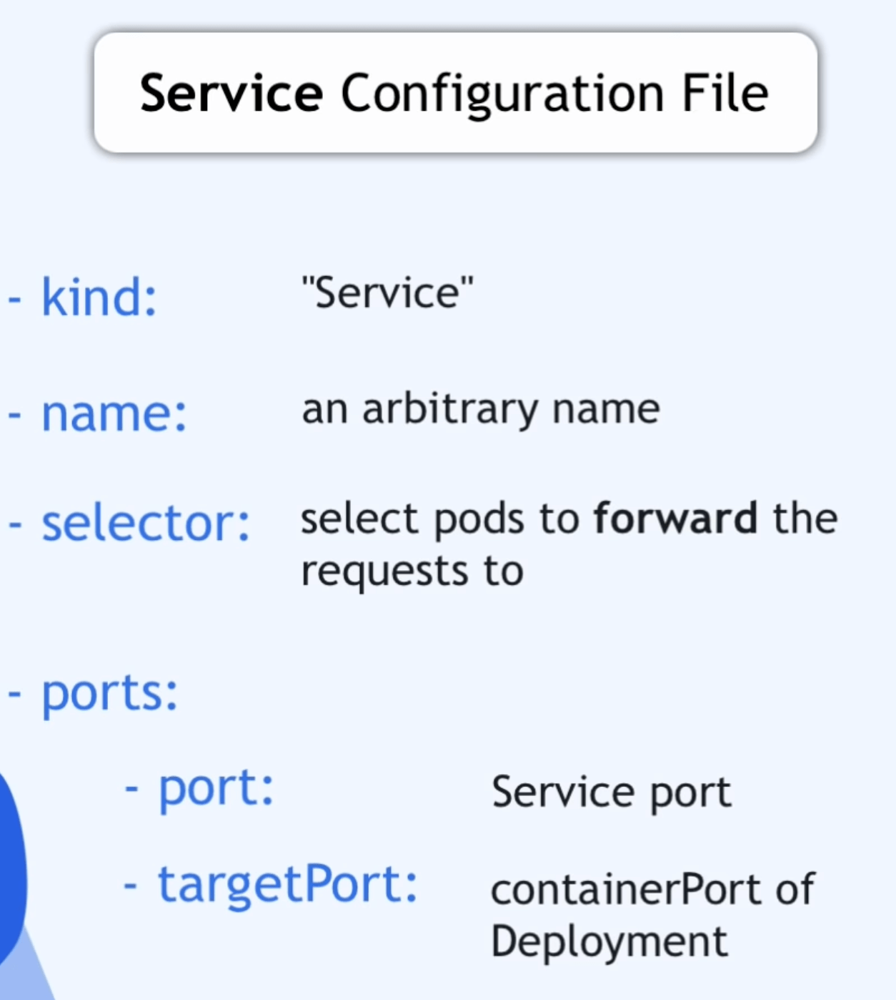

# ⚙️ Kubernetes

Also known as k8s, is an open-source system for automating deployment, scaling, and management of containerized applications.

### Managed Kubernetes

Managed Kubernetes environment where cloud provider is responsible for managing the control plane, which includes the Kubernetes API server, scheduler, and controller manager.

- Google Kubernetes Engine (GKE)
- AWS Fargate
- Amazon Elastic Container Service for Kubernetes (EKS)
- Azure Kubernetes Service (AKS)
- IBM Cloud Kubernetes Service

## Components



* Node or "Worker Node" - virtual or physical machine
* Master Node - Main Node for cluster
* Pod - abstraction over container. Usually 1 Pod = 1 App
* Service - static address for Pod (not connected with Pod lifecycle)
* Ingress - routs traffic to k8s cluster and sends to services inside k8s
* ConfigMap - keeps external config of application. could keep env. vars
* Secret - same as config map, encoded in base64 + should be secure encoded
* Volume - storage for data local (inside Node) or remote
* Deployment - 'blueprint' for Pods configuration
* StatefulSet 'sts' - component for stateful apps or DB
* DaemonSet

## Architecture

K8s cluster contains of:

* At least one **Master Node** (virtual or physical machine)
* Multiple **Worker Nodes** with **kubelet** process ("node agent") on it.

**kubelet** - allows running application processes and communicate

**Apps** are running on Worker Nodes.

### Master Node

On Master Node are running **Main k8s Processes** to run and manage cluster. Better to use multiple.

#### Master Node Processes



* API Server entrypoint to cluster
  * Access through **UI/API/CLI**
* Controller Manager
  * Monitoring what's going on in cluster
* Scheduler
  * controls the placement of the pods depending on the load
* etcd
  * key-value storage\
    storing info and configs. etcd snapshots are using for backup
  * makes snapshots for recovering proccees

### Pod



### Service

Could be internal or external.

Has permanent ip address and works as load balancer if there is more than one Pod



### Config Map and Secrets



### Volume



Stores data. Could be local or remote

### Virtual Network

Virtual Network provides connection between nodes. "Creates one unified machine". Each Pod get internal IP address. If Pod will be restarted - IP will be chanegd.

## Configutation

Consist of

* metadata
* specification
* status (gets from **etcd**)

File format - .yaml, .json

#### example

`controllers/nginx-deployment.yaml`

```yaml
apiVersion: apps/v1
kind: Deployment
metadata:
  name: nginx-deployment
  labels:
    app: nginx
spec:
  replicas: 3
  selector:
    matchLabels:
      app: nginx
  template:
    metadata:
      labels:
        app: nginx
    spec:
      containers:
      - name: nginx
        image: nginx:1.14.2
        ports:
        - containerPort: 80
```


## Tools and Apps

### minikube

 tool for running and testing k8s locally

- https://github.com/kubernetes/minikube




Master node processes and Node processes inside one Virtual Node on your machine.

minikube works as container (docker, etc) or as virtual machine (virtualbox, etc)

is mainly used to start/delete a local cluster. all other interactions take place via kubectl

#### commands

```bash
# start and define driver
minikube start --driver docker
# check current status
minikube status
```

### **kubectl**



**kubectl** - Kubernetes command-line tool. to have CLI access to cluster API Server, autoinstalled with minikube

#### commands

```bash
# get active nodes
kubectl get node
# get created pods
kubectl get pod
# get pods, deployments, services
kubectl get all
```

### configuration

#### ConfigMap file

doc - [https://kubernetes.io/docs/concepts/configuration/configmap](https://kubernetes.io/docs/concepts/configuration/configmap/)

/mongo-config.yaml

```yaml
apiVersion: v1
kind: ConfigMap
metadata:
  name: mongo-config
data:
  mongo-url: mongo-service
```

#### Secret file

doc - [https://kubernetes.io/docs/concepts/configuration/secret](https://kubernetes.io/docs/concepts/configuration/secret)

/mongo-secret.yaml

```bash
# create example user and encode to base64
echo -n mongouser | base64
echo -n mongopassword | base64
```

```yaml
apiVersion: v1
kind: Secret
metadata:
  name: mongo-secret
type: Opaque
data:
  mongo-user: bW9uZ291c2Vy
  mongo-password: bW9uZ29wYXNzd29yZA==
```

### Deployment & Service file



doc - [https://kubernetes.io/docs/concepts/workloads/controllers/deployment](https://kubernetes.io/docs/concepts/workloads/controllers/deployment/)

/mongo.yaml

deployment part

```yaml
apiVersion: apps/v1
kind: Deployment
metadata:
  name: mongo-deployment
  labels:
    app: mongo
spec:
  replicas: 1
  selector:
    matchLabels:
      app: mongo
  template:
    metadata:
      labels:
        app: mongo
    spec:
      containers:
      - name: mongodb
        image: mongo:5.0
        ports:
        - containerPort: 27017
---
apiVersion: v1
kind: Service
metadata:
  name: mongo-service
spec:
  selector:
    app.kubernetes.io/name: mongo
  ports:
    - protocol: TCP
      port: 8080
      targetPort: 27017
```

service part^



doc - [https://kubernetes.io/docs/concepts/services-networking/service/](https://kubernetes.io/docs/concepts/services-networking/service/)
