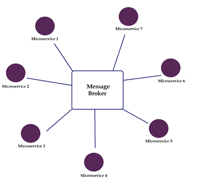
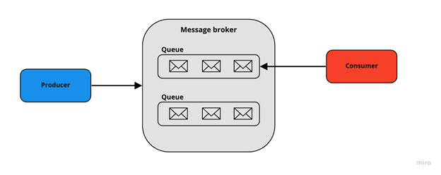
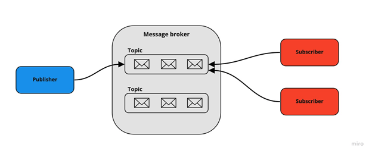

# 🐇 Message Brokers

links

[https://hasithas.medium.com/introduction-to-message-brokers-c4177d2a9fe3](https://hasithas.medium.com/introduction-to-message-brokers-c4177d2a9fe3)

Message queue stores messages in the exact order they are received and sends to the receiver in the same order. If somehow a message was unable to be delivered (problem with the network) the message will be rescheduled for later in the queue. Also in a message queue, messages are stored in the exact order in which they were transmitted and remain in the queue until receipt is confirmed.

Using a message broker is an optimal solution where when there are **time and resource consuming tasks** and when the **response of a request is not required immediately**.

### Components of a message broker

Now let’s look into the basic components of a message broker:

**Producer** –This component is responsible for sending messages. It’s connected to the message broker. In publish/subscribe pattern (We have discussed in the below section) they are called publishers.

**Consumer** — This component consumes messages in the message broker. In publish/subscribe pattern they are called subscribers.

**Queue/topic** — Message broker store messages here.

### Point-to-Point 

* message queues have a one-to-one relationship with the message’s sender (Producer) and receiver (Consumer).
* Each message in the queue is only sent to one recipient and is received only once.
* Optimal for financial transaction processing since payment needs to be done only once

### Publish-Subscribe 

* This message model is also known as “pub/sub”.
* In this model, message queues have a one-to-many relationship with the message sender and receiver. Also, the sender is known as the publisher and the receiver is known as the subscribe.
* According to this model, a sender publishes messages on a topic. These messages are distributed among all the consumers that have subscribed to the topic.
* This model can be used for a system where data should be shared among several parties constantly.

### advantages of using 

**Message delivery is guaranteed —** Even though the consumer was not active or offline the message will deliver when active.

**System performance is increased with asynchronous processing —** Processes that take a long time can be processed separately and therefore the main thread of the application will not be affected.

**Applications to communicate with each other, even if they are implemented in different programming languages —** (Ex: SOAP, REST API, IoT devices etc).

### drawbacks of using 

**Learning curve —** There are several messaging brokers and design patterns you can use them with. You need to know the differences and which one to use. Not to mention the configuration process of setting up message brokers.

**Debugging —** With system complexity, increased debugging can be hard.

**Complexity —** Having a message broker definitely adds a whole new component to the system architecture.
