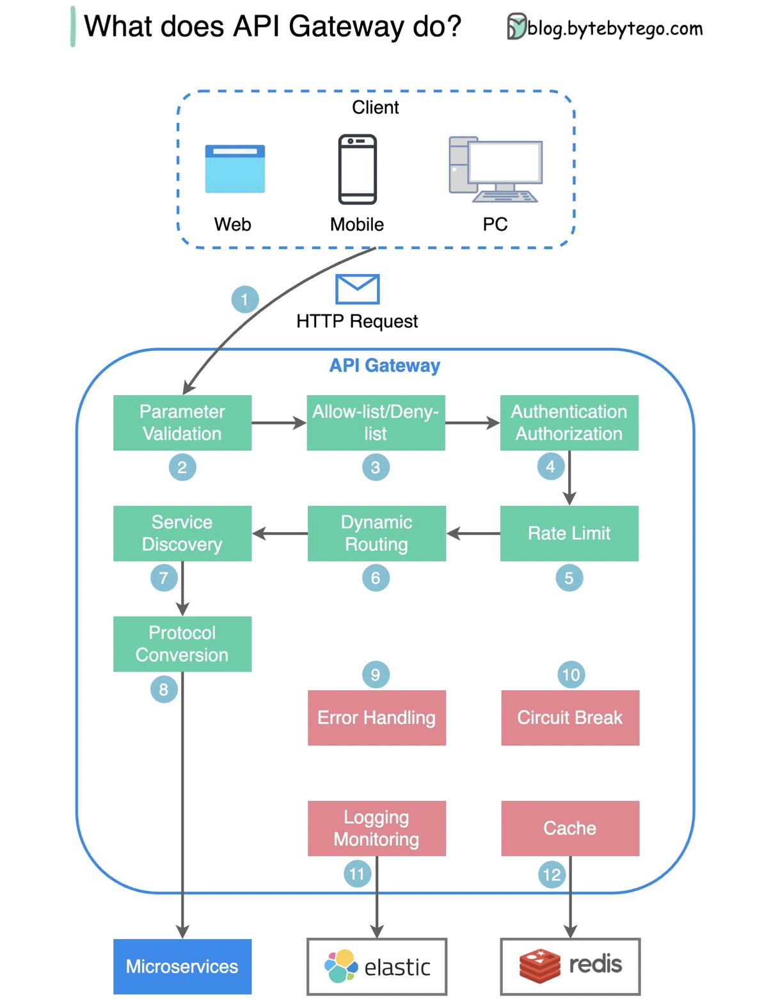

# 🛤️ API Gateway

### About

An API Gateway is a software layer that acts as a single point of entry into a system, sitting between the application user and a collection of backend services.

It receives requests from an application user, routes the request to the appropriate services, gathers the appropriate data, and combines the results for the user in a single package. This setup simplifies and standardizes how applications and users can access data, business logic, or functionality from backend services. It also enhances security by protecting against threats such as Denial of Service (DoS) attacks and offers API usage monitoring.

### Schema

### Open source gateways

* [KrakenD](https://www.krakend.io/)
* [Kong API Gateway](https://konghq.com/learning-center/api-gateway/what-is-an-api-gateway)
