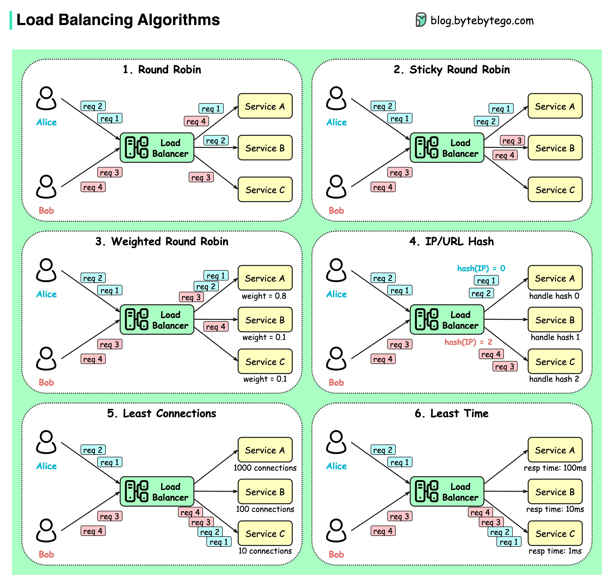

# ⚖️ Load Balancers

### About

Load balancing is a critical component of modern IT infrastructure, enabling the distribution of workloads across multiple computing resources to ensure efficient and reliable service delivery.

load-balancers-1

### Workload Distribution

* **Host-based**: Distributes requests based on the requested hostname.
* **Path-based**: Uses the entire URL to distribute requests.
* **Content-based**: Inspects the message content of a request for distribution based on content, such as the value of a parameter [1](https://simplicable.com/new/load-balancing).

### Layers

* **Network-layer (Layer 4)**: Operates at the networking transport layer, performing routing based on networking information like IP addresses.
* **Application-layer (Layer 7)**: Operates at the application layer, reading requests in their entirety to perform content-based routing

### Types of Load Balancers

* **Application Layer Load Balancers**: Operate at the highest layer of the network stack, inspecting the content of incoming traffic for intelligent decisions.
* **Transport Layer Load Balancers**: Make routing decisions based on information in the network transport layer protocols.
* **Network Layer Load Balancers**: Use network-level information, such as IP addresses, to distribute traffic.
* **Multi-cloud Load Balancers**: Operate across different cloud platforms, managing and balancing traffic across multiple cloud environments

### Popular Open-Source Load Balancers

* **HAProxy**: A TCP and HTTP load balancer with features like load balancing algorithms, health checks, SSL termination.
* **NGINX**: Initially a web server, now also functions as a reverse proxy and load balancer, offering advanced load balancing capabilities.
* **Envoy**: A modern, high-performance edge and service proxy with advanced load balancing, observability, and dynamic configuration capabilities.
* **Traefik**: A cloud-native reverse proxy and load balancer built for modern containerized environments, offering automatic service discovery and dynamic configuration .

## load-balancing algorithms

