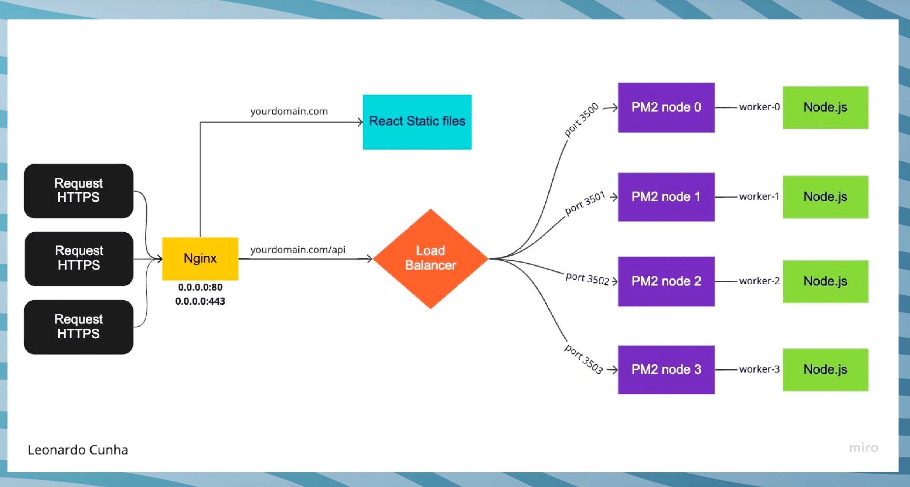

# 🟩 NGINX

#### links

[_https://www.youtube.com/watch?v=PAEDJrGJyaY_](https://www.youtube.com/watch?v=PAEDJrGJyaY)

### Base info

_nginx_ \[engine x] is an HTTP and reverse proxy server, a mail proxy server, and a generic TCP/UDP proxy server.

Initially a web server, now also functions as a reverse proxy and load balancer

It listens :80 and :443 ports on host machine and redirects http requests to sertan applications (ports) on machine

