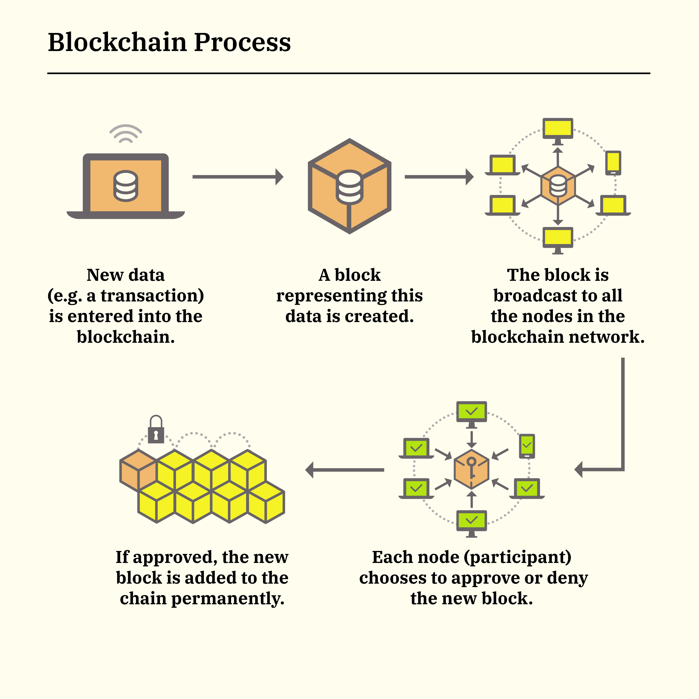

# 🧊 Blockchain

## What

Blockchain is a distributed ledger technology that maintains a secure, immutable record of transactions across a network of computers. It is decentralized, meaning no single entity controls the entire network. Each block in the chain contains a number of transactions, and every time a new transaction occurs on the blockchain, a record of that transaction is added to every participant's ledger.

Key benefits of blockchain include:

* **Enhanced Security**: Transactions are encrypted and linked to the previous transaction, with data distributed across a network, making it difficult to hack.
* **Transparency**: All network participants with authorized access can view the same transaction data, which is immutable and time-stamped.
* **Cost Reduction**: By streamlining processes, blockchain reduces the need for middlemen, paperwork, and errors, cutting overhead and transaction costs.
* **Traceability**: Each transaction on a blockchain can be easily traced, providing an audit trail that documents the history of an asset.
* **Smart Contracts**: These self-executing contracts with the terms directly written into code can automate transactions and increase efficiency.

## How

Creating a new transaction in a blockchain involves several steps:

1. **Transaction Creation**: Construct a transaction with details like sender's address, recipient's address, and the amount to be transferred.
2. **Signing**: Sign the transaction using the sender's private key, confirming the transaction's authenticity.
3. **Broadcasting**: Broadcast the signed transaction to the network.
4. **Validation**: Validate the transaction by checking the digital signature and ensuring the sender has enough balance.
5. **Block Creation**: Collect valid transactions into a new block.
6. **Block Propagation**: Broadcast the new block to the network.
7. **Chain Addition**: Add the new block to the existing blockchain.
8. **Finalization**: Confirm the transaction after a certain number of blocks have been added after the block containing the transaction.
