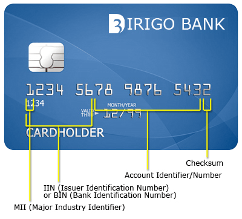
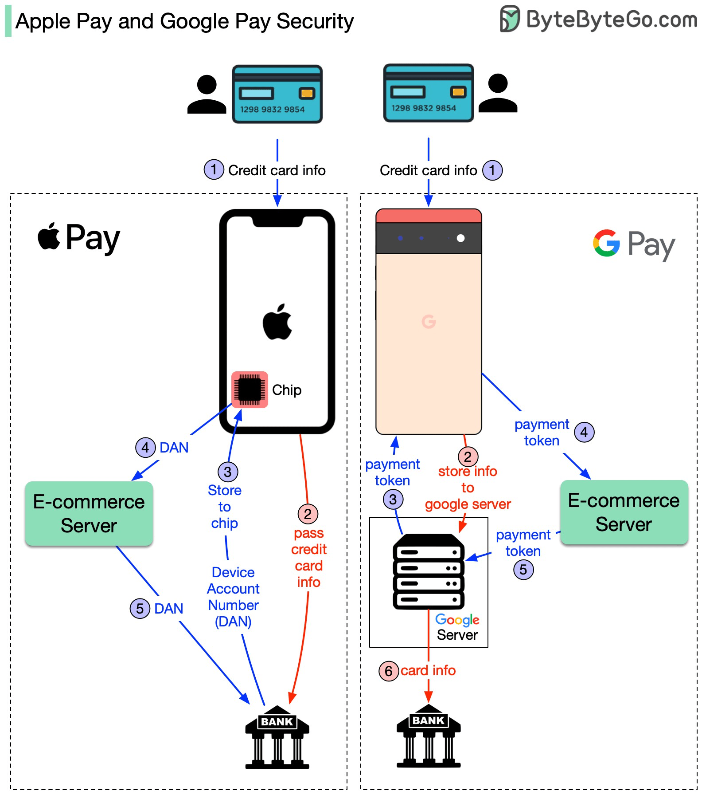

# 💳 Card Payments

### Terms

#### General

**POS** - Point-of-Sale Terminal aka Merchant Terminal

Acquiring Bank (**Acquirer**) - bank that processes card payments on behalf of a merchant

**Issuing Bank** ("Emitent" - RU) - bank that offers payment cards directly to consumers

#### Cards

**MII** - major industry identifier (2 - MIR, 3 - American Express, 4 - Visa, 5 -  MasterCard, 6 UnionPay)

**BIN** - Bank Identification Number - the first four to six numbers that appear on payment cards, or Issuer Identification Number (**IIN**)

**PAN** - Primary Account Number - Card Number

**CVV/CVC** - Card Verification Value/Code

**PCI DSS** -  Payment Card Industry Data Security Standard

#### Online Card Payments

**CNP** - Card Not Present

CNP Types:

* **CIT** - Customer Initiated Transaction
* **MIT** - Merchant Initiated Transaction
* **COF** - Card On File

**3DS** - 3 Domain Server

**PSP** - Payment System Platform (Stripe)

**MCC** - Merchant Category Code

**DAN** - Digital Account Number

**TSP** - Token Service Provider

### Card Data

* First digit is the major industry identifier (MII)
* A six or eight-digit Issuer Identification Number (IIN/BIN)
* A variable length (up to 12 digits) individual account identifier/number
* Last one number - a checksum, which is a key that shows whether a credit card is valid or not

### Payment: Payment stages

* 🕙 Authorization (Merchant => Bank Acquirer => Payment System => Issuing bank)
* 📄 Sending for clearing (capture, presentment, clear) (Merchant => Bank Acquirer => Payment System => Issuing bank)
* ❌ Cancellations (Merchant => Bank Acquirer => Payment System => Issuing bank)
* 🤑 Refunds (User request => Merchant => Bank Acquirer => Payment System => Issuing bank)
* 🕵️‍♂️ Chargeback (User request => Issuing bank => Payment System => Bank Acquirer)

### Online Payments

Payments type:

* CIT - triggered by Customer
* MIT - triggered by Merchant
* Recurrent Payment - triggered by Merchant, based on previous payments
* COF - could be triggered by Merchant or Customer, using already saved to service card data (without CVV)

PCI-DSS Compliance rules include:

1. Maintain secure network and system.
2. Protect cardholder data.
3. Maintain vulnerability management program.
4. Implement strong access control measures.
5. Regularly monitor and test networks.
6. Maintain information security policies.

3DS involves three parties: the Acquirer Domain, the Issuer Domain, and the Interoperability Domain

MCC - four-digit number that classifies the type of goods or services a business offers

Tokenization - when used Digital Account Number instead of Primary Account Number.

#### Apple Pay Payment

Apple Pay Card (DAN) => POS => Bank Merchant => Payment System => Token Service Provirder (PAN) => Payment System => Bank Issuer

### How do Apple Pay and Google Pay handle sensitive card info

ref - https://twitter.com/alexxubyte/status/1572614943811440642
