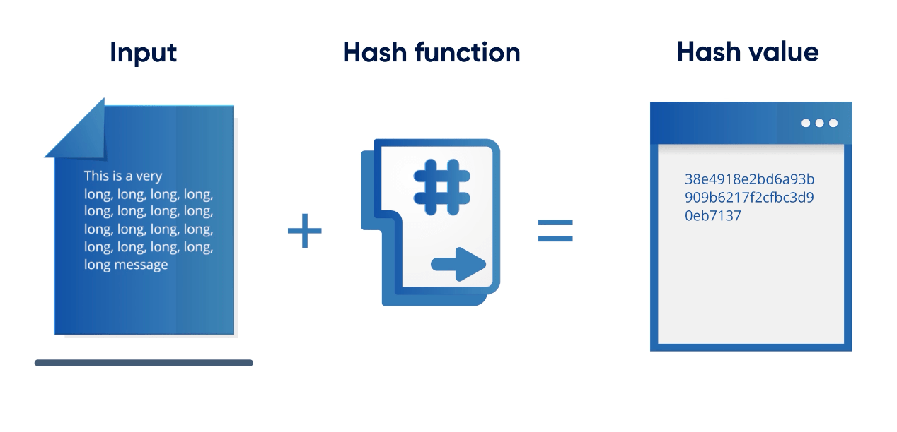
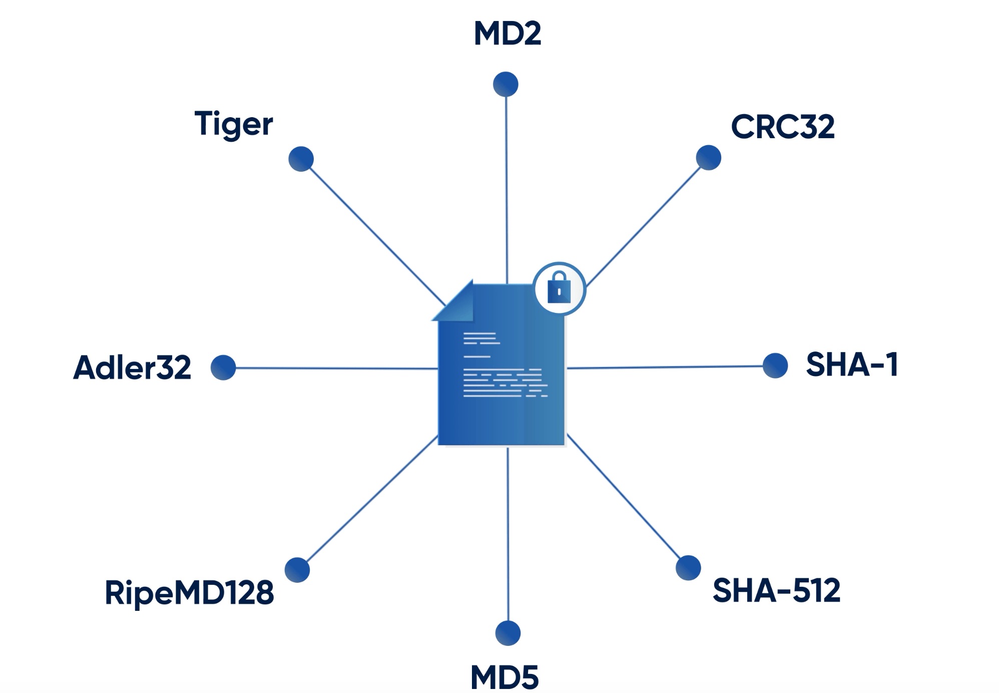

# 🏦 Hash

What is Hashing

#### links

https://www.freecodecamp.org/news/what-is-hashing
https://www.youtube.com/watch?v=2BldESGZKB8
https://www.youtube.com/watch?v=jmtzX-NPFDc

## Hashing

Hashing is the use of mathematical transformations to convert variable-sized input data into fixed-sized output data, called a **hash value** or hash code.

## Hash Function

Expected properties of hash function:
- **Efficiency**: An efficient hash function should perform data processing quickly, optimizing computational resources for actual applications.
- **Determinism** means the function will result in the same output for a particular input no matter when and how often it's applied.
- **Uniformity**: The hash values should be uniformly distributed, meaning the inputs should map evenly among possible hash values.

example

if we want to store and check user passwords
1. save hash to DB\
   plaintext pass + hash function = password hash
2. check pass on login\
   compare new generated password hash and already stored password hash

### Salting

To avoid same hash for same data inputs we can add random keyword to input to make it unique

### Peppering

We can add same keyword to input value to make in changed

### Hash tables

Fast and convenient data structures that use hashing

Hash tables have to support 3 functions:
* insert (key, value)
* get (key)
* delete (key)
## Algoritms

## SHA-1

It is a string of 40 hexadecimal characters (0-9 and a-f) and is computed from the contents of a file or directory structure. The SHA-1 hash looks something like this: `24b9da6552252987aa493b52f8696cd6d3b00373`

