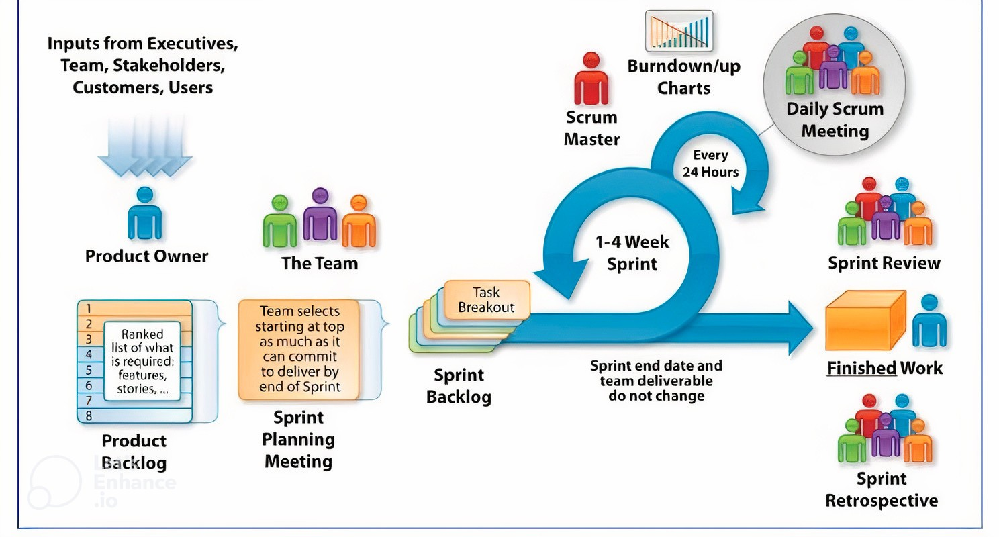

# 😖 Scrum framework

#### links

- scrumguides.org/scrum-guide.html
- scrum.org/resources/scrum-glossary
- https://www.youtube.com/watch?v=MvqnTuEqr-k

## Scrum Process

1. A **Product Owner** orders the work for a complex problem into a **Product Backlog**.
2. The **Scrum Team** turns a selection of the work into an **Increment** of value during a **Sprint**.
3. The **Scrum Team** and its **stakeholders** **inspect** the results and **adjust** for the next Sprint.
4. _Repeat_

### Scrum Theory

Scrum combines four formal events for inspection and adaptation within a containing event, the Sprint. These events work because they implement the empirical Scrum pillars of transparency, inspection, and adaptation.

#### Transparency

The emergent process and work must be visible to those performing the work as well as those receiving the work.

Transparency enables inspection. Inspection without transparency is misleading and wasteful.

#### Inspection

The Scrum artifacts and the progress toward agreed goals must be inspected frequently and diligently to detect potentially undesirable variances or problems.

Inspection enables adaptation. Inspection without adaptation is considered pointless. Scrum events are designed to provoke change.

#### Adaptation

If any aspects of a process deviate outside acceptable limits or if the resulting product is unacceptable, the process being applied or the materials being produced must be adjusted. The adjustment must be made as soon as possible to minimize further deviation.

## Scrum Team

The fundamental unit of Scrum is a small team of people, a Scrum Team. The Scrum Team consists of **one Scrum Master**, **one Product Owner**, and **Developers**. Within a Scrum Team, there are no sub-teams or hierarchies. It is a cohesive unit of professionals focused on one objective at a time, the **Product Goal**.

### Developers 

Developers are the people in the Scrum Team that are committed to creating any aspect of a usable Increment each Sprint.

* Creating a plan for the Sprint, the Sprint Backlog;
* Instilling quality by adhering to a Definition of Done;
* Adapting their plan each day toward the Sprint Goal; and,
* Holding each other accountable as professionals.

### Product Owner 
The Product Owner is accountable for maximizing the value of the product resulting from the work of the Scrum Team. Owns product Vision.

The Product Owner is also accountable for effective Product Backlog management, which includes:

* Developing and explicitly communicating the Product Goal;
* Creating and clearly communicating Product Backlog items;
* Ordering Product Backlog items;
* Ensuring that the Product Backlog is transparent, visible and understood.

### Scrum Master 

The Scrum Master helping everyone understand Scrum theory and practice, both within the Scrum Team and the organization. The Scrum Master is accountable for the Scrum Team’s **effectiveness**.

The Scrum Master serves the **Scrum Team** in several ways, including:

* Coaching the team members in self-management and cross-functionality;
* Helping the Scrum Team focus on creating high-value Increments that meet the Definition of Done;
* Causing the removal of impediments to the Scrum Team’s progress; and,
* Ensuring that all Scrum events take place and are positive, productive, and kept within the timebox.

The Scrum Master serves the **Product Owner** in several ways, including:

* Helping find techniques for effective Product Goal definition and Product Backlog management;
* Helping the Scrum Team understand the need for clear and concise Product Backlog items;
* Helping establish empirical product planning for a complex environment; and,
* Facilitating stakeholder collaboration as requested or needed.

## Sprint (Scrum Events) 

The Sprint is a container for all other events. Each event in Scrum is a formal opportunity to inspect and adapt Scrum artifacts. These events are specifically designed to enable the transparency required. Events are used in Scrum to create regularity and to minimize the need for meetings not defined in Scrum.

### Sprint

Sprints are fixed length events of one month or less to create consistency. A new Sprint starts immediately after the conclusion of the previous Sprint.

During the Sprint:

* No changes are made that would endanger the Sprint Goal;
* Quality does not decrease;
* The Product Backlog is refined as needed;
* Scope may be clarified and renegotiated with the Product Owner as more is learned.

Sprints enable predictability by ensuring inspection and adaptation of progress toward a Product Goal at least every calendar month.

A Sprint could be cancelled if the Sprint Goal becomes obsolete. Only the Product Owner has the authority to cancel the Sprint.

### Sprint Planning 

The Product Owner ensures that attendees are prepared to discuss the most important Product Backlog items and how they map to the Product Goal. The Scrum Team may also invite other people to attend Sprint Planning to provide advice.

**Topic One: Why is this Sprint valuable?**

The Product Owner proposes how the product could increase its value and utility in the current Sprint. The whole Scrum Team then collaborates to define a Sprint Goal that communicates why the Sprint is valuable to stakeholders.

**Topic Two: What can be Done this Sprint?**

Through discussion with the Product Owner, the Developers select items from the Product Backlog to include in the current Sprint. The Scrum Team may refine these items during this process, which increases understanding and confidence.

**Topic Three: How will the chosen work get done?**

For each selected Product Backlog item, the Developers plan the work necessary to create an Increment that meets the Definition of Done. This is often done by decomposing Product Backlog items into smaller work items of one day or less. How this is done is at the sole discretion of the Developers.

### Daily Scrum 

"What did I do, what will I do, what are the difficulties?"

The purpose of the Daily Scrum is to inspect progress toward the Sprint Goal and adapt the Sprint Backlog as necessary, adjusting the upcoming planned work.

The Daily Scrum is a 15-minute event for the Developers of the Scrum Team. To reduce complexity, it is held at the same time and place every working day of the Sprint.

### Sprint Review (Demo) 

The purpose of the Sprint Review is to inspect the outcome of the Sprint and determine future adaptations. The Scrum Team presents the results of their work to key stakeholders and progress toward the Product Goal is discussed.

During the event, the Scrum Team and stakeholders review what was accomplished in the Sprint and what has changed in their environment. Based on this information, attendees collaborate on what to do next. The Product Backlog may also be adjusted to meet new opportunities. The Sprint Review is a working session and the Scrum Team should avoid limiting it to a presentation.

### Sprint Retrospective 

The purpose of the Sprint Retrospective is to plan ways to increase quality and effectiveness.

The Scrum Team inspects how the last Sprint went with regards to individuals, interactions, processes, tools, and their Definition of Done. Inspected elements often vary with the domain of work. Assumptions that led them astray are identified and their origins explored. The Scrum Team discusses what went well during the Sprint, what problems it encountered, and how those problems were (or were not) solved.

The Scrum Team identifies the most helpful changes to improve its effectiveness. The most impactful improvements are addressed as soon as possible. They may even be added to the Sprint Backlog for the next Sprint.

## Scrum Artifacts 

Scrum’s artifacts represent work or value. They are designed to maximize transparency of key information. Thus, everyone inspecting them has the same basis for adaptation.

Each artifact contains a commitment to ensure it provides information that enhances transparency and focus against which progress can be measured:

* For the Product Backlog it is the Product Goal.
* For the Sprint Backlog it is the Sprint Goal.
* For the Increment it is the Definition of Done.

### Product Backlog 

The Product Backlog is an emergent, ordered list of what is needed to improve the product. It is the single source of work undertaken by the Scrum Team.

Headed by the Product Owner.

Product Backlog items that can be Done by the Scrum Team within one Sprint are deemed ready for selection in a Sprint Planning event. They usually acquire this degree of transparency after refining activities.

#### Product Backlog refinement

Is the act of breaking down and further defining Product Backlog items into smaller more precise items. This is an ongoing activity to add details, such as a description, order, and size.

**Commitment: Product Goal**

The Product Goal describes a future state of the product which can serve as a target for the Scrum Team to plan against. The Product Goal is in the Product Backlog. The rest of the Product Backlog emerges to define “what” will fulfill the Product Goal.

### Sprint Backlog 

The Sprint Backlog is composed of the Sprint Goal (why), the set of Product Backlog items selected for the Sprint (what), as well as an actionable plan for delivering the Increment (how).

It is a highly visible, real-time picture of the work that the Developers plan to accomplish during the Sprint in order to achieve the Sprint Goal. Consequently, the Sprint Backlog is updated throughout the Sprint as more is learned. It should have enough detail that they can inspect their progress in the Daily Scrum.

Sprint items could be sorted by status on **Kanban** board during the Sprint.

**Commitment: Sprint Goal**

The Sprint Goal is the single objective for the Sprint.

The Sprint Goal is created during the Sprint Planning event and then added to the Sprint Backlog.  If the work turns out to be different than they expected, they collaborate with the Product Owner to negotiate the scope of the Sprint Backlog within the Sprint without affecting the Sprint Goal.

### Increment

An Increment is a concrete stepping stone toward the Product Goal. Each Increment is additive to all prior Increments and thoroughly verified, ensuring that all Increments work together. In order to provide value, the Increment must be usable.

Work cannot be considered part of an Increment unless it meets the Definition of Done.

**Commitment: Definition of Done**

The Definition of Done is a formal description of the state of the Increment when it meets the quality measures required for the product.

The moment a Product Backlog item meets the Definition of Done, an Increment is born.

The Definition of Done creates transparency by providing everyone a shared understanding of what work was completed as part of the Increment. If a Product Backlog item does not meet the Definition of Done, it cannot be released or even presented at the Sprint Review. Instead, it returns to the Product Backlog for future consideration.
