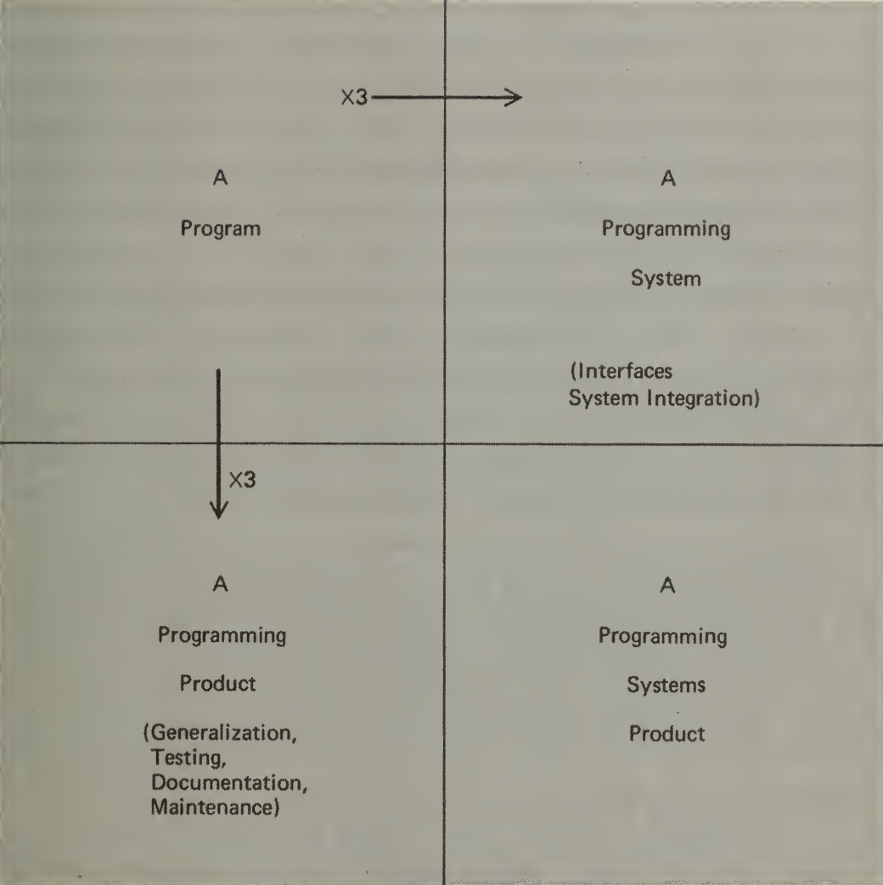
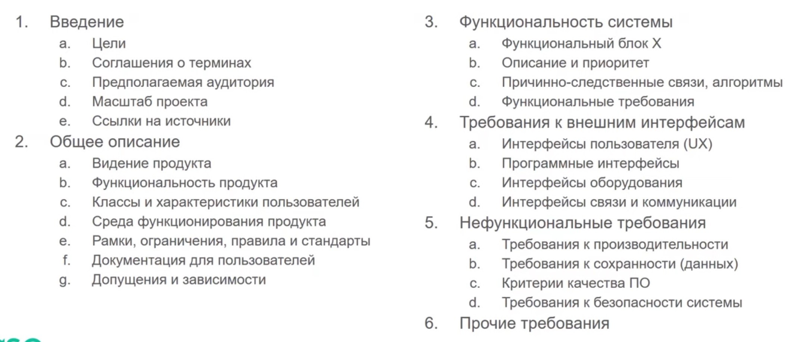
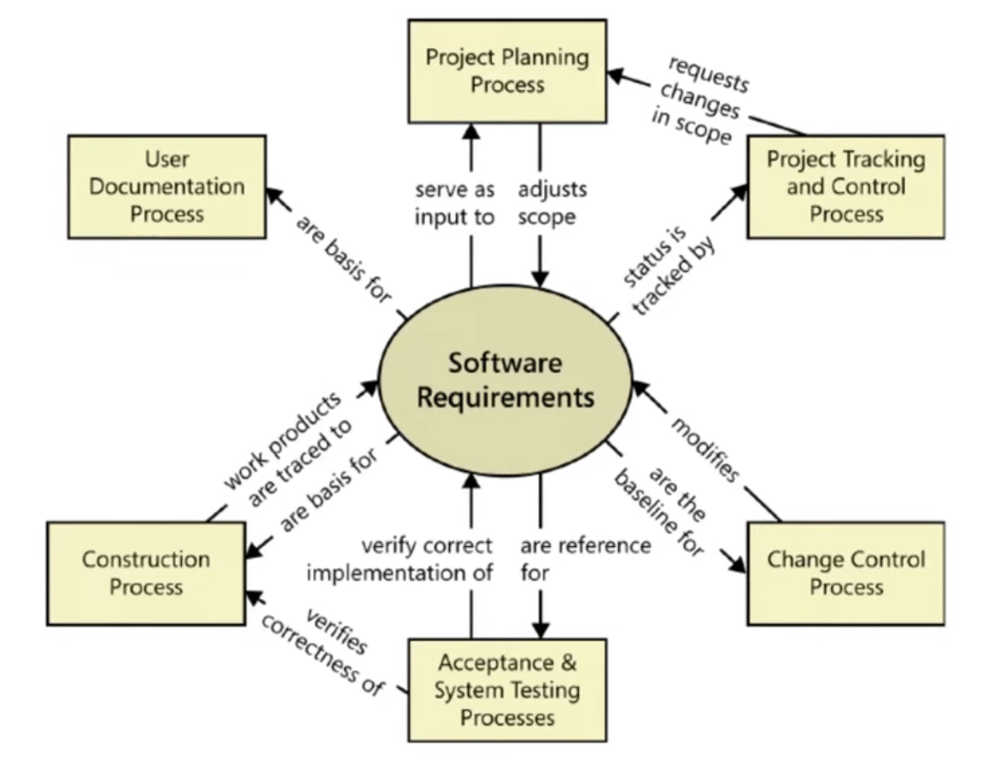
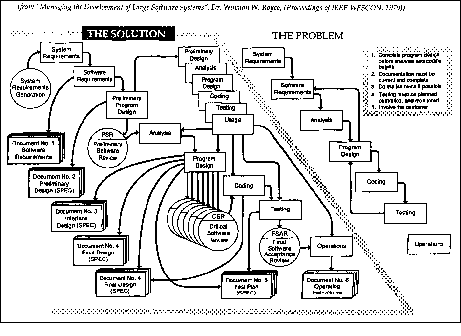
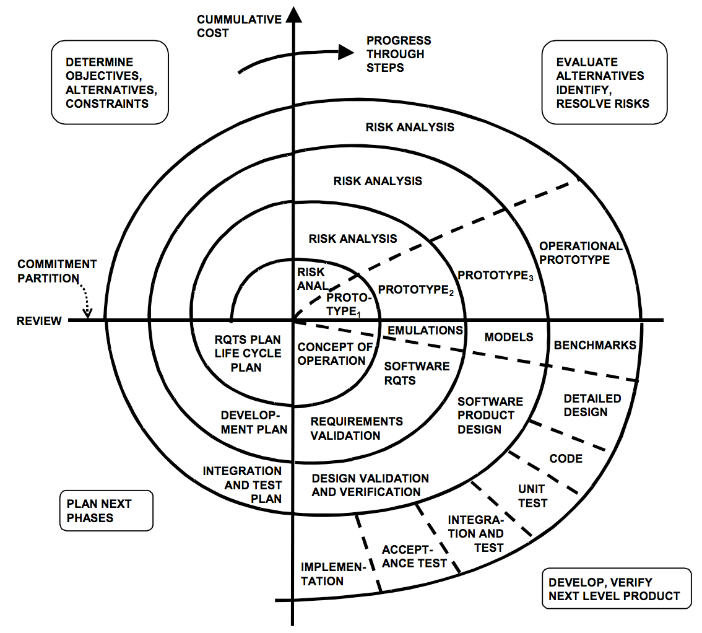
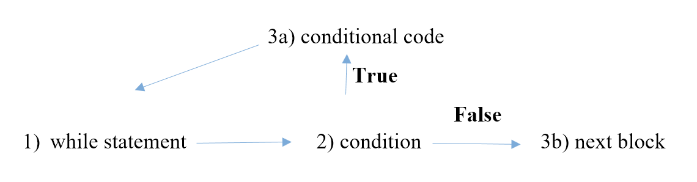
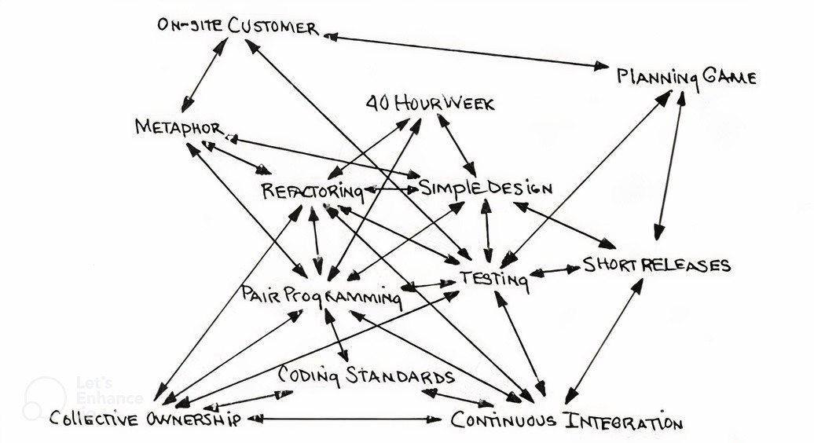
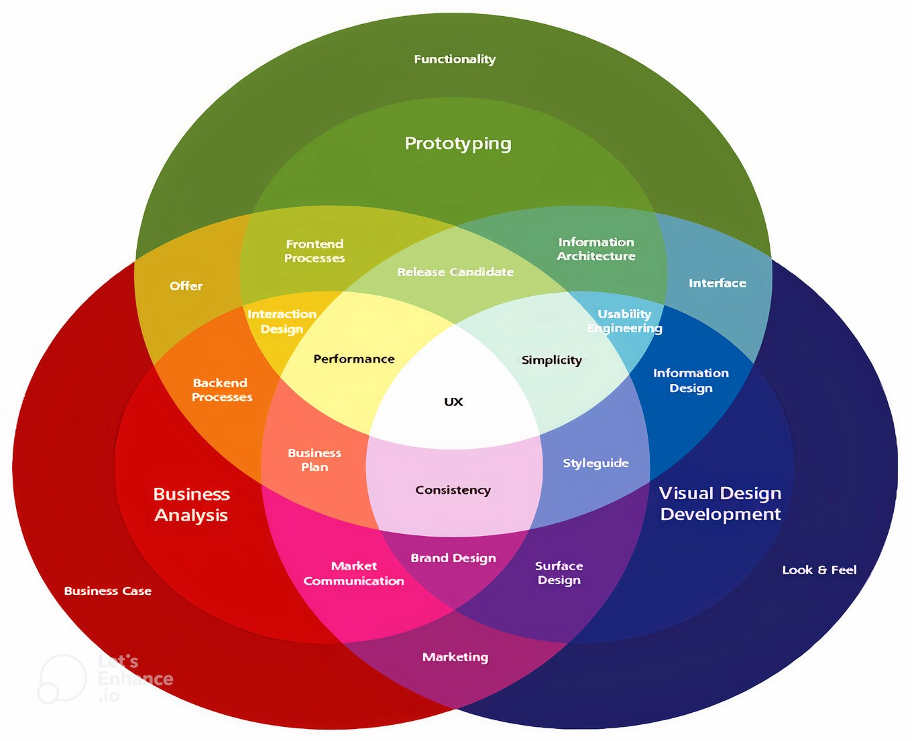
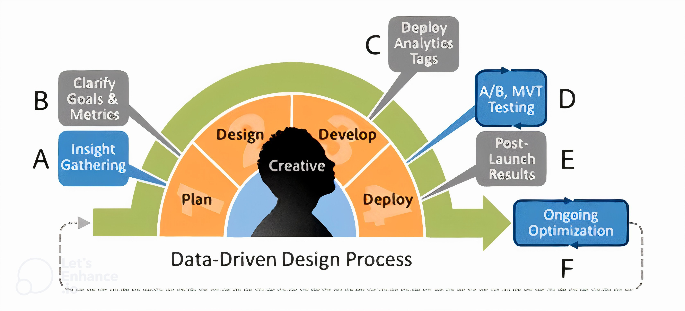

# 👯 Software Engineering

What is Program And what is Product

If we're talking about the final product (for the business, for the customer), it's much more than just code or application components. And it takes a lot more time.

Frederick P. Brooks suggested that it would take 3 times as long as the program itself. But that was in 1975...

Evolution of the programming systems product

### src

- lecture - youtube.com/playlist?list=PLlb7e2G7aSpSidTs7HuqUX\_NeslBsg2Mb

## Requirements to requirements

- Singularity (1 req = one piece of text)
- Completeness (req is final)
- Consistency (1 req can’t be against 2 req)
- Atomicity (req can’t be divided)
- Traceability (by whom, for what)
- Relevance (we need it)
- Feasibility (We can do it)
- Unambiguity (only one meaning)
- Mandatory (why we need it, if no?)
- Verifiability (we can see, measure changes)

## Requirements analysis

- Feasibility analysis of requirements
- Prioritization of requirements
- Requirements planing
- Creating a dictionary of terms
- Creating a context diagram
- Creation of user interface and technical prototypes

## Project components

### Components

- Money
- Time
- People
- Features
- Quality

### Priority

- Must
- Want
- Skip

## Product specification

## Processes

### RFI RFP RFQ

RFI (Request for Information)
- **Purpose:** The RFI is an initial exploratory document sent out to potential vendors or service providers to gather information about their capabilities, experience, products, and services.
- **When to Use:** This stage is used when the project requirements are not fully defined, and you need more information to understand what solutions are available in the market.
- **Content:** The RFI typically includes a set of questions focused on understanding the vendor's experience, technology, capabilities, and possible solutions they might offer.
- **Outcome:** The responses to an RFI help narrow down the list of vendors who are capable of meeting the project's needs and guide the development of more detailed project requirements.

RFP (Request for Proposal)
- **Purpose:** The RFP is a more detailed document that invites vendors to propose specific solutions or services in response to a well-defined set of requirements.
- **When to Use:** This stage is used when the project requirements are clear, and you are ready to evaluate specific solutions or proposals from vendors.
- **Content:** The RFP typically includes detailed information about the project, the scope of work, deliverables, timelines, and evaluation criteria. Vendors are expected to submit comprehensive proposals that outline how they would approach the project, including technical details, methodologies, timelines, and pricing.
- **Outcome:** The responses to an RFP are evaluated based on predefined criteria, and a shortlist of vendors is usually created. This stage often involves negotiations and discussions to refine the proposals before making a final selection.

RFQ (Request for Quotation)
- **Purpose:** The RFQ is focused on obtaining detailed pricing information from vendors for specific products or services. It is usually more transactional than the RFP.
- **When to Use:** This stage is used when the project requirements are fully defined, and you need to get precise cost estimates from vendors.
- **Content:** The RFQ includes detailed specifications of the goods or services required, and vendors are expected to provide itemized quotes or bids.
- **Outcome:** The responses to an RFQ are compared primarily based on price, although factors like delivery time and terms of service may also be considered. The vendor with the best combination of cost and terms is usually selected.

RFIs (Request for Information Supplement)
- **Purpose:** Sometimes, after receiving an RFI or RFP response, an organization may issue an RFI Supplement to clarify or request additional details from vendors.
- **When to Use:** This stage is used when initial responses are incomplete or when the organization needs further details to make a more informed decision.
- **Outcome:** The additional information helps the organization finalize its vendor shortlist or refine project requirements.

### Discovery

Main objectives are to understand the problem or opportunity, define the project’s goals, gather detailed requirements, identify constraints and risks, and explore feasible solutions.

Key Activities
1. **Stakeholder Engagement:** Conduct interviews and workshops to gather input.
2. **Requirement Analysis:** Document and prioritize functional and non-functional requirements.
3. **Current State Assessment:** Analyze existing systems and processes.
4. **Solution Exploration:** Evaluate potential technologies and approaches.
5. **Risk Assessment:** Identify and assess project risks.
6. **Documentation:** Compile findings into a discovery report.
7. **Review and Approval:** Present findings to stakeholders for feedback and approval.
### Development

## SDLC Methodology

SDLC - Software development life cycle.

### Waterfall model

### Spiral model

### Agile Methodology

- link - [https://agilemanifesto.org/](https://agilemanifesto.org/)

#### Manifesto for Agile Software Development

* Individuals and interactions over processes and tools
* Working software over comprehensive documentation
* Customer collaboration over contract negotiation
* Responding to change over following a plan

#### 12 Principles

* Our highest priority is to satisfy the customer through early and continuous delivery of valuable software.
* Welcome changing requirements, even late in development. Agile processes harness change for the customer's competitive advantage.
* Deliver working software frequently, from a couple of weeks to a couple of months, with a preference to the shorter timescale.
* Business people and developers must work together daily throughout the project.
* Build projects around motivated individuals. Give them the environment and support they need, and trust them to get the job done.
* The most efficient and effective method of conveying information to and within a development team is face-to-face conversation.
* Working software is the primary measure of progress.
* Agile processes promote sustainable development. The sponsors, developers, and users should be able to maintain a constant pace indefinitely.
* Continuous attention to technical excellence and good design enhances agility.
* Simplicity--the art of maximizing the amount of work not done--is essential.
* The best architectures, requirements, and designs emerge from self-organizing teams.
* At regular intervals, the team reflects on how to become more effective, then tunes and adjusts its behavior accordingly.

### XP - Extreme Programming

link - [http://www.extremeprogramming.org](http://www.extremeprogramming.org/)

#### Rules

link - [http://www.extremeprogramming.org/rules.html](http://www.extremeprogramming.org/rules.html)

#### Main practices of XP

## Therms

### Bus Factor

Bus factor refers to the number of key people on a team who, if they were suddenly hit by a metaphorical bus, would significantly impact the team's ability to function or complete a project.

1 person-  is critical. need more knowledge sharing

2 and more people - more confident

## UI/UX

## Design Strategy

### User-Centered Design (UCD)

User-based design

UCD  is an iterative design process where designers focus on the users and their needs throughout the design process. It involves users through research, requirement definition, design creation, and evaluation. The UCD process is guided by principles such as focusing on the people, solving the right problem, recognizing everything as a system, and not rushing to a solution.

#### Template

_For (**target users**) who wants (**needs**) (**Product X**) is a (**product category**) that have (**one key advantage**). Unlike main competitors - (**Products A, B, C**) our (**Product X**) can do (**unique difference**)._

#### Decision making

Could be based on need of typical users types & typical user groups. We can create a virtual person representing a user group, write their main user stories and main anti-stories.

### Activity-centered design (ACD)

User-based design

* focus on the actions that are taken to solve the problem
* there may be many users
* users may not know what they want
* people adapt well to technology

### Data-driven design

Data-based design

Can be used to improve an existing product

[https://designlab.com/blog/what-is-data-driven-design](https://designlab.com/blog/what-is-data-driven-design)

## Product Discovery

### A/B Testing

Experiment to check user statistic in group A with half of users (current flow with no changes) and group B with second half (new flow that expects to increase some metrics).

## Architectural patterns

### Three-tier architecture

Client-server software architecture approach performing as a relation between three logical components where each has its role.

Tiers
- presentation
- application
- data access.

It's a high-level architecture pattern that focuses on the overall structure of the application.

### MVC (Model-View-Controller)

MVC is an architectural pattern separating an application into three logical components
- Model is responsible for all data and its related logic;
- View is responsible for presenting data to users or handling user interaction;
- Controller informs the Model of the need for changes.

### MVP (Model-View-Presenter)

tbd

### MVVM (Model-View-ViewModel)

tbd
