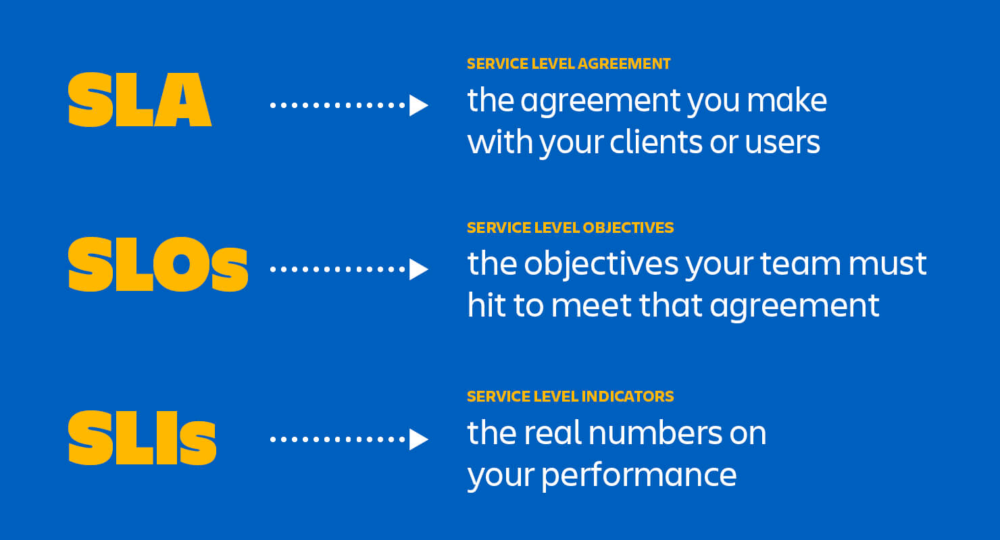
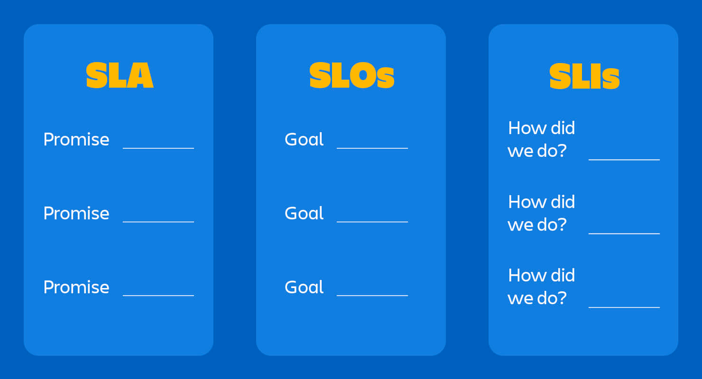

# 🔧 SRE and SLA

Site Reliability Engineering

### Culture

Product Results/Metrics

Incremental Product updates

Automatisation

### Tech

Monitoring/Alerting

Implementing Best Practice

### Organisation

In team - Anyone can do Anything (+knowledge sharing)

## SLA

An SLA (service level agreement) is an agreement between provider and client about measurable metrics like uptime, responsiveness, and responsibilities.

## SLO

Service Level Objectives - is an agreement within an SLA about a specific metric like uptime or response time.

## SLI

Service Level Indicator - measures compliance with an SLO.

