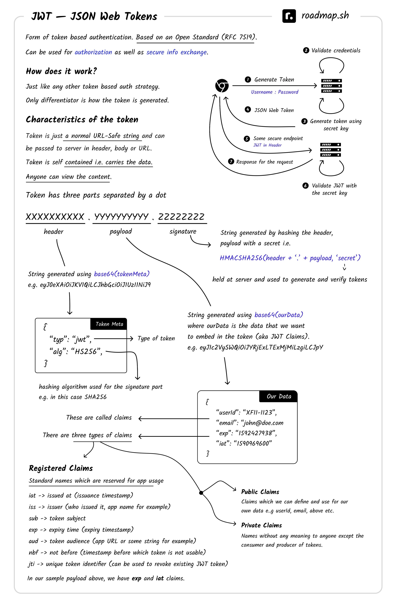

# JWT (JSON Web Token)

#### links

[https://jwt.io/#debugger](https://jwt.io/#debugger)\
[https://datatracker.ietf.org/doc/html/rfc7519](https://datatracker.ietf.org/doc/html/rfc7519)

JSON Web Token (JWT) is a compact means of representing claims to be transferred between two parties. The claims in a JWT are encoded as a JSON object that is used as the payload of a JSON Web Signature (JWS) structure or as the plaintext of a JSON Web Encryption (JWE) structure, enabling the claims to be digitally signed or integrity protected with a Message Authentication Code (MAC) and/or encrypted.

## Header

The header _typically_ consists of two parts: the type of the token, which is JWT, and the signing algorithm being used, such as HMAC SHA256 or RSA.

JWTs can be signed using a secret (with the **HMAC** algorithm) or a public/private key pair using **RSA** or **ECDSA**.

```json
{"typ":"JWT",
"alg":"HS256"}
```

## Payload (JWT Claims Set)

Contains the claims. Claims are statements about an entity (typically, the user) and additional data. There are three types of claims:

* _registered_
* _public_
* _private_

```json
{"iss":"joe",
"exp":1300819380,
"http://example.com/is_root":true}
```

## Signature

To create the signature part you have to take the encoded header, the encoded payload, a secret, the algorithm specified in the header, and sign that.

The signature is used to verify the message wasn't changed along the way, and, in the case of tokens signed with a private key, it can also verify that the sender of the JWT is who it says it is.

```
HMACSHA256(base64UrlEncode(header) + "." + base64UrlEncode(payload), secret)
```

## Example

```
eyJhbGciOiJIUzI1NiIsInR5cCI6IkpXVCJ9.
eyJzdWIiOiIxMjM0NTY3ODkwIiwibmFtZSI6IkpvaG4gRG9lIiwiaWF0IjoxNTE2MjM5MDIyfQ.
SflKxwRJSMeKKF2QT4fwpMeJf36POk6yJV_adQssw5c
```



- ref https://twitter.com/kamrify/status/1683128191550930946
