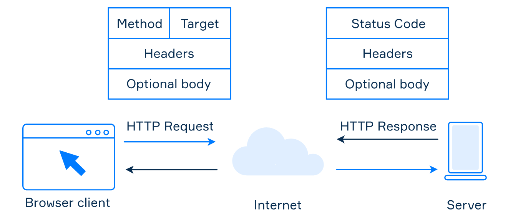
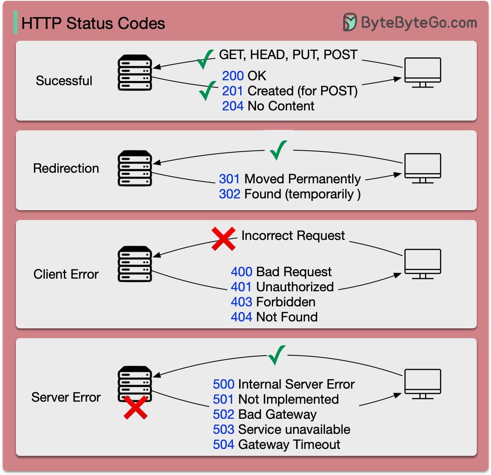

# 🔧 HTTP

Hypertext Transfer Protocol

#### links

* Methods - [https://developer.mozilla.org/en-US/docs/Web/HTTP/Methods](https://developer.mozilla.org/en-US/docs/Web/HTTP/Methods)



## Basics

In the HTTP protocol, all messages consist of text strings. Both requests and responses have roughly the same standardized format:

1. **Start line** which may vary:
   * for requests, it indicates the type of request (**method**) and the URL where to send it (**target**);
   * for responses, it contains a status code to determine the success of the operation.
2. **Headers** which describe the message and convey various parameters.
3. **Body** in which the message data is located.

The **start line** and the **header** are required attributes, so the other parts may be empty.

## Status codes



- 1xx: Informational 
  Codes beginning with "1" are called information codes. They report on how client requests are processed.
- 2xx: Success
  Messages of this class inform that the action requested by the client has been successfully accepted for processing.
- 3xx: Redirection 
  It means further action must be taken in order to complete the request.
- 4xx: Client Error 
  It reports errors on the client's side.
- 5xx: Server Error 
  The code indicates that the operation was unsuccessful due to the fault of the server.

## HTTP Headers

An HTTP header consists of several fields, each with a specific role and meaning.

* _Host_: This is the domain name of the server.
* _Content-Length_: This field in the request or response header plays a crucial role in data transfer. It specifically indicates the size of the body of the request or response in bytes. This helps the receiver understand when the current message ends and potentially prepare for the next one, especially in cases where multiple HTTP messages are being sent over the same connection.
* _Connection_: This field is crucial in HTTP persistent connections, where a single TCP connection is used to send and receive multiple HTTP requests and responses.
* _Content-type_: This field tells the client the format of the data it’s receiving.
* _Content-encoding_: This field indicates the compression format used for the data. For example, if the client sees ‘_gzip’_ encoding, it knows it needs to decompress the data.

## HTTP Request Methods

HTTP protocols define various methods or ‘verbs’ to perform different actions on web resources. The commonly used ones are GET, POST, PUT, and DELETE, which are often used to read, create, update, and delete resources. Less common methods include HEAD, CONNECT, OPTIONS, TRACE, and PATCH.

HTTP methods have certain properties that define how they interact with server resources. Two such properties are whether they're 'non-mutating' and 'idempotent.'

**non-mutating** method doesn't alter any server resources.

**idempotent** method produces the same result, regardless of how many times it's repeated

### **Options**

The **HTTP `OPTIONS` method** requests permitted communication options for a given URL or server. A client can specify a URL with this method, or an asterisk (`*`) to refer to the entire server.

#### Preflighted requests in CORS

links

- another CORS doc - [cors-mechanism](../web-browsers/cors-mechanism.md)
- https://developer.mozilla.org/en-US/docs/Glossary/XHR_(XMLHttpRequest)#preflighted_requests_in_cors

In [CORS](https://developer.mozilla.org/en-US/docs/Web/HTTP/CORS), a [preflight request](https://developer.mozilla.org/en-US/docs/Glossary/Preflight\_request) is sent with the `OPTIONS` method so that the server can respond if it is acceptable to send the request.

example

```
OPTIONS /resources/post-here/ HTTP/1.1
Host: bar.example
Accept: text/html,application/xhtml+xml,application/xml;q=0.9,*/*;q=0.8
Accept-Language: en-us,en;q=0.5
Accept-Encoding: gzip,deflate
Connection: keep-alive
Origin: https://foo.example
Access-Control-Request-Method: POST
Access-Control-Request-Headers: Content-Type
```

The server now can respond if it will accept a request under these circumstances. In this example, the server response says that:

- [`Access-Control-Allow-Origin`](https://developer.mozilla.org/en-US/docs/Web/HTTP/Headers/Access-Control-Allow-Origin)
  The `https://foo.example` origin is permitted to request the `bar.example/resources/post-here/` URL via the following:

- [`Access-Control-Allow-Methods`](https://developer.mozilla.org/en-US/docs/Web/HTTP/Headers/Access-Control-Allow-Methods)
  [`POST`](https://developer.mozilla.org/en-US/docs/Web/HTTP/Methods/POST), [`GET`](https://developer.mozilla.org/en-US/docs/Web/HTTP/Methods/GET), and `OPTIONS` are permitted methods for the URL. (This header is similar to the [`Allow`](https://developer.mozilla.org/en-US/docs/Web/HTTP/Headers/Allow)response header, but used only for [CORS](https://developer.mozilla.org/en-US/docs/Web/HTTP/CORS).)

- [`Access-Control-Allow-Headers`](https://developer.mozilla.org/en-US/docs/Web/HTTP/Headers/Access-Control-Allow-Headers)
  Any script inspecting the response is permitted to read the values of the `X-PINGOTHER` and `Content-Type` headers.

- [`Access-Control-Max-Age`](https://developer.mozilla.org/en-US/docs/Web/HTTP/Headers/Access-Control-Max-Age)
  The above permissions may be cached for 86,400 seconds (1 day).

```
HTTP/1.1 204 No Content
Date: Mon, 01 Dec 2008 01:15:39 GMT
Server: Apache/2.0.61 (Unix)
Access-Control-Allow-Origin: https://foo.example
Access-Control-Allow-Methods: POST, GET, OPTIONS
Access-Control-Allow-Headers: X-PINGOTHER, Content-Type
Access-Control-Max-Age: 86400
Vary: Accept-Encoding, Origin
Keep-Alive: timeout=2, max=100
Connection: Keep-Alive
```

## HTTP 1-3

* HTTP/1.0 - 1996
  was finalized and formally documented in . This version had a key limitation: each request to the same server required a separate TCP connection.
* HTTP/1.1 - 1997
  It introduced the concept of a ‘persistent connection’, -  a TCP connection could be left open for reuse. Despite this enhancement, HTTP/1.1 couldn’t fix the issue of ‘Head-of-Line’ (HOL) blocking - happens when all parallel request slots in a browser are filled, forcing subsequent requests to wait until previous ones are complete. Since HTTP version 1.1, all connections are persistent unless declared otherwise.
* HTTP/2.0 - 2015
  It implemented ‘request multiplexing’, a strategy to eliminate HOL blocking at the application layer, introduced the concept of HTTP ‘streams’. This abstraction allows the multiplexing of different HTTP exchanges onto the same TCP connection, freeing us from the need to send each stream in order. However, HOL blocking could still occur at the transport (TCP) layer.
* HTTP/3.0 2020
  replaces TCP with [QUIC](https://en.wikipedia.org/wiki/QUIC) as the underlying transport protocol. This effectively eliminates HOL blocking at the transport layer. QUIC is based on UDP. It introduces streams as first-class citizens at the transport layer. QUIC streams share the same QUIC connection, requiring no additional handshakes or slow starts to create new ones. QUIC streams are delivered independently. It means that in most cases packet loss in one stream doesn't impact others.
  


## Persistent connection 

Also known as HTTP keep-alive or HTTP connection reuse. Added in HTTP 1.1

HTTP connection that can send multiple requests and receive multiple responses.

Server will keep the TCP connection open for a certain period of time (known as the keep-alive timeout) or until the client closes the connection

Header - `Connection: keep-alive`

The browser's HTTP client implementation will typically handle the following tasks:

- Managing the connection pool: The browser will maintain a pool of open connections to each server, and will reuse connections from the pool when making subsequent requests.
- Handling connection timeouts: If the connection is idle for too long, the browser will close the connection to conserve resources.
- Handling connection errors: If an error occurs on the connection, the browser will close the connection and establish a new one.

![[http-4.png]]

### Types

- Long Polling - browser establishes an HTTP connection with the server and holds it for a long time so that the server can send its response at any time without having to create a new connection
- Server-Sent Events (SSE) allows the browser to receive automatic updates from the server. Basically, the server sends updates to the browser and changes the content on the web page asynchronously
- WebSockets - **independent protocol** based on the TCP, unlike long polling and SSE which are based on HTTP

## Protocol upgrading

HTTP 1.1 (or a higher)  provides protocol upgrading for persistent connections. It can be used to upgrade HTTP 1.1 to HTTP 2.0 or an HTTP connection into a WebSocket.

```http
Connection: upgrade
Upgrade: HTTP/2.0
```

```http
Connection: upgrade
Upgrade: websocket
```