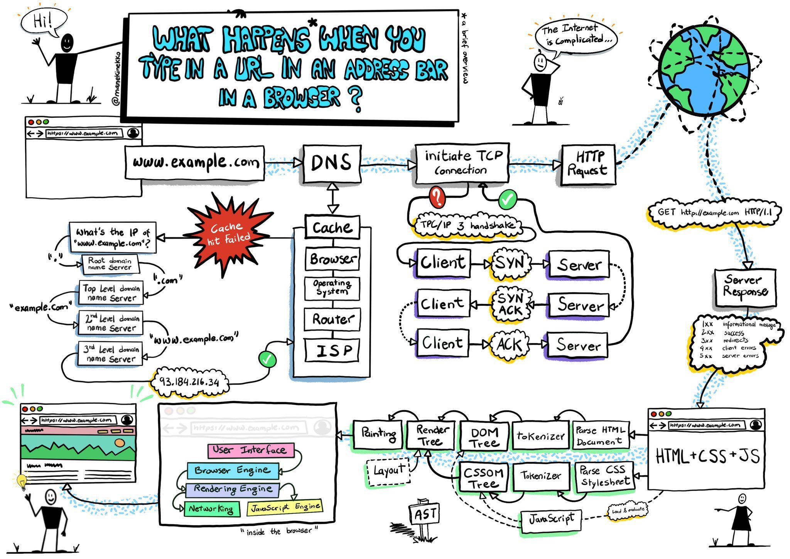
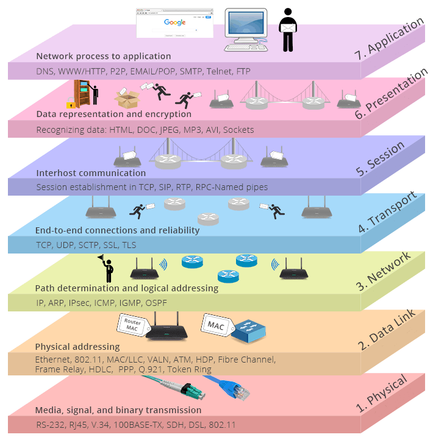
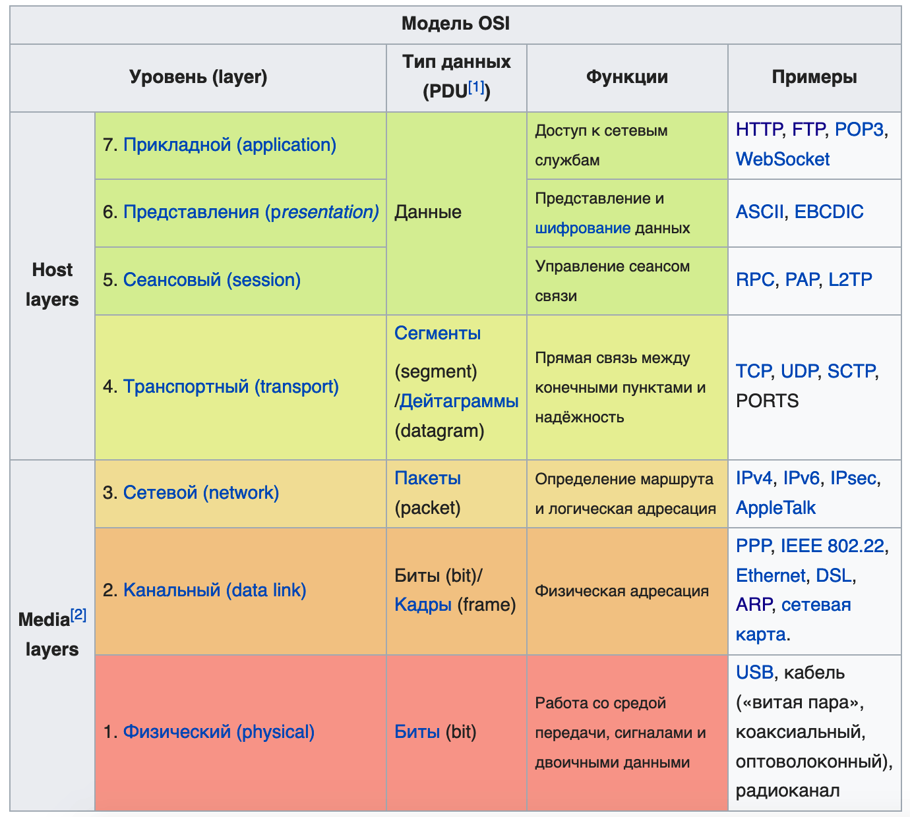
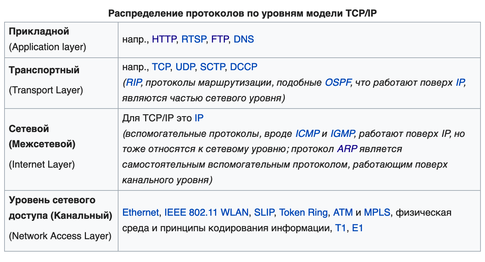
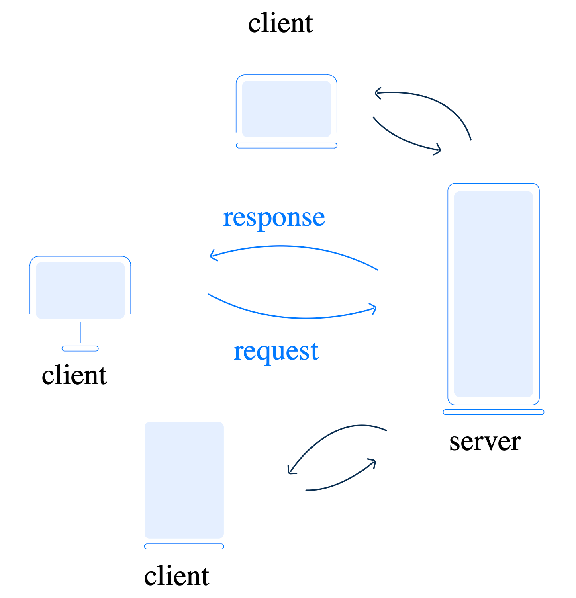
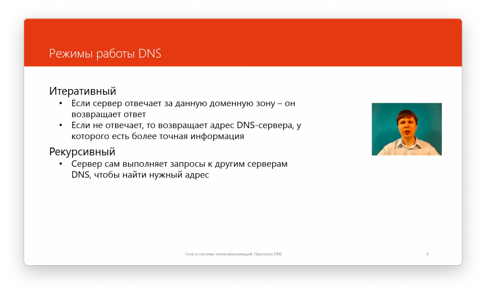
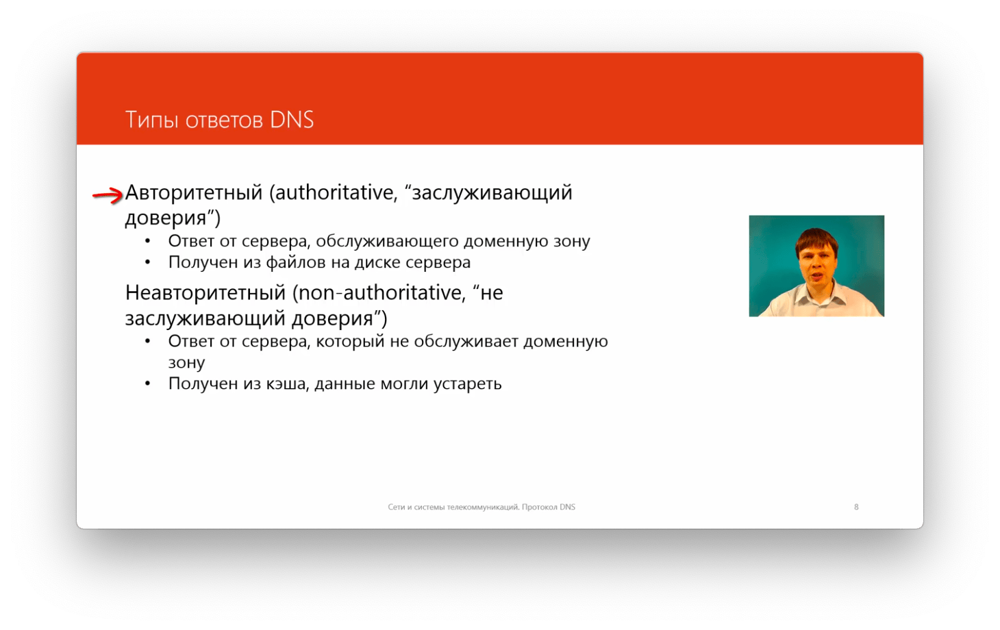
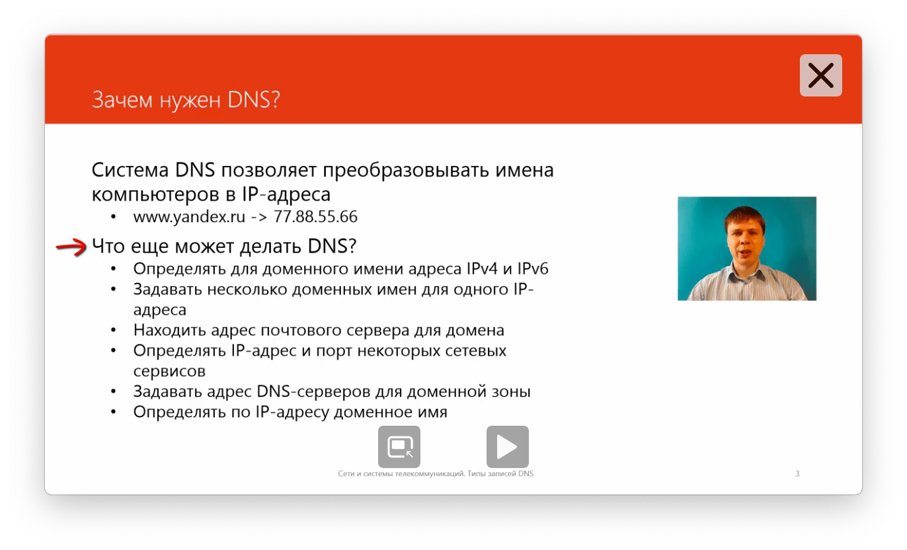

# Network

#### Links

- Lectures (ru) - [https://www.youtube.com/playlist?list=PLtPJ9lKvJ4oiNMvYbOzCmWy6cRzYAh9B1](https://www.youtube.com/playlist?list=PLtPJ9lKvJ4oiNMvYbOzCmWy6cRzYAh9B1)
- Web-App example (ru) - [https://www.youtube.com/watch?v=4haMUvUxUJI](https://www.youtube.com/watch?v=4haMUvUxUJI)

## Glossaries

### Термины

TLS - Transport Layer Security\
SSL - Secure Socket Layer\
TCP - Transmission Control Protocol\
UDP - User Datagram Protocol\
Hub - концентратор\
SSID - ServiceSetID - имя сети (WiFi)

### Стандарты

ISO международ орг. стандартизации\
IEEE - институт инженеров электротехнике и электронике\
IAB - совет по архитектуре интернета\
W3C - консорциум интернета

## OSI Model

**OSI** stands for **Open Systems Interconnection**. The OSI model provides a visual representation of how each communication layer is built on top of another

### Layers

1. **Physical** — exchange of physical signals between physical devices using cables
2. **Data Link** — solves the problem of addressing when transmitting the information, establishes a connection between two physical devices
3. **Network** — provides package routing by discovering the best path across the network
4. **Transport** — responsible for data transport over the network built by the router on the previous layer
5. **Session** — manages the interaction between applications and opens up the possibility of task synchronization, session termination, and information exchange
6. **Presentation** — defines how data will be represented in the application. At this level, processes such as encoding, encryption, and decryption occur, according to the system requirements
7. **Application** — interactions with the end user occur through applications. At this layer, the transmitted data is presented, and user input and output take place.

## TCP/IP

Internet works based on the TCP/IP model

- Application Layer
- Transport Layer
- Network Layer
- Link Layer

### Application Layer
Прикладной уровень

#### HTTP

**HyperText Transfer Protocol**

[**https://developer.mozilla.org/en-US/docs/Web/HTTP**](https://developer.mozilla.org/en-US/docs/Web/HTTP)

HTTP keep-alive - постоянное соединение

HTTP pipelining - конвейерная обработка. Возможность отправить несколько запросов на получение нескольких ресурсов одновременно

HTTP позволяет браузеру и серверу договориться о кешировании полученных данных и правилах проверки актуальности и обновлений

#### SMTP/POP3/IMAP

#### DNS

**Domain Name System**

Децентрализованная система.\
Пространство имен разделено на зоны (домены)\
За каждую зону отвечает регистратор.

Режим работы DNS

Типы ответов

Возможности DNS

### Transport Layer

#### UDP - User Datagram Protocol

Нет надежной доставки\
Нет сохранения порядка сообщений

DNS использует UDP

Нет проверки получения запросов, при отправке запроса запускается таймер и повторяет запрос если на него не получен ожидаемый ответ

Основная задача - укзать порты отправителя и получателя

#### TCP - Transmission Control Protocol

Гарантия доставки данных (подтверждение получения сегменов данных)\
Гарантия порядка сообщений

Перед передачей данных устанавливается соединение в рамках которого устанавливаются параметры передачи данных

#### Стандартные порты

- 1-1024
- 80 - HTTP (WEB)
- 25 - SMTP (MAIL)
- 53 - DNS
- 1025-49151 - Зарегистрированные порты (нельзя использовать)
- 49151-65535 - Динамические порты (можно использовать)

#### Сокеты

Сокет - сочетание IP + TCP(port)\
Определяется как на стороне клиента, так и на стороне сервера

#### NAT

**Network Address Translation**

Механизм в сетях TCP/IP, позволяющий изменять IP-адрес в заголовке пакета, проходящего через устройство маршрутизации трафика.

#### Firewall

Брандмаур/Межсетевой экран

Позволяет фильтровать все проходящие запросы по заданным правилам фильтрации
