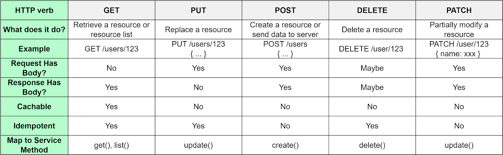

# 🤼 REST API

This architectural style was developed to help easily build convenient web services. A service written with regard to REST rules is called **RESTful**. It is not a standard, but rather a set of useful recommendations

## Design rules

### Six REST principles

1. **Client-server interaction model.** By separating the user interface from the data warehouse server, we improve and simplify application operations.
2. **Stateless.** Each request from a client to a server must contain all necessary information and cannot rely on any state stored on the server side. According to REST, the service does not store the results of the previous operation. Simply put, it works according to the _"Asked, answered, forgotten"_ concept.
3. **Cacheable.** A request-response pair can be marked as cached and stored on the user side. It is possible to draw an analogy to web page caching: if a page was downloaded once, it could be accessed without addressing the server again.
4. **Uniform interface.** REST architecture specifies that any REST service must be understandable without its developer.
5. **Layered system.** A client cannot just tell whether it is connected directly to the end server or an intermediary along the way.
6. **Code on demand \[Optional]**. On request, the service must give executable code in the form of an applet or script to be executed on the client's side. In practice, it is very seldom used.

### HTTP Verbs

In the REST concept, interaction with resources is performed by calling the URL of the resource and four basic HTTP methods: `GET`, `POST`, `PUT`, `DELETE`.

<figure><figcaption></figcaption></figure>

### Status Codes

<figure><figcaption></figcaption></figure>
