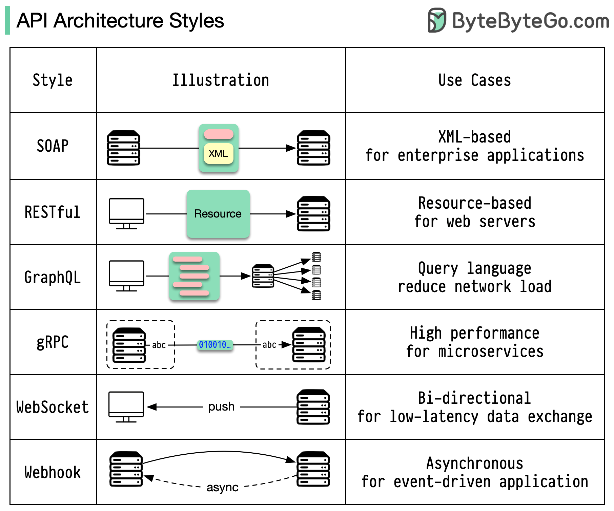
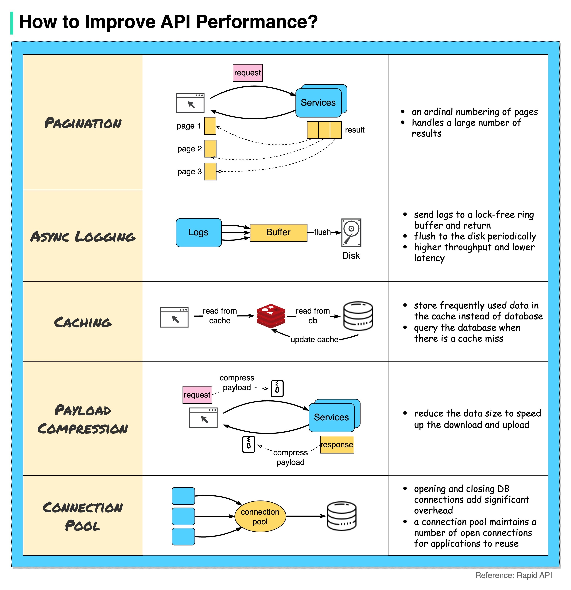
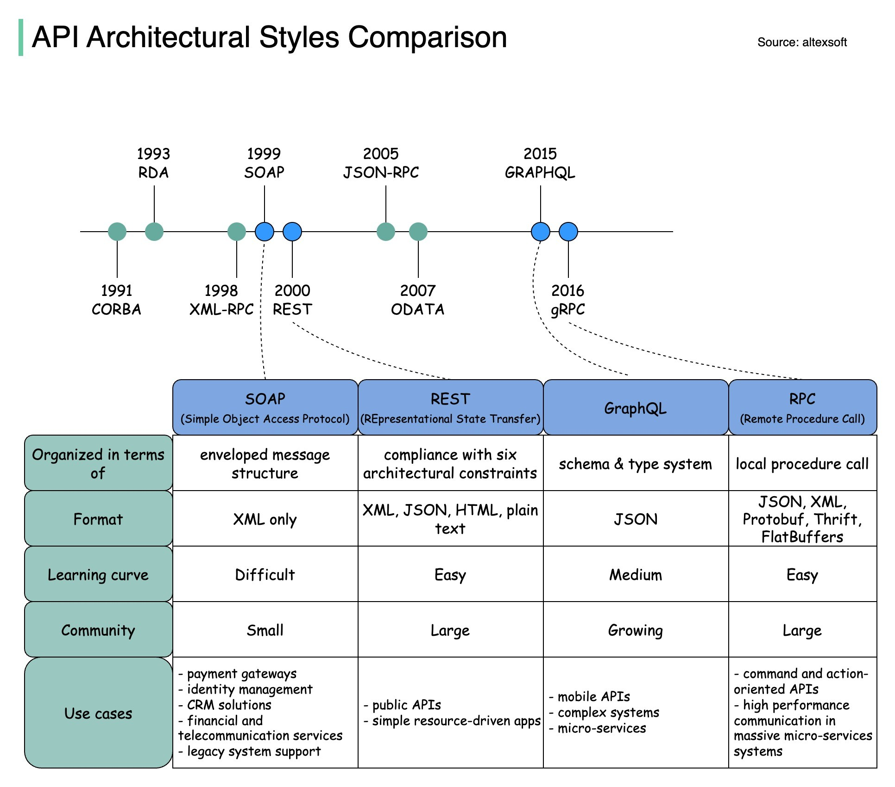

# Communication types and protocols

Architecture styles define how different components of an application programming interface (API) interact with one another

## Styles

- SOAP: 
    Mature, comprehensive, XML-based
    Best for enterprise applications 
- RESTful: 
    Popular, easy-to-implement, HTTP methods 
    Ideal for web services 
- GraphQL:
    Query language, request specific data 
    Reduces network overhead, faster responses 
- gRPC: 
    Modern, high-performance, Protocol Buffers 
    Suitable for microservices architectures 
- WebSocket: 
    Real-time, bidirectional, persistent connections 
    Perfect for low-latency data exchange 
- Webhook: 
    Event-driven, HTTP callbacks, asynchronous 
    Notifies systems when events occur

## Perfomance

## Comparison

