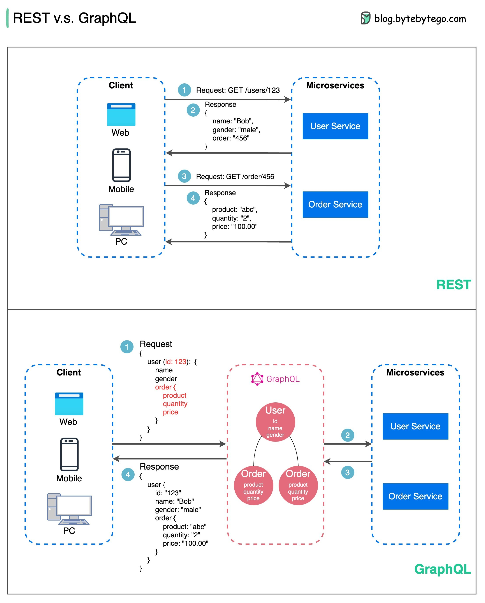

# GraphQL

- Provides a single endpoint for clients to query for precisely the data they need.
- Clients specify the exact fields required in nested queries, and the server returns optimized payloads containing just those fields.
- Supports Mutations for modifying data and Subscriptions for real-time notifications.
- Great for aggregating data from multiple sources and works well with rapidly evolving frontend requirements.
- However, it shifts complexity to the client side and can allow abusive queries if not properly safeguarded
- Caching strategies can be more complicated than REST.

#### links

- https://graphql.org/

## REST API vs. GraphQL

