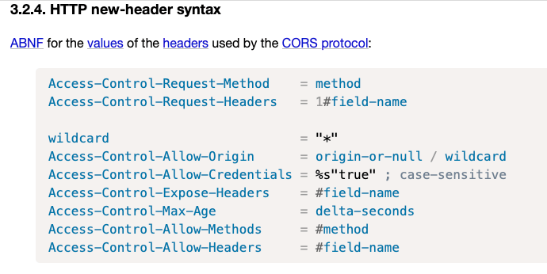

# CORS mechanism

#### links

[**https://fetch.spec.whatwg.org/#http-cors-protocol**](https://fetch.spec.whatwg.org/#http-cors-protocol)\
[**https://developer.mozilla.org/en-US/docs/Web/HTTP/CORS**](https://developer.mozilla.org/en-US/docs/Web/HTTP/CORS)\
[**https://habr.com/ru/company/macloud/blog/553826/**](https://habr.com/ru/company/macloud/blog/553826/?ref=tg%2Fwebdevblog)

**Cross-Origin Resource Sharing** ([CORS](https://developer.mozilla.org/en-US/docs/Glossary/CORS)) is an [HTTP](https://developer.mozilla.org/en-US/docs/Glossary/HTTP)-header based mechanism that allows a server to indicate any [origins](https://developer.mozilla.org/en-US/docs/Glossary/Origin) (domain, scheme, or port) other than its own from which a browser should permit loading resources. CORS also relies on a mechanism by which browsers make a "preflight" request to the server hosting the cross-origin resource, in order to check that the server will permit the actual request. In that preflight, the browser sends headers that indicate the HTTP method and headers that will be used in the actual request.

For security reasons, browsers restrict cross-origin HTTP requests initiated from scripts. For example, `XMLHttpRequest` and the [Fetch API](https://developer.mozilla.org/en-US/docs/Web/API/Fetch\_API) follow the [same-origin policy](https://developer.mozilla.org/en-US/docs/Web/Security/Same-origin\_policy). This means that a web application using those APIs can only request resources from the same origin the application was loaded from unless the response from other origins includes the right CORS headers.

### What requests use CORS?

- https://developer.mozilla.org/en-US/docs/Web/HTTP/CORS#what\_requests\_use\_cors

This [cross-origin sharing standard](https://fetch.spec.whatwg.org/#http-cors-protocol) can enable cross-origin HTTP requests for:

* Invocations of the [`XMLHttpRequest`](https://developer.mozilla.org/en-US/docs/Web/API/XMLHttpRequest) or [Fetch APIs](https://developer.mozilla.org/en-US/docs/Web/API/Fetch\_API), as discussed above.
* Web Fonts (for cross-domain font usage in `@font-face` within CSS), [so that servers can deploy TrueType fonts that can only be loaded cross-origin and used by web sites that are permitted to do so.](https://www.w3.org/TR/css-fonts-3/#font-fetching-requirements)
* [WebGL textures](https://developer.mozilla.org/en-US/docs/Web/API/WebGL\_API/Tutorial/Using\_textures\_in\_WebGL).
* Images/video frames drawn to a canvas using [`drawImage()`](https://developer.mozilla.org/en-US/docs/Web/API/CanvasRenderingContext2D/drawImage).
* [CSS Shapes from images.](https://developer.mozilla.org/en-US/docs/Web/CSS/CSS\_Shapes/Shapes\_From\_Images)
