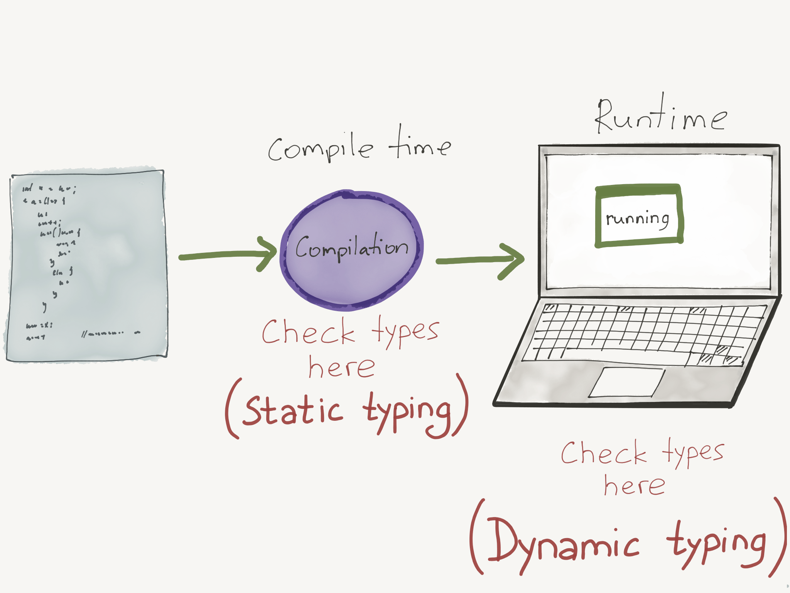
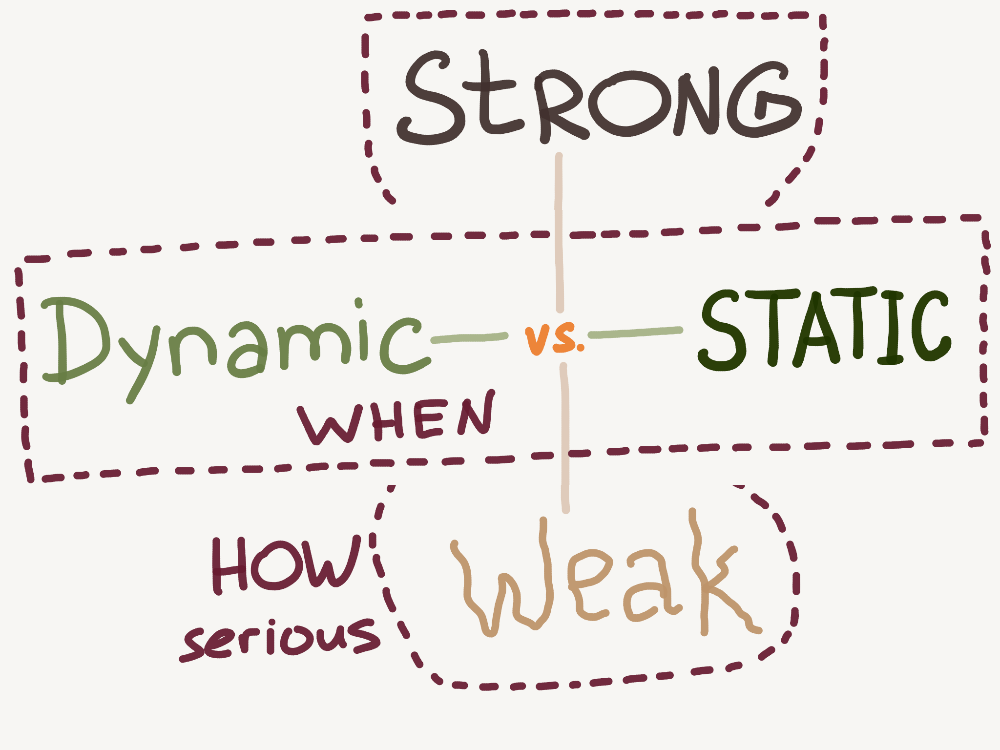
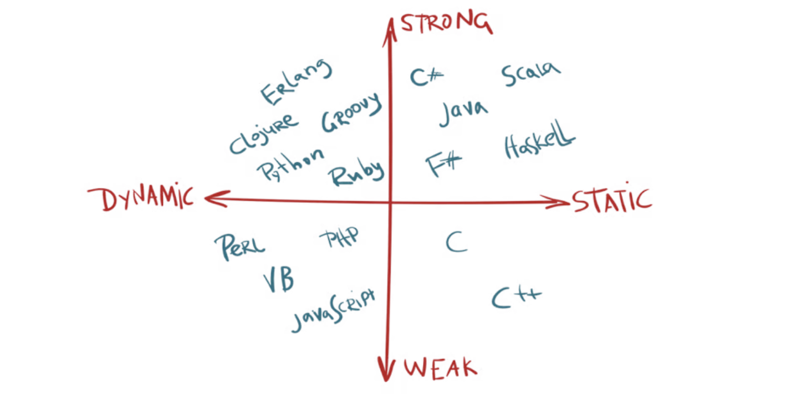

# 🤓 Basic Knowledge

## Statically v. dynamically v. strongly v. weakly typed languages

#### Links

- hexlet.io/courses/intro_to_programming/lessons/types/theory_unit
- educative.io/answers/statically-v-dynamically-v-strongly-v-weakly-typed-languages

### Type checking



- Static type-checking - checking types during compilation process
- Dynamic type-checking - checking types at run time

### Strong and weak typing



Strong versus weak is about HOW SERIOUS DO YOU GET while checking the types.

JS example: weak typing

```javascript
4 + '7';      // '47'
4 * '7';      // 28
2 + true;     // 3
false - 3;    // -3
```

Python example: strong typing

```python
var = 21;            #type assigned as int at runtime.
var = var + "dot";   #type-error, string and int cannot be concatenated.
print(var);
```



## Design principles

- Don't Repeat Yourself (**DRY**)
- You Ain't Gonna Need It (**YAGNI**)
- Keep It Simple, Stupid (**KISS**)

### SOLID

[Single responsibility principle](https://en.wikipedia.org/wiki/Single\_responsibility\_principle)\
A [class](https://en.wikipedia.org/wiki/Class\_\(computer\_programming\)) should only have a single responsibility, that is, only changes to one part of the software's specification should be able to affect the specification of the class.

[Open–closed principle](https://en.wikipedia.org/wiki/Open%E2%80%93closed\_principle)\
"Software entities ... should be open for extension, but closed for modification."

[Liskov substitution principle](https://en.wikipedia.org/wiki/Liskov\_substitution\_principle)\
"Objects in a program should be replaceable with instances of their subtypes without altering the correctness of that program." See also [design by contract](https://en.wikipedia.org/wiki/Design\_by\_contract).

[Interface segregation principle](https://en.wikipedia.org/wiki/Interface\_segregation\_principle)\
"Many client-specific interfaces are better than one general-purpose interface."

[Dependency inversion principle](https://en.wikipedia.org/wiki/Dependency\_inversion\_principle)\
One should "depend upon abstractions, \[not] concretions."
