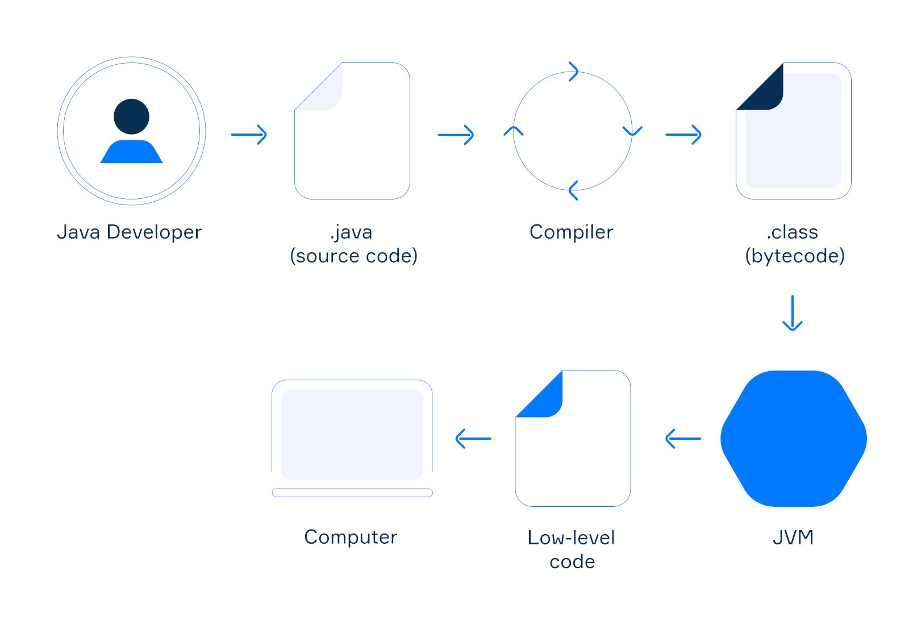
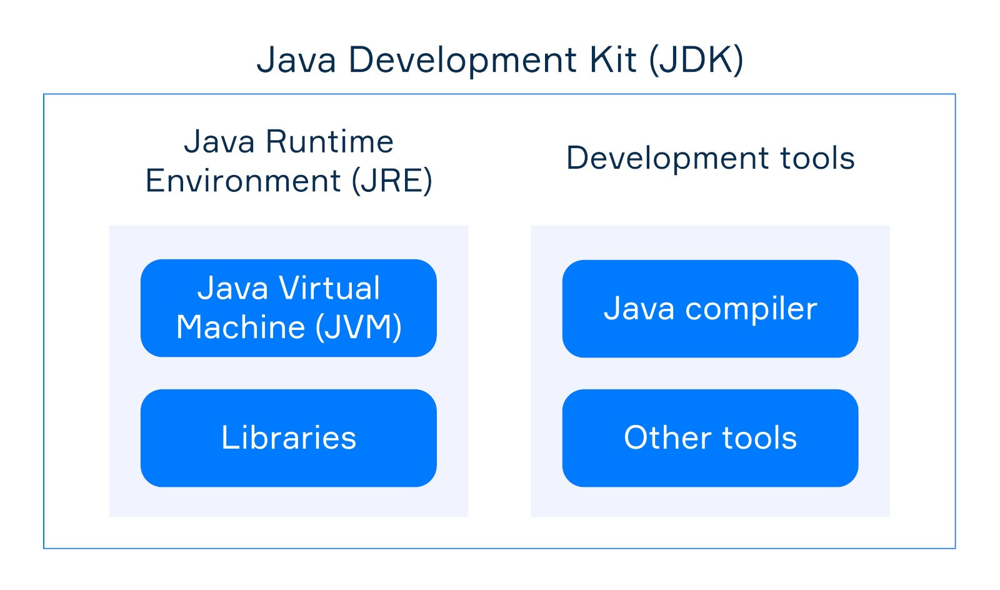

# ☕ Java

## Writing, compiling and running Java programs






* **JVM** executes compiled Java programs;
* **JRE** includes **JVM** and standard libraries: it is needed **to run** Java programs;
* **JDK** includes **JRE** and development tools: it is needed **to develop** Java programs.

## IntelliJ IDEA shortcuts

* To insert a live template into your code, you can use **Code | Insert Live Template** or **Ctrl(⌘)+J.**

## Terminal commands

### create + run

```bash
javac Main.java 
java -cp . Main
```

## Templates

```java
import java.util.Scanner;

class Main {
    public static void main(String[] args) {
        Scanner scanner = new Scanner(System.in);

        int a = scanner.nextInt();
        int b = scanner.nextInt();
        int c = scanner.nextInt();
        int d = scanner.nextInt();

        System.out.println((--a) + " " + (--b) + " " + (--c) + " " + (--d));
    }
}
```

## Printing data

The `println` method displays the passed string followed by a new line on the screen (**print-line**).

The `print` method displays the passed value and places the cursor (the position where we display a value) after it.

```java
System.out.print(108);   // printing a number
System.out.print('c');   // printing a character that represents a letter
System.out.print("Q");   // printing a string
System.out.println('3'); // printing a character that represents a digit
```

## Types and variables

### Rules for naming variables

* names are case-sensitive;
* a name can include [Unicode](https://en.wikipedia.org/wiki/Unicode) letters, digits, and two special characters (`$`, `_`);
* a name cannot start with a digit;
* a name must not be a keyword (`class`, `static`, `int` are illegal names).

### Naming conventions for variables

* if a variable name is a single word it should be in lowercase (for instance: `number`, `price`);
* if a variable name includes multiple words it should be in `lowerCamelCase`, i.e. the first word should be in lowercase and each word after the first should have its first letter written in uppercase (for instance: `numberOfCoins`);
* variable names should not start with `_` and `$` characters, although they are allowed;

### Alternative forms of declaration

* Standart

```java
String dayOfWeek = "Monday";
int one = 1;
```

* Declaring several variables of the same type as a single statement:

```java
String language = "java", version = "8 or newer";
```

* Separating declaration and initialization into statements:

```java
int age;
age = 35;
```

* Since Java 11, you can write **var** instead of a specific type to force automatic type inference based on the type of assigned value:

```java
var language = "Java"; // String
var version = 11; // int
```

## Binary arithmetic operators

* addition `+`
* subtraction `-`
* multiplication `*`
* integer division `/`
* remainder `%`

```java
System.out.println(13 + 25); // prints 38
System.out.println(70 - 30); // prints 40
System.out.println(21 * 3);  // prints 63
System.out.println(8 / 3); // prints 2
System.out.println(10 % 3) // prints 1, because 10 divided by 3 leaves a remainder of 1
System.out.println(1 + 3 * 4 - 2); // prints 11
```

### Unary operators

```java
System.out.println(+5); // prints 5
System.out.println(-8);  // prints -8
System.out.println(-(100 + 4)); // prints -104
```

### The precedence order 

https://introcs.cs.princeton.edu/java/11precedence/

* parentheses
* unary plus/minus
* multiplication, division
* addition, subtraction

## Comments

The Java programming language supports three kinds of comments.

### End-of-line comments

text from `//`

```java
class Program {
    public static void main(String[] args) {
        // The line below will be ignored
        // System.out.println("Hello, World");
        // It prints the string "Hello, Java"
        System.out.println("Hello, Java"); // Here can be any comment
    }
}
```

### Multi-line comments

text from `/*` and the nearest `*/`

```java
class Program {
    public static void main(String[] args) {
        /* This is a single-line comment */
        /*  This is an example of
            a multi-line comment */
  }
}
```

### Documentation comments

text from `/**` to `*/`

```java
class Program {
    /**
     * The main method accepts an array of string arguments
     *
     * @param args from the command line
     */
    public static void main(String[] args) {
        // do nothing
    }
}
```

## Scanning the input

simplest way to obtain data from the standard input is to use the standard class `Scanner`.

```java
import java.util.Scanner; // importing scanner from the standard library
public class Main {
    public static void main(String[] args) {
        Scanner scanner = new Scanner(System.in); // an object for reading data 
        int num1 = scanner.nextInt(); // read the first number
        int num2 = scanner.nextInt(); // read the second number
        //String line = scanner.nextLine(); // read a whole line, for example "Hello, Java"
        //int num = scanner.nextInt(); // read a number, for example 123
        //double d = scanner.nextDouble(); // read double, for example 123.01
        //String string = scanner.next(); // read a string (not a line), for example "Hello"
        System.out.println(num2); // print the second number
        System.out.println(num1); // print the first number
    }
}
```

## Increment and decrement

Java has two opposite operations called increment (`++`) and decrement (`--`) to increase/decrease the value of a variable by one.

```java
int n = 10;
n++; // 11
n--; // 10
n += 1; // 11
n -= 1; // 10
```

### Prefix and postfix forms 

**Prefix increment:**

```java
int a = 4;
int b = ++a; // a = a + 1; b = a;

System.out.println(a); // 5
System.out.println(b); // 5
```

In this case, the value of `a` has been incremented and then assigned to `b`. So, `b` is 5.

**Postfix increment:**

```java
int a = 4;
int b = a++; // b = a; a = a + 1;

System.out.println(a); // 5
System.out.println(b); // 4
```

In this case, the value of `a` has been assigned to `b` and then incremented by 1. So, `b` is 4.

## Characters

The `char` type is used to represent letters (both uppercase and lowercase), digits, and other symbols. Each character is just a symbol enclosed in single quotes.

```java
char lowerCaseLetter = 'a';
char upperCaseLetter = 'Q';
char number = '1';
char space = ' ';
char dollar = '$';
```

```java
char ch = 'A';
ch += 10;
System.out.println(ch);   // 'K'
System.out.println(++ch); // 'L'
System.out.println(++ch); // 'M'
System.out.println(--ch); // 'L'
```

### Escape sequences 

* `'\n'` is the newline character;
* `'\t'` is the tab character;
* `'\r'` is the carriage return character;
* `'\\'` is the backslash character itself;
* `'\''` is the single quote mark;
* `'\"'` is the double quote mark.

```java
System.out.print('\t'); // makes a tab
System.out.print('a');  // prints 'a'
System.out.print('\n'); // go to the new line
System.out.print('c');  // prints 'c'
```

## String

* **immutable type**: it's impossible to change a character in a string;
* it has methods for getting individual characters and extracting substrings;
* individual characters can be accessed by indexes, the first character has the index **0**, the last one - **the length of the string - 1**;
* non-primitive type

```java
String anotherString = "This is\na multiple\nstring"; // a string with escape sequences
System.out.println(anotherString); // it prints the result in several lines
String nullString = null; // it is null
String str = new String("my-string"); // it creates an object and assigns it to the variable
```

* `length()` returns the number of characters in the string;
* `charAt(int index)` returns a character by its index;ё

```java
String s = "Hi, all";

int len = s.length(); // the len is 7

char theFirstChar = s.charAt(0);  // 'H' has the index 0

char theFifthChar = s.charAt(4); // 'a' has the index 4

char theLastChar = s.charAt(s.length() - 1); // 'l' has the index 6
```

### Useful methods of strings 

* `isEmpty()` returns `true` if the string is empty, otherwise - `false`;
* `toUpperCase()` returns a new string in uppercase;
* `toLowerCase()` returns a new string in lowercase;
* `startsWith(prefix)` returns `true` if the string starts with the given string prefix, otherwise - `false`;
* `contains(...)` returns `true` if the string contains the given string or character;
* `substring(beginIndex, endIndex)` returns a substring of the string in the range: `beginIndex`, `endIndex - 1`;
* `replace(old, new)` returns a new string obtained by replacing all occurrences of `old` with `new` that can be chars or strings.

```java
String text = "The simple text string";

boolean empty = text.isEmpty(); // false

String textInUpperCase = text.toUpperCase(); // "THE SIMPLE TEXT STRING"

boolean startsWith = textInUpperCase.startsWith("THE"); // true

/* replace all whitespaces with empty strings */
String noWhitespaces = textInUpperCase.replace(" ", ""); // "THESIMPLETEXTSTRING"
```

### Exceptions 

**`NullPointerException`**.\
If a string is `null` and you call a method of the string, it throws `NullPointerException`.

```java
String s = null;
int length = s.length(); // it throws NullPointerException
```

**`StringIndexOutOfBoundsException`.**\
If you try to access a non-existing character by an index then this exception occurs.

```java
String s = "ab";
char c = s.charAt(2); // it throws StringIndexOutOfBoundsException because indexing starts with 0
```

### Concatenating strings 

```java
String firstName = "John";
String lastName = "Smith";

// concatenation using the "+" operator
String fullName1 = firstName + " " + lastName; // "John Smith"

// concatenation using the concat method 
String fullName2 = firstName.concat(" ").concat(lastName); // "John Smith"
```

### Appending values to a string

It's possible to add values of different types to a string. The value will be automatically converted to a string.

```java
String shortString = "str";
long number = 100;

String result1 = shortString + number + 50; // the result is "str10050"
String result2 = number + 50 + shortString; // The result2 is 150str,
```

### How to compare strings correctly? 

Since `String` is a reference type you shouldn't compare strings using `==` or `!=` operators. In these case, only addresses will be compared, but not actual values.

`String` has two convenient methods for comparing the equivalence of the actual content of one string with the content of another string: `equals(other)` and `equalsIgnoreCase(other)`.

```java
String first = "first";
String second = "second";

String anotherFirst = "first";
String secondInUpperCase = "SECOND";

System.out.println(first.equals(second)); // false, the strings have different values
System.out.println(first.equals(anotherFirst)); // true, the strings have the same value

System.out.println(second.equals(secondInUpperCase)); // false, the strings have different cases
System.out.println(second.equalsIgnoreCase(secondInUpperCase)); // true, it ignores cases 
```
