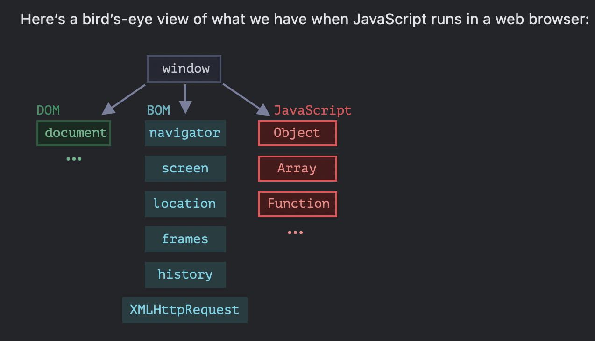

# Browser

## Global object

The global object provides variables and functions that are available anywhere. By default, those that are built into the language or the environment.

In a browser it is named `window`, for Node.js it is `global`, for other environments it may have another name.



## Browser events

[https://developer.mozilla.org/en-US/docs/Web/Events](https://developer.mozilla.org/en-US/docs/Web/Events)

### Mouse events

* `click` is the event that occurs when a user clicks on an item with the left mouse button;
* `dblclick` is responsible for events occurring after double clicking with the left mouse button;
* `contextmenu` is when a user clicks on an element with the right mouse button.

### Keyboard events 

* `keydown` is the event that occurs when the user presses a key;
* `keyup` is the event that happens when the any key is released;
* `keypress` is the event that occurs when any key other than Shift, Fn, CapsLock is in the pressed position

Each browser event has an **event handler**: a code block that occurs after the event operation. When the code block is executed, we can say that we register the event handler. It is thanks to these handlers that the code can react to user actions.

```javascript
document.addEventListener("click", function() {
  console.log("There's been a browser event");
});
```

```javascript
document.getElementById("myBtn").addEventListener("keypress", function() {
  // body
});
```

### Key Codes 

Javascript has a property `event.code` that allows you to get the code for the specific keyboard character. Each key has its own code which depends on its location on the keyboard:

* letter codes are composed according to a `Key<letter>` scheme;
* numeric key codes are built on the principle `Digit<number>`;
* the code for special keys is their name, for instance, `Enter` for the _Enter_ key.

Use `event.code` when you do not care about case and vice versa, use `event.key` when you care about case.

### Event handling 

```javascript
document.addEventListener("keydown", function(event) {
  if (event.code == "AltRight") {
    console.log(event);
  }
});
```

```javascript
document.addEventListener("keydown", function(event) {
  if (event.key == "W") {
    console.log("W Pressed");
  }
});
```

## Audio Object 

`Audio Object` can be created by using the following syntax:

```javascript
let audio = document.createElement("AUDIO");
//or
let audio = new Audio("path/to/myAudio.mp3");
```

To get access to this object, we can use the method we're already familiar with: `getElementById()`. Let's assume that our HTML `<audio>` element has the id `myAudioID`. We call the method `getElementById()` to access that element by its id:

```
let audio = document.getElementById("myAudioID");
```

#### Properties

[https://www.w3schools.com/jsref/dom\_obj\_audio.asp](https://www.w3schools.com/jsref/dom\_obj\_audio.asp)

```javascript
let audio = getElementById("myObjectID");
let src = audio.src; // "path/to/myAudio.mp3"
console.log(src);
```

The `duration` property lets us know the duration of the audio file in seconds:

```
let duration = audio.duration;
console.log(duration);
```

#### Methods

[https://www.w3schools.com/jsref/dom\_obj\_audio.asp](https://www.w3schools.com/jsref/dom\_obj\_audio.asp)

The following method is responsible for reloading the `<audio>` element:

```
audio.load();
```

The following methods are probably the most basic ones:

```
audio.play();
audio.pause();
```

## Document methods

### getElementById()

```markup
<p id="blue-text">What's your hyper skill?</p>
<script>
  let element = document.getElementById("blue-text"); // get the element by id
</script>
```

### querySelector()

With the `querySelector()` method it is possible to return the first document element that corresponds to the specified selector:

```html
<p>What's your hyper skill?</p>
 
<script>
  let element = document.querySelector("p"); // get the element by selector
</script>
```

#### querySelectorAll()

\*\*\*\*gets all elements that match the specified selector:

```html
<p>Tell me</p>
<p>What's your hyper skill?</p>
 
<script>
  let elements = document.querySelectorAll("p"); // get elements by selector
</script>
```
