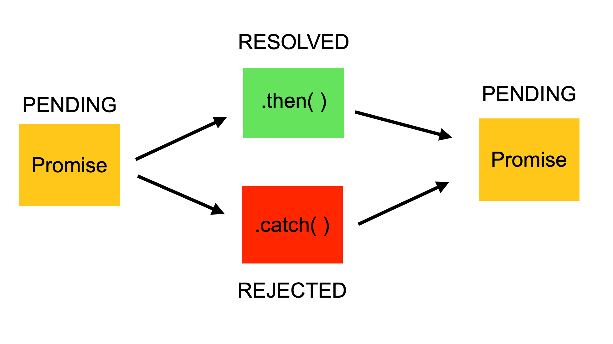

# 🔞 JavaScript

a lightweight, interpreted, or just-in-time compiled programming
  language

#### Links

- Styleguide - [https://github.com/airbnb/javascript](https://github.com/airbnb/javascript)
- ESLint statically analyzes your code - [https://eslint.org/](https://eslint.org)
- Online IDE - [https://replit.com/](https://replit.com/)

#### Comments

Example

```javascript
// Coment on new line
console.log("Nice to see you!"); // This code outputs the message to the console

/*  
  The following code outputs the message to the console
  The console will display a line with the text "Hello, JS!"
*/
```

## Types, Values, and Variables

### Variables

The name of a variable can contain only letters, numbers or symbols `$` and `_` and it _cannot_ begin with a number.

JavaScript uses keywords to create variables:

* `let` defines a **mutable variable** the value of which can be changed as many times as needed;
* `const` declares a **constant** the value of which cannot be changed.
* `var` - is an **outdated** way of declaring a variable

```javascript
let letters, &ampersand, _underscore; // variable examples

let 1number; // SyntaxError: Invalid or unexpected token
```

### Primitive types

JavaScript types can be divided into two categories: primitive types and object types. \
Primitive types include `numbers`, `strings` of text (known as strings), and `Boolean` truth values (known as booleans).

The special JavaScript values `null` and `undefined` are primitive values, but they are not numbers, strings, or booleans. undefined to represent a system-level, unexpected, or error- like absence of value and null to represent a program-level, normal, or expected absence of value.

Any JavaScript value that is not a number, a string, a boolean, a symbol, null, or undefined is an object.

#### Numbers, strings, boolean, null, undefined

```javascript
// JavaScript supports several types of values
x = 1; // Numbers.
x = 0.01; // Numbers can be integers or reals.
x = "hello world"; // Strings of text in quotation marks.
x = 'JavaScript'; // Single quote marks also delimit strings.
x = true; // A Boolean value.
x = false; // The other Boolean value.
x = null; // Null is a special value that means "no value."
x = undefined; // Undefined is another special value like null.

// more undefined examples
let count; 
console.log(count); // undefined

let person = {
  age: 27
}; 
console.log(person.name); // undefined

function getDetails(a) {
  console.log(a);
}
getDetails(); // undefined value returned when a function has a missing parameter:

//more string examples
'two\nlines' // A string representing 2 lines written on one line

// A one-line string written on 3 lines:
"one\
 long\
 line"
 
// A two-line string written on two lines:
`the newline character at the end of this line
is included literally in this string`
```

#### Strings

Strings are immutable in JavaScript. Methods like replace() and toUpperCase() return new strings: they do not modify the string on which they are invoked.

```javascript
let s = "hello"; // Start with some lowercase text 
s.toUpperCase(); // Returns "HELLO" , but doesn't alter s 
s // => "hello": the original string has not  changed
```

Strings can also be treated like read-only arrays

#### Template Literals (ES 6)

```javascript
let name = "Bill";
let greeting = `Hello ${name}.`; // greeting == "Hello Bill."

// string as array
let s = "hello, world";
s[0] // => "h"
s[s.length-1] // => "d"
```

### Object

An **object** is a _non-primitive_ data type that represents an **unordered** collection of _properties_. A **property** is a part of the object that imitates a variable. It consists of a **key** and a **value** separated by a colon. A key can only be a string, but the value may be of any data type.

JavaScript’s object types are **mutable** and its primitive types are **immutable**. \
JavaScript program can change the values of object properties and array elements.

```javascript
// An object is a collection of name/value pairs, or a string to value map.
let book = { // Objects are enclosed in curly braces.
topic: "JavaScript", // The property "topic" has value  "JavaScript."
edition: 7 // The property "edition" has value 7
}; // The curly brace marks the end of the object.

// Access the properties of an object with . or []:
book.topic // => "JavaScript" 
book["edition"] // => 7: another way to access property values.
book.author = "Flanagan"; // Create new properties by assignment.
book.contents = {}; // {} is an empty object with no properties.

// Conditionally access properties with ?. (ES2020): 
book.contents?.ch01?.sect1 // => undefined: book.contents has no ch01 property.
```

To **delete** a property, we can use the `delete` operator and a dot.

```javascript
delete country.population;
```

### Array

Object. Ordered collection of numbered values. The JavaScript language includes special syntax for working with arrays, and arrays have some special behavior that distinguishes them from ordinary objects.

```javascript
const companies = ["Apple", "Google", "Amazon"];
companies.push("Yandex"); // add new:
companies.pop(); // delete last:
const firstPlace = companies[0] // get by index
companies.length // check length
```

### Other object types

A Set object represents a set of values.

A Map object represents a mapping from keys to values.

Various “typed array” types facilitate operations on arrays of bytes and other binary data.

The RegExp type represents textual patterns and enables sophisticated matching, searching, and replacing operations on strings.

The Date type represents dates and times and supports rudimentary date arithmetic.

Error and its subtypes represent errors that can arise when executing JavaScript code.

## Operators

Operators act on values (the operands) to produce a new value.

#### _typeof_ operator

```javascript
console.log(typeof(9)); // number
console.log(typeof 9); // number
```

#### gt lt

greater than (gt)

```js
a > b
```

greater than or equal to

```js
a >= b
``` 

lt and lte accordingly

### Arithmetic operators

The JavaScript programming language provides operators to perform arithmetic operations. They are called **binary** because they apply to two **operands** (objects over which the operation is performed).

```javascript
3+2 // => 5: addition
3-2 // => 1: subtraction
3*2 // => 6: multiplication
3/2 // => 1.5: division
points[1].x - points[0].x // => 1: more complicated operands also work
"3" + "2" // => "32": + adds numbers, concatenates strings

// JavaScript defines some shorthand arithmetic operators
let count = 0; 
count++; // Increment the variable
count--; // Decrement the variable
count += 2; // Add 2: same as count = count + 2;
count *= 3; // Multiply by 3: same as count = count * 3;
count // => 6: variable names are expressions, too.

// remainder %. This operator finds the residue from the division
console.log(10 % 3); // 1, because 10 divided by 3 leaves a remainder of 1
console.log(12 % 4); // 0, because 12 divided by 4 leaves no remainder

// exponentiation **
console.log(2 ** 3); // 8, because (2 * 2 * 2) is 8
```

#### Order

The list below is sorted from the highest to the lowest precedence level:

* parentheses
* unary plus/minus
* multiplication, division
* addition and subtraction

#### equality

the `==` equality operator is deprecated in favor of the strict equality operator `===`, which does no type conversions

### Boolean and logical operators

#### Comparison operators 

[https://hyperskill.org/learn/step/8580](https://hyperskill.org/learn/step/8580)

There are only three of them in JavaScript: logical AND (`&&`), logical OR (`||`) and NOT (`!`).

```javascript
console.log(true && true);   // true
console.log(true && false);  // false
console.log(false && true);  // false
console.log(false && false); // false
// || returns false if both operands are false and true in all other cases:
console.log(true || true);   // true
console.log(true || false);  // true
console.log(false || true);  // true
console.log(false || false); // false
// ! returns false to true and true to false: 
console.log(!false); // true
console.log(!true);  // false
```

Among the numerical values, `0` is considered `false`, and all other numbers are true. Strings are considered true.

Expression is always calculated from left to right. `&&` returns \*\*\*\* _false_ as soon as it finds the first occurring \*\*\*\* _false_, and the operator `||` returns \*\*\*\* _true_ as soon as it sees the first \*\*\*\* _true_:

```javascript
console.log(true || 0);      // true
console.log(false && "sun"); // false
console.log(1 || 0);         // 1
```

The priority of `!` is higher than that of `&&`, and the priority of `&&` is higher than that of `||`. If you need to change the priority, use parentheses:

```javascript
console.log(!false && !true);   // false
console.log(!(false && !true)); // true
```

## Type conversion

#### String conversion

In JS, an _implicit conversion_ will be called by the binary `+` operator when one of the operands is a string:

```javascript
"3" + 4                        // "34"
4 + ""                         // "4"
true + "detective"             // "truedetective"
"You are " + 25 + " years old" // "You are 25 years old"
```

The automatic conversion will take place regardless of the location of the operand string on the right or left side of the expression.

Remember the order of arithmetic operations. If there are several numbers before the string, these numbers will be added before the conversion:

```javascript
3 + 10 + "1" // "131", not "3101"
```

#### Numeric conversion 

When converting a string to a number, spaces and characters `\n,`  at the beginning and the end of the string are cut off. If the string turns out to be empty, the result will be `0`. The boolean type behaves as expected: `false` turns into `0`, `true` turns into `1`.

If the values ​​cannot be cast to a number, the result of the conversion will be `NaN`. For example, `Number("apple")` will return a `NaN` value, which means **Not-a-Number**. Usually, this value is returned when an operation with numbers is performed incorrectly.

The _implicit_ conversion is a little more confusing. It occurs in almost all mathematical functions and expressions:

```javascript
true + 43 // 44
3 - false // 3
10 / "5"  // 2
-true     // -1
+"85"     // 85
```

#### Boolean conversion 

The rules for using this function are simple: values that imply "empty", like `0` or an empty string `""` turn into `false`. All other values turn into `true`.

An _implicit_ conversion occurs when using logical operators (`||&&` `!`):

```javascript
!!3                      // true
0 || "hello"             // "hello"
"Master" && "Margarita"  // "Margarita"
```

## **built-in** Functions

#### Console.log()

print some text

```javascript
console.log("Learning JavaScript is easy and enjoyable!");
```

#### String()

```javascript
String(123);   // "123"
String(false); // "false"
```

#### Number()

```javascript
Number("1");    // 1
Number(" 37 "); // 37
Number("");     // 0
Number("\n3");  // 3
Number("\n");   // 0
Number("\t");   // 0
Number(true);   // 1
Number(false);  // 0
```

#### Boolean()

```javascript
Boolean(1);            // true
Boolean(0);            // false
Boolean("Am I nice?"); // true
Boolean("");           // false
```

#### fetch()

The global **`fetch()`** method starts the process of fetching a resource from the network, returning a promise which is fulfilled once the response is available.

Syntax

```javascript
fetch(resource)
fetch(resource, options) // response - Promise with Response object

// example
fetch('https://domain.com/api/v1/purchases?limit=50&offset=50', 
      {
          headers: 
          {
              'Authorization': 'Bearer blalax'
          }
})
  .then((response) => response.json())
  .then((data) => data)
```

## user-defined Functions

### default style

```javascript
function plus1(x) { // Define a function named "plus1" with parameter "x"
    return x + 1; // Define a function named "plus1" value passed in
}

plus1(y) // => 4: y is 3, so this invocation returns 3+1

let square = function (x) { // Functions are values and can be assigned to vars
    return x * x;           // Compute the function's value
};                         // Semicolon marks the end of the assignment.

square (plus1(y)) // => 16: invoke two functions in one expression
```

### arrow functions style

Arrow functions are most commonly used when you want to pass an unnamed function as an argument to another function.

```javascript
const name = (a, b) => {
  const result = a + b
  return result;
};

two = (a) => b = 2 + a; // it could be one-line function
```

* Arrow functions don't have their own bindings to [`this`](https://developer.mozilla.org/en-US/docs/Web/JavaScript/Reference/Operators/this), [`arguments`](https://developer.mozilla.org/en-US/docs/Web/JavaScript/Reference/Functions/arguments) or [`super`](https://developer.mozilla.org/en-US/docs/Web/JavaScript/Reference/Operators/super), and should not be used as [methods](https://developer.mozilla.org/en-US/docs/Glossary/Method).
* Arrow functions don't have access to the [`new.target`](https://developer.mozilla.org/en-US/docs/Web/JavaScript/Reference/Operators/new.target) keyword.
* Arrow functions aren't suitable for [`call`](https://developer.mozilla.org/en-US/docs/Web/JavaScript/Reference/Global\_Objects/Function/call), [`apply`](https://developer.mozilla.org/en-US/docs/Web/JavaScript/Reference/Global\_Objects/Function/apply) and [`bind`](https://developer.mozilla.org/en-US/docs/Web/JavaScript/Reference/Global\_Objects/Function/bind) methods, which generally rely on establishing a [scope](https://developer.mozilla.org/en-US/docs/Glossary/Scope).
* Arrow functions cannot be used as [constructors](https://developer.mozilla.org/en-US/docs/Glossary/Constructor).
* Arrow functions cannot use [`yield`](https://developer.mozilla.org/en-US/docs/Web/JavaScript/Reference/Operators/yield), within its body.

**Формальными параметрами** функции называются имена переменных в _определении функции_. Например у функции `const f = (a, b) => a - b;` формальные параметры — это `a` и `b`.

**Фактические параметры** — это то, что было _передано в функцию_ в момент вызова. Например если предыдущую функцию вызвать так `f(5, z)`, где `const z = 8`, то фактическими параметрами являются `5` и `z`. Результатом этого вызова будет число `-3`, а внутри функции на момент конкретного вызова параметр `a` становится равным `5`, а `b` становится равным `8`.

### recursion

```javascript
const factorial = (n) => {
  if (n === 0) {
    return 1;
  }
  else {
    return n * factorial(n - 1);
  }
}

const answer = factorial(3);
```

### Callback Functions

the way to create a callback function is to pass it as a parameter to another function, and then to call it back right after something has happened or some task is completed

```javascript
const message = function() {  
    console.log("This message is shown after 3 seconds");
}
setTimeout(message, 3000);

//Anonymous Function
setTimeout(function() {  
    console.log("This message is shown after 3 seconds");
}, 3000);
//Arrow Function
setTimeout(() => { 
    console.log("This message is shown after 3 seconds");
}, 3000);
```

### async-await

The [`async`](https://developer.mozilla.org/en-US/docs/Web/JavaScript/Reference/Statements/async\_function) keyword gives you a simpler way to work with asynchronous promise-based code. Adding `async` at the start of a function makes it an async function.

Inside an async function, you can use the `await` keyword before a call to a function that returns a promise. This makes the code wait at that point until the promise is settled, at which point the fulfilled value of the promise is treated as a return value, or the rejected value is thrown.

```javascript
async function fetchProducts() {
  try {
    // after this line, our function will wait for the `fetch()` call to be settled
    // the `fetch()` call will either return a Response or throw an error
    const response = await fetch('https://mdn.github.io/learning-area/javascript/apis/fetching-data/can-store/products.json');
    if (!response.ok) {
      throw new Error(`HTTP error: ${response.status}`);
    }
    // after this line, our function will wait for the `response.json()` call to be settled
    // the `response.json()` call will either return the parsed JSON object or throw an error
    const data = await response.json();
    console.log(data[0].name);
  }
  catch (error) {
    console.error(`Could not get products: ${error}`);
  }
}

fetchProducts();
```

```javascript
async function getStarWarsMovie(id) {
  const response = await fetch(`https://swapi.dev/api/films/${id}/`)
  console.log("ответ получен", response) // *1
  return response.json()
}

const movies = getStarWarsMovie(1).then((movie) => {
  console.log(movie.title)
}) // *2
console.log("результат вызова функции", movies) // *3

```

## Methods

When functions are assigned to the properties of an object, we call them "methods."

```javascript
// All JavaScript objects (including arrays) have methods:
let a = []; // Create an empty array
a.push(1,2,3); // The push() method adds elements to an array
a.reverse(); // Another method: reverse the order of elements 

// We can define our own methods, too. The "this" keyword refers to the object
// on which the method is defined: in this case, the points array from earlier.
points.dist = function() { // Define a method to compute distance between points
    let p1 = this[0]; // First element of array we're invoked on
    let p2 = this[1]; // Second element of the "this"object
    let a = p2.x-p1.x; // Difference in x coordinates
    let b = p2.y-p1.y; // Difference in y coordinates
    return Math.sqrt(a*a + b*b); // Math.sqrt() computes the square root
};

points.dist() // => Math.sqrt(2): distance between our 2 points
```

### array.sort()

default behavior of `sort()` is to sort values alphabetically, which doesn't work correctly for numbers.

When sort() is called without any arguments, it sorts the elements of the array in lexicographic order, which means that it sorts the elements as strings.

However, when sort() is called with a comparison function, it sorts the elements of the array based on the result of the comparison function. In this case, the comparison function (a, b) => a - b subtracts the second number from the first number, which produces a negative number if a is less than b, zero if a equals b, or a positive number if a is greater than b. This comparison function ensures that the resulting array will be sorted in ascending order.

```javascript
let numbers = [1, 30, 4, 21, 100000];
console.log(numbers.sort()); // => [ 1, 100000, 21, 30, 4 ]
console.log(numbers.sort((a, b) => a - b));// => [ 1, 100000, 21, 30, 4 ]
```

## XMLHttpRequest (XHR)

Objects are used to interact with servers. You can retrieve data from a URL without having to do a full page refresh.

`XMLHttpRequest` is used heavily in [AJAX](https://developer.mozilla.org/en-US/docs/Web/Guide/AJAX) programming.

Despite its name, `XMLHttpRequest` can be used to retrieve any type of data, not just XML.

```javascript
function reqListener() {
  console.log(this.responseText);
}

const req = new XMLHttpRequest();
req.addEventListener("load", reqListener);
req.open("GET", "http://www.example.org/example.txt");
req.send();
```

## Promises 

a Promise is an object. There are 3 states of the Promise object:

* **Pending:** Initial State, before the Promise succeeds or fails
* **Resolved:** Completed Promise
* **Rejected:** Failed Promise



It takes two parameters, one for success (resolve) and one for fail (reject):

Finally, there will be a condition. If the condition is met, the Promise will be resolved, otherwise it will be rejected:

```javascript
const myPromise = new Promise((resolve, reject) => {  
    let condition;  
    
    if(condition is met) {    
        resolve('Promise is resolved successfully.');  
    } else {    
        reject('Promise is rejected');  
    }
});
```

## Classes

```javascript
class Human { // class name with Capital Letter
    constructor(name, gender) { // Constructor function to initialize new instances.
        this.name = name;
        this.gender = gender; 
    }                         // No return is necessary in constructor functions.
    sayMyName() {             // add method to class
        console.log("My name is " + this.name);
    } 
}

let idealHuman = new Human("John", "investigating"); // create new instance

idealHuman.sayMyName(); // call method 
```

## Conditional operators

### if

```javascript
let condition = null; 
 
if (condition === null) {
    console.log("True!");
} else if (condition === 10) {
    console.log("Wow its 10!")
}
else {
    console.log("Not True");   
}
```

### ternary operator "? :" <a href="#the-ternary-operator" id="the-ternary-operator"></a>

short version of the `if...else` block

```javascript
const getColour = colour => colour === 'white' ? 'white' : 'black';
```

## Loops

### for

```javascript
const names = ["JD", "DJ", "Dr. D"]
for (let i = 0; i < names.length; i++) {
    console.log(names[i]);
}
// another example
let arr = [1, 2, 5, -3, 15, 20, 13, -3, -5, -10, 22, 14]
// Задача — найти все отрицательные элементы
let found = []
for (let i = 0; i < arr.length; i++) {
  if (arr[i] < 0) {
    found.push(arr[i])
  }
}
console.log(found)
// reverse for
for (let i = Name.length-1; i >= 0; i--)   
```

### while

```javascript
let answer = "sun";
let guess = "";

while (guess != answer) {
    guess = prompt("What do you see?");
}

alert("Yep!");
```

### do while

```javascript
let factorial = 1;
let number = 5;
let original = number;

do {
    factorial = factorial * number;
    number--
} while (number > 0);

console.log(original + " factorial is " + factorial);
```

## XHR vs fetch


Instead of having to write code like this

```javascript
function reqListener() {
    var data = JSON.parse(this.responseText);
}

function reqError(err) { ... }

var oReq = new XMLHttpRequest();
oReq.onload = reqListener;
oReq.onerror = reqError;
oReq.open('get', './api/some.json', true);
oReq.send();
```

we can clean things up and write something a little more concise and readable with promises and modern syntax

```javascript
fetch('./api/some.json')
    .then((response) => {
        response.json().then((data) => { 
            ... 
        });
    })
    .catch((err) => { ... });
```

## Math

Arithmetic in JavaScript does not raise errors in cases of overflow, underflow, or division by zero. When the result of a numeric operation is larger than the largest representable number (overflow), the result is a special infinity value, Infinity.

Division by zero is not an error in JavaScript: it simply returns infinity or negative infinity. There is one exception, however: zero divided by zero does not have a well-defined value, and the result of this operation is the special not-a-number value, NaN.

```javascript
Math.pow(2,53) // => 9007199254740992: 2 to the power 53 
Math.round(.6) // => 1.0: round to the nearest integer
Math.ceil(.6) // => 1.0: round up to an integer
Math.floor(.6) // => 0.0: round down to an integer
Math.abs(-5) // => 5: absolute value
Math.max(x,y,z) // Return the largest argument
Math.min(x,y,z) // Return the smallest argument
Math.random() // Pseudo-random number x where 0 <= x < 1.0
Math.PI // π: circumference of a circle diameter
Math.E // e: The base of the natural logarithm
Math.sqrt(3) // => 3**0.5: the square root of 3
Math.pow(3, 1/3) // => 3**(1/3): the cube root of 3
Math.sin(0) // Trigonometry: also Math.cos Math.atan, etc.
Math.log(10) // Natural logarithm of 10
Math.log(100)/Math.LN10 // Base 10 logarithm of 100 
Math.log(512)/Math.LN2 // Base 2 logarithm of 512 Math.exp(3)

// ES6
Math.cbrt(27) // => 3: cube root
Math.hypot(3, 4) // => 5: square root of sum of squares of all arguments
Math.log10(100) // => 2: Base-10 logarithm
Math.log2(1024) // => 10: Base-2 logarithm
Math.log1p(X) // Natural log of (1+x); accurate for very small X
Math.expm1(x) // Math.exp(x)-1; the inverse of Math. logip ()
Math.sign(X) // -1, 0, or 1 for arguments <, ==, or > 0
Math.imul(2,3) // => 6: optimized multiplication of 32-bit integers
Math.c1z32(0xf) // => 28: number of leading zero bits in a 32-bit integer
Math.trunc(3.9) // => 3: convert to an integer by truncating fractional part
Math.fround(x) // Round to nearest 32-bit float number
Math.sinh(x) // Hyperbolic sine. Also Math.cosh(),Math.tanh()
Math.asinh(x) // Hyperbolic arcsine. Also Math.acosh (),Math.atanh()
```

## Dates and Times

```javascript
let timestamp = Date.now(); // The current time as a timestamp (a number).
let now = new Date(); // The current time as a Date object.
let ms = now.getTime(); // Convert to a millisecond timestamp.
let iso = now.toISOString(); // Convert to a string in standard format.

```
