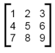

# Nested lists

A list in Python may contain any objects as its elements, including other lists – they are called **nested lists**.

### Accessing elements of nesting lists 

```
nested_letters  = ['a', 'b', ['c', 'd'], 'e']
nested_numbers = [[1], [2], [3]]
```


```
numbers = [1, [2, 3], 4]
nested_numbers = numbers[1]
 
print(nested_numbers)     # [2, 3]
print(nested_numbers[1])  # 3
```


```
lists = [0, [1, [2, 3]]]
print(lists[1][1][0])   # 2
```

### Matrices 



```
M = [[1, 2, 3], [4, 5, 6], [7, 8, 9]]
#M[1][2] = 6
```

### Nested list comprehension 

```
# original list
school = [["Mary", "Jack", "Tiffany"], 
          ["Brad", "Claire"],
          ["Molly", "Andy", "Carla"]]
```

If you want to create a list of all students in all classes without the list comprehension it would look like this:

```
student_list = []
for class_group in school:
    for student in class_group:
        student_list.append(student)
```

But, we can also use a comprehension with a double `for` loop, then it would look like this:

```
student_list = [student for class_group in school for student in class_group]
```

The order of the `for` loops is the same as in the notation with indentation: first the outer loop, and then the inner loop.
